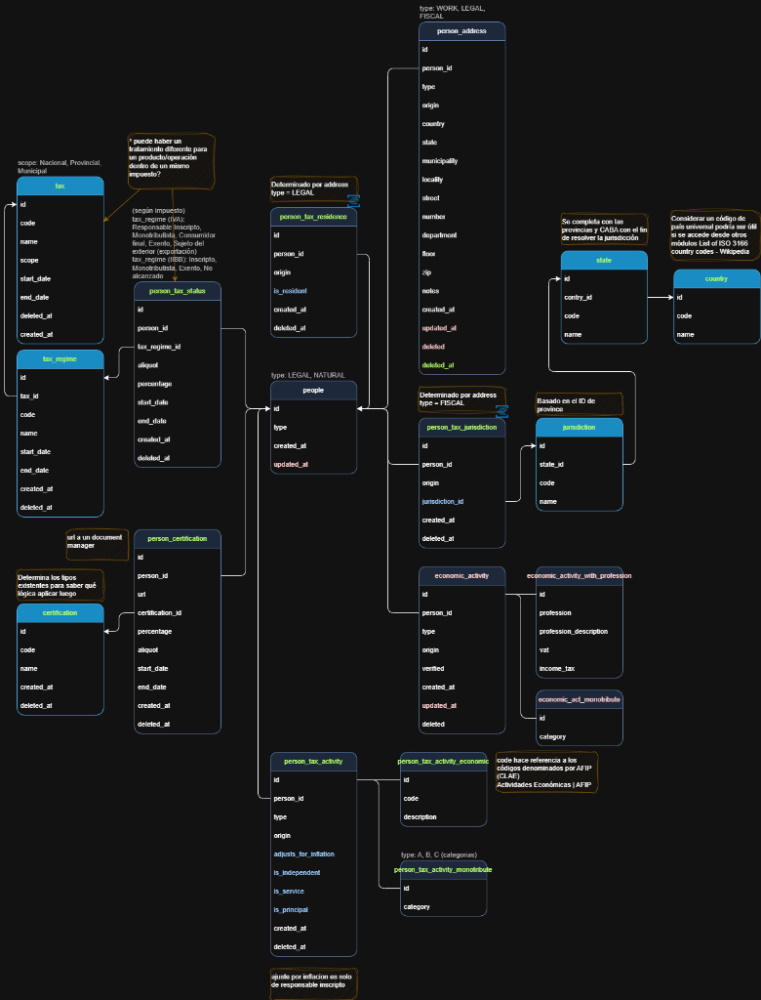

# Guía para Agregar un Nuevo Endpoint en People Center

Esta guía detalla los pasos necesarios para implementar un nuevo endpoint en el proyecto `people-center-develop`, usando como ejemplo la historia de usuario de **Certificaciones**.

## Estructura del Proyecto

El proyecto sigue una arquitectura en capas típica de Spring Boot:

```
microservice/src/main/java/ar/com/bds/people/center/
├── controller/     # Controladores REST
├── service/        # Lógica de negocio
│   └── impl/      # Implementaciones de servicios
├── repository/     # Acceso a datos (JPA)
├── entity/         # Entidades JPA
├── mapper/         # Mappers (MapStruct)
└── exception/      # Excepciones personalizadas
```

---

## Modelo de Datos

### Diagrama de Relaciones

El sistema de certificaciones se integra con el modelo existente de People Center:

```
┌─────────────────┐
│     people      │  (Tabla principal)
│                 │
│  id (PK)        │
│  type           │
│  created_at     │
│  updated_at     │
└────────┬────────┘
         │ 1
         │
         │ N
         ├──────────────────────────────────┐
         │                                  │
         ↓                                  ↓
┌─────────────────────┐          ┌─────────────────────┐
│  certification      │          │ person_certification│
│                     │          │                     │
│  id (PK)            │          │  id (PK)            │
│  code               │◄─────────│  person_id (FK)     │
│  name               │     N    │  certification_id(FK)│
│  created_at         │          │  url                │
│  deleted_at         │          │  percentage         │
└─────────────────────┘          │  aliquot            │
                                 │  start_date         │
                                 │  end_date           │
                                 │  created_at         │
                                 │  deleted_at         │
                                 └─────────────────────┘
```

### Diagrama Entidad-Relación Completo



En el diagrama completo se puede ver cómo `person_certification` se relaciona con:

- **people** (tabla principal) mediante `person_id`
- **certification** (catálogo) mediante `certification_id`

### Relaciones

- **people (1) → (N) person_certification**: Una persona puede tener múltiples certificaciones
- **certification (1) → (N) person_certification**: Un tipo de certificación puede estar asociado a múltiples personas
- **person_certification**: Tabla de relación que almacena las certificaciones específicas de cada persona

> [!NOTE]
> La tabla `certification` es un catálogo maestro que define los tipos de certificaciones disponibles (ej: CERT_IVA, CERT_GANANCIAS), mientras que `person_certification` almacena las certificaciones concretas de cada persona con sus datos específicos (URL del documento, fechas de vigencia, etc.).

---

## Pasos para Implementar un Nuevo Endpoint

### 1. **Crear la Migración de Base de Datos**

**Ubicación:** `microservice/src/main/resources/db/migration/`

**Nombre del archivo:** `V25__create_certification_tables.sql` (incrementar el número de versión)

**Contenido:**

```sql
-- Tabla: certification
CREATE TABLE IF NOT EXISTS `certification`
(
    `id`         INT          NOT NULL AUTO_INCREMENT,
    `code`       VARCHAR(50)  NOT NULL,
    `name`       VARCHAR(100) NOT NULL,
    `created_at` DATETIME     NOT NULL,
    `deleted_at` DATETIME     NULL,
    PRIMARY KEY (`id`),
    UNIQUE KEY `code_unique` (`code`)
);

-- Tabla: person_certification
CREATE TABLE IF NOT EXISTS `person_certification`
(
    `id`               INT            NOT NULL AUTO_INCREMENT,
    `person_id`        BIGINT         NOT NULL,
    `url`              VARCHAR(250)   NOT NULL,
    `certification_id` INT            NOT NULL,
    `percentage`       DECIMAL(5, 4)  NULL,
    `aliquot`          DECIMAL(5, 4)  NULL,
    `start_date`       DATETIME       NULL,
    `end_date`         DATETIME       NULL,
    `created_at`       DATETIME       NOT NULL,
    `deleted_at`       DATETIME       NULL,
    PRIMARY KEY (`id`),
    KEY `person_id_certification_idx` (`person_id`),
    KEY `certification_id_idx` (`certification_id`),
    CONSTRAINT `person_id_certification_fk` FOREIGN KEY (`person_id`) REFERENCES `people` (`id`),
    CONSTRAINT `certification_id_fk` FOREIGN KEY (`certification_id`) REFERENCES `certification` (`id`)
);

-- Datos iniciales (ajustar según definición final)
INSERT INTO `certification` (`code`, `name`, `created_at`)
VALUES ('CERT_IVA', 'Certificación IVA', NOW()),
       ('CERT_GANANCIAS', 'Certificación Ganancias', NOW());
```

> [!NOTE]
> Los códigos y nombres de las certificaciones deben ser definidos según los requerimientos del equipo de Impuestos.

---

### 2. **Crear las Entidades JPA**

#### 2.1. Entidad `CertificationEntity`

**Ubicación:** `microservice/src/main/java/ar/com/bds/people/center/entity/CertificationEntity.java`

```java
package ar.com.bds.people.center.entity;

import lombok.*;
import org.hibernate.annotations.CreationTimestamp;
import org.hibernate.annotations.Where;

import javax.persistence.*;
import java.time.ZonedDateTime;

@Getter
@Setter
@Entity
@Table(name = "certification")
@NoArgsConstructor
@AllArgsConstructor
@Builder
@Where(clause = "deleted_at IS NULL")
public class CertificationEntity {

    @Id
    @GeneratedValue(strategy = GenerationType.IDENTITY)
    private Integer id;

    @Column(name = "code", nullable = false, unique = true, length = 50)
    private String code;

    @Column(name = "name", nullable = false, length = 100)
    private String name;

    @Column(name = "created_at", updatable = false, nullable = false)
    @CreationTimestamp
    private ZonedDateTime createdAt;

    @Column(name = "deleted_at")
    private ZonedDateTime deletedAt;
}
```

#### 2.2. Entidad `PersonCertificationEntity`

**Ubicación:** `microservice/src/main/java/ar/com/bds/people/center/entity/PersonCertificationEntity.java`

```java
package ar.com.bds.people.center.entity;

import com.fasterxml.jackson.annotation.JsonBackReference;
import lombok.*;
import org.hibernate.annotations.CreationTimestamp;
import org.hibernate.annotations.Where;

import javax.persistence.*;
import java.math.BigDecimal;
import java.time.ZonedDateTime;

@Getter
@Setter
@Entity
@Table(name = "person_certification", indexes = {
    @Index(name = "person_id_certification_idx", columnList = "person_id"),
    @Index(name = "certification_id_idx", columnList = "certification_id")
})
@NoArgsConstructor
@AllArgsConstructor
@Builder
@Where(clause = "deleted_at IS NULL")
public class PersonCertificationEntity {

    @Id
    @GeneratedValue(strategy = GenerationType.IDENTITY)
    private Integer id;

    @JoinColumn(name = "person_id", nullable = false)
    @ManyToOne
    @JsonBackReference
    private PersonEntity personId;

    @Column(name = "url", nullable = false, length = 250)
    private String url;

    @JoinColumn(name = "certification_id", nullable = false)
    @ManyToOne
    private CertificationEntity certification;

    @Column(name = "percentage", precision = 5, scale = 4)
    private BigDecimal percentage;

    @Column(name = "aliquot", precision = 5, scale = 4)
    private BigDecimal aliquot;

    @Column(name = "start_date")
    private ZonedDateTime startDate;

    @Column(name = "end_date")
    private ZonedDateTime endDate;

    @Column(name = "created_at", updatable = false, nullable = false)
    @CreationTimestamp
    private ZonedDateTime createdAt;

    @Column(name = "deleted_at")
    private ZonedDateTime deletedAt;
}
```

#### 2.3. Actualizar `PersonEntity` para incluir la relación

**Ubicación:** `microservice/src/main/java/ar/com/bds/people/center/entity/PersonEntity.java`

Debes agregar la relación `@OneToMany` en `PersonEntity` para que tenga acceso a las certificaciones:

```java
@Entity
@Table(name = "people")
public class PersonEntity implements HasCreatedAndUpdated {
    
    public static final String PERSON_ID_COLUMN_NAME = "person_id";
    
    @Id
    private Long id;
    
    // ... otras relaciones existentes ...
    
    @OneToMany(cascade = CascadeType.ALL)
    @JoinColumn(name = PERSON_ID_COLUMN_NAME)
    private Set<TaxpayersProfileEntity> taxpayersProfiles;
    
    // ✅ AGREGAR esta nueva relación
    @OneToMany(cascade = CascadeType.ALL)
    @JoinColumn(name = PERSON_ID_COLUMN_NAME)
    private Set<PersonCertificationEntity> certifications;
    
    // ... resto de las relaciones ...
}
```

> [!IMPORTANT]
> La relación en `PersonEntity` es **opcional** si solo vas a acceder a las certificaciones desde `PersonCertificationEntity`. Sin embargo, es recomendable agregarla para mantener consistencia con el resto del modelo y permitir navegación bidireccional.

---

### 3. **Crear los Repositorios**

#### 3.1. `CertificationRepository`

**Ubicación:** `microservice/src/main/java/ar/com/bds/people/center/repository/CertificationRepository.java`

```java
package ar.com.bds.people.center.repository;

import ar.com.bds.people.center.entity.CertificationEntity;
import org.springframework.data.jpa.repository.JpaRepository;
import org.springframework.stereotype.Repository;

import java.util.Optional;

@Repository
public interface CertificationRepository extends JpaRepository<CertificationEntity, Integer> {
    Optional<CertificationEntity> findByCode(String code);
}
```

#### 3.2. `PersonCertificationRepository`

**Ubicación:** `microservice/src/main/java/ar/com/bds/people/center/repository/PersonCertificationRepository.java`

```java
package ar.com.bds.people.center.repository;

import ar.com.bds.people.center.entity.PersonCertificationEntity;
import org.springframework.data.jpa.repository.JpaRepository;
import org.springframework.data.jpa.repository.Query;
import org.springframework.data.repository.query.Param;
import org.springframework.stereotype.Repository;

import java.time.ZonedDateTime;
import java.util.List;
import java.util.Optional;

@Repository
public interface PersonCertificationRepository extends JpaRepository<PersonCertificationEntity, Integer> {
    
    Optional<PersonCertificationEntity> findByIdAndPersonId_Id(Integer id, Long personId);
    
    @Query("SELECT pc FROM PersonCertificationEntity pc " +
           "WHERE pc.personId.id = :personId " +
           "AND pc.deletedAt IS NULL " +
           "AND (pc.startDate IS NULL OR pc.startDate <= :now) " +
           "AND (pc.endDate IS NULL OR pc.endDate >= :now)")
    List<PersonCertificationEntity> findValidCertifications(
        @Param("personId") Long personId, 
        @Param("now") ZonedDateTime now
    );
}
```

---

### 4. **Crear los DTOs (Modelos)**

> [!IMPORTANT]
> Los DTOs deben crearse en el módulo `library/model` para ser compartidos con los clientes.

**Ubicación:** `library/model/src/main/java/ar/com/bds/lib/peoplecenter/model/`

> [!NOTE]
> Los DTOs de respuesta van en la carpeta `model/`, mientras que los requests van en `model/requests/`.

#### 4.1. `Certification.java`

```java
package ar.com.bds.lib.peoplecenter.model;

import lombok.*;

@Getter
@Setter
@NoArgsConstructor
@AllArgsConstructor
@Builder
public class Certification {
    private String code;
    private String name;
}
```

#### 4.2. `PersonCertification.java`

```java
package ar.com.bds.lib.peoplecenter.model;

import com.fasterxml.jackson.annotation.JsonFormat;
import lombok.*;

import java.math.BigDecimal;
import java.time.ZonedDateTime;

@Getter
@Setter
@NoArgsConstructor
@AllArgsConstructor
@Builder
public class PersonCertification {
    private Integer id;
    private String url;
    private Certification certification;
    private BigDecimal aliquot;
    private BigDecimal percentage;
    
    @JsonFormat(shape = JsonFormat.Shape.STRING, pattern = "yyyy-MM-dd'T'HH:mm:ss.SSSXXX")
    private ZonedDateTime startDate;
    
    @JsonFormat(shape = JsonFormat.Shape.STRING, pattern = "yyyy-MM-dd'T'HH:mm:ss.SSSXXX")
    private ZonedDateTime endDate;
    
    @JsonFormat(shape = JsonFormat.Shape.STRING, pattern = "yyyy-MM-dd'T'HH:mm:ss.SSSXXX")
    private ZonedDateTime createdAt;
    
    @JsonFormat(shape = JsonFormat.Shape.STRING, pattern = "yyyy-MM-dd'T'HH:mm:ss.SSSXXX")
    private ZonedDateTime deletedAt;
}
```

#### 4.3. `CreatePersonCertificationRequest.java`

**Ubicación:** `library/model/src/main/java/ar/com/bds/lib/peoplecenter/model/requests/`

```java
package ar.com.bds.lib.peoplecenter.model.requests;

import com.fasterxml.jackson.annotation.JsonFormat;
import lombok.*;

import javax.validation.constraints.DecimalMax;
import javax.validation.constraints.DecimalMin;
import javax.validation.constraints.NotBlank;
import java.math.BigDecimal;
import java.time.ZonedDateTime;

@Getter
@Setter
@NoArgsConstructor
@AllArgsConstructor
@Builder
public class CreatePersonCertificationRequest {
    
    @NotBlank(message = "URL is required")
    private String url;
    
    @NotBlank(message = "Certification code is required")
    private String certificationCode;
    
    @DecimalMin(value = "0.0", inclusive = true, message = "Aliquot must be >= 0")
    @DecimalMax(value = "1.0", inclusive = true, message = "Aliquot must be <= 1")
    private BigDecimal aliquot;
    
    @DecimalMin(value = "0.0", inclusive = true, message = "Percentage must be >= 0")
    @DecimalMax(value = "1.0", inclusive = true, message = "Percentage must be <= 1")
    private BigDecimal percentage;
    
    @JsonFormat(shape = JsonFormat.Shape.STRING, pattern = "yyyy-MM-dd'T'HH:mm:ss.SSSXXX")
    private ZonedDateTime startDate;
    
    @JsonFormat(shape = JsonFormat.Shape.STRING, pattern = "yyyy-MM-dd'T'HH:mm:ss.SSSXXX")
    private ZonedDateTime endDate;
}
```

---

### 5. **Actualizar Definiciones de API en Library**

Para que otros microservicios puedan usar constantes de paths del nuevo endpoint, debes actualizar `PathV2.java` en la `library`.

#### 5.1. Actualizar `PathV2.java`

**Ubicación:** `library/model/src/main/java/ar/com/bds/lib/peoplecenter/api/PathV2.java`

Agrega la constante `CERTIFICATIONS_PATH` siguiendo el orden alfabético de las demás constantes:

```java
package ar.com.bds.lib.peoplecenter.api;

import lombok.experimental.UtilityClass;

@UtilityClass
public final class PathV2 {

    public static final String CUSTOMER_PATH = "/v2/customers";
    private static final String BASE_PATH = "/v2/people";

    public static final String ACCEPTED_TERMS_PATH = BASE_PATH + "/{id}/accepted-terms";
    public static final String ADDRESS_PATH = BASE_PATH + "/{id}/addresses";
    
    // ✅ AGREGAR esta nueva constante
    public static final String CERTIFICATIONS_PATH = BASE_PATH + "/{id}/certifications";
    
    public static final String CHANNELS_PATH = BASE_PATH + "/{id}/channels";
    public static final String CONTACTS_PATH = BASE_PATH + "/{id}/contacts";
    public static final String CORE_DATA_PATH = BASE_PATH + "/{id}/core-data";
    public static final String DOCUMENTS_PATH = BASE_PATH + "/{id}/documents";
    public static final String ECONOMIC_ACTIVITY_PATH = BASE_PATH + "/{id}/economic-activity";
    public static final String INCOME_INFORMATION_PATH = BASE_PATH + "/{id}/income-information";
    public static final String LEGAL_INFORMATION_PATH = BASE_PATH + "/{id}/legal-information";
    public static final String PERSONAL_INFO_PATH = BASE_PATH + "/{id}/personal-info";
    public static final String PERSON_PATH = BASE_PATH;
    public static final String RELATIONSHIP_PATH = BASE_PATH + "/{id}/relationships";
    public static final String RISK_EVALUATION_PATH = BASE_PATH + "/{id}/risk-evaluation";
}
```

#### 5.2. Ventajas de Usar Constantes de Paths

**1. Consistencia:**

```java
// ✅ BIEN - Usa constante
String url = baseUrl + PathV2.CERTIFICATIONS_PATH.replace("{id}", personId.toString());

// ❌ MAL - Hardcodea el path
String url = baseUrl + "/v2/people/" + personId + "/certifications";
```

**2. Mantenibilidad:**
Si cambias el path en el futuro, solo lo cambias en un lugar y todos los clientes se actualizan automáticamente.

**3. Type-safety:**
Evitas errores de tipeo en URLs.

#### 5.3. Ejemplo de Uso en Otros Microservicios

```java
// En otro microservicio: loan-service
import ar.com.bds.lib.peoplecenter.api.PathV2;
import ar.com.bds.lib.peoplecenter.model.PersonCertification;
import org.springframework.core.ParameterizedTypeReference;

@Service
public class LoanService {
    
    @Autowired
    private RestTemplate restTemplate;
    
    @Value("${people-center.base-url}")
    private String baseUrl;
    
    public List<PersonCertification> getPersonCertifications(Long personId) {
        // ✅ Usa la constante de PathV2
        String url = baseUrl + PathV2.CERTIFICATIONS_PATH
            .replace("{id}", personId.toString());
        
        return restTemplate.exchange(
            url,
            HttpMethod.GET,
            null,
            new ParameterizedTypeReference<List<PersonCertification>>() {}
        ).getBody();
    }
}
```

> [!NOTE]
> Agregar la constante en `PathV2.java` es **opcional** pero **altamente recomendado** para mantener consistencia con el resto de la API y facilitar el consumo por otros servicios.

#### 5.4. Modificaciones Opcionales en Library

Además de `PathV2.java`, hay otras modificaciones opcionales que puedes considerar según tus necesidades:

##### **A. Agregar Certificaciones al DTO `Person`** ⚠️

**Ubicación:** `library/model/src/main/java/ar/com/bds/lib/peoplecenter/model/Person.java`

El DTO `Person` contiene listas de todos los sub-recursos (addresses, contacts, documents, etc.). Puedes agregar la lista de certificaciones para mantener consistencia:

```java
@Data
@NoArgsConstructor
@AllArgsConstructor
@Builder
public class Person implements HasId {
    
    // ... campos existentes ...
    
    @Valid
    @Builder.Default
    private List<TaxpayersProfile> taxpayersProfiles = new ArrayList<>();
    
    // ✅ AGREGAR esta nueva lista (OPCIONAL)
    @Valid
    @Builder.Default
    private List<PersonCertification> certifications = new ArrayList<>();
    
    @Valid
    @Builder.Default
    private List<Document> documents = new ArrayList<>();
    
    // ... resto de campos ...
}
```

**¿Cuándo agregarlo?**

| Escenario | ¿Agregar? | Razón |
|-----------|-----------|-------|
| Quieres que `GET /v2/people/{id}` incluya certificaciones | ✅ Sí | Las certificaciones se cargarán automáticamente con la persona |
| Solo accederás a certificaciones vía `/certifications` | ❌ No | No necesitas la lista en `Person` |
| Otros servicios necesitan certificaciones al obtener personas | ✅ Sí | Facilita el consumo de datos completos |
| Quieres mantener consistencia con otros sub-recursos | ✅ Sí | Todos los sub-recursos están en `Person` |

**Impacto:**

- ✅ **Ventaja:** Datos completos en una sola llamada
- ⚠️ **Desventaja:** Payload más grande en `GET /people/{id}`

##### **B. Crear Enum para Tipos de Certificación** 🤔

**Ubicación:** `library/model/src/main/java/ar/com/bds/lib/peoplecenter/model/enums/CertificationType.java`

Si los códigos de certificación son **fijos y conocidos**, puedes crear un enum:

```java
package ar.com.bds.lib.peoplecenter.model.enums;

public enum CertificationType {
    CERT_IVA("Certificación IVA"),
    CERT_GANANCIAS("Certificación Ganancias"),
    CERT_INGRESOS_BRUTOS("Certificación Ingresos Brutos"),
    CERT_SUSS("Certificación SUSS");
    
    private final String description;
    
    CertificationType(String description) {
        this.description = description;
    }
    
    public String getDescription() {
        return description;
    }
}
```

**¿Cuándo crearlo?**

| Escenario | ¿Crear Enum? | Razón |
|-----------|--------------|-------|
| Los códigos son **fijos** (ej: CERT_IVA, CERT_GANANCIAS) | ✅ Sí | Type-safety y validación en compile-time |
| Los códigos son **dinámicos** (se agregan desde BD) | ❌ No | Usa `String` para flexibilidad |
| Quieres validación estricta de códigos | ✅ Sí | El enum previene códigos inválidos |
| Los códigos pueden cambiar frecuentemente | ❌ No | Evitas recompilar y redistribuir la library |

**Impacto:**

- ✅ **Ventaja:** Type-safety, autocomplete en IDEs
- ⚠️ **Desventaja:** Menos flexible, requiere recompilar para nuevos tipos

##### **C. Implementar Cliente HTTP** 🔗

**Ubicación:** `library/client/src/main/java/ar/com/bds/lib/peoplecenter/client/PeopleCenterClient.java`

Si otros microservicios van a consumir el endpoint frecuentemente, puedes agregar métodos al cliente HTTP:

```java
package ar.com.bds.lib.peoplecenter.client;

import ar.com.bds.lib.peoplecenter.api.PathV2;
import ar.com.bds.lib.peoplecenter.model.PersonCertification;
import ar.com.bds.lib.peoplecenter.model.requests.CreatePersonCertificationRequest;
import org.springframework.core.ParameterizedTypeReference;
import org.springframework.http.HttpMethod;
import org.springframework.stereotype.Component;
import org.springframework.web.client.RestTemplate;

import java.util.List;

@Component
public class PeopleCenterClient {
    
    private final RestTemplate restTemplate;
    private final String baseUrl;
    
    // ... constructor y otros métodos ...
    
    // ✅ AGREGAR estos métodos (OPCIONAL)
    
    public Integer createCertification(Long personId, CreatePersonCertificationRequest request) {
        String url = baseUrl + PathV2.CERTIFICATIONS_PATH.replace("{id}", personId.toString());
        return restTemplate.postForObject(url, request, Integer.class);
    }
    
    public List<PersonCertification> getCertifications(Long personId) {
        String url = baseUrl + PathV2.CERTIFICATIONS_PATH.replace("{id}", personId.toString());
        return restTemplate.exchange(
            url,
            HttpMethod.GET,
            null,
            new ParameterizedTypeReference<List<PersonCertification>>() {}
        ).getBody();
    }
    
    public PersonCertification getCertificationById(Long personId, Integer certificationId) {
        String url = baseUrl + PathV2.CERTIFICATIONS_PATH.replace("{id}", personId.toString()) 
            + "/" + certificationId;
        return restTemplate.getForObject(url, PersonCertification.class);
    }
    
    public void deleteCertification(Long personId, Integer certificationId) {
        String url = baseUrl + PathV2.CERTIFICATIONS_PATH.replace("{id}", personId.toString()) 
            + "/" + certificationId;
        restTemplate.delete(url);
    }
}
```

**¿Cuándo implementarlo?**

| Escenario | ¿Implementar? | Razón |
|-----------|---------------|-------|
| Múltiples servicios consumirán este endpoint | ✅ Sí | Evita duplicar código de cliente en cada servicio |
| Solo un servicio lo usará | ❌ No | Ese servicio puede crear su propio cliente |
| Quieres estandarizar el consumo de la API | ✅ Sí | Todos usan el mismo cliente con la misma lógica |
| Cada equipo prefiere sus propias implementaciones | ❌ No | Más flexibilidad para cada equipo |

**Impacto:**

- ✅ **Ventaja:** Código reutilizable, menos duplicación
- ⚠️ **Desventaja:** Dependencia adicional para los clientes

##### **Resumen de Modificaciones Opcionales**

| Modificación | Prioridad | ¿Cuándo hacerla? | Archivo |
|--------------|-----------|------------------|---------|
| **Person.java** | 🟡 Media | Si quieres certificaciones en `GET /people/{id}` | `model/Person.java` |
| **CertificationType Enum** | 🟢 Baja | Si los códigos son fijos y quieres type-safety | `model/enums/CertificationType.java` |
| **Cliente HTTP** | 🟢 Baja | Si múltiples servicios consumirán el endpoint | `client/PeopleCenterClient.java` |

> [!TIP]
> **Recomendación:** Comienza sin estas modificaciones opcionales. Agrégalas solo cuando identifiques la necesidad real en tu proyecto. Es mejor mantener la library simple y agregar funcionalidad según se requiera.

---

### 6. **Crear el Mapper**

**Ubicación:** `microservice/src/main/java/ar/com/bds/people/center/mapper/PersonCertificationMapper.java`

```java
package ar.com.bds.people.center.mapper;

import ar.com.bds.lib.peoplecenter.model.Certification;
import ar.com.bds.lib.peoplecenter.model.PersonCertification;
import ar.com.bds.people.center.entity.CertificationEntity;
import ar.com.bds.people.center.entity.PersonCertificationEntity;
import org.mapstruct.*;

@Mapper(
    componentModel = MappingConstants.ComponentModel.SPRING,
    nullValueCheckStrategy = NullValueCheckStrategy.ALWAYS
)
public interface PersonCertificationMapper {

    @Mapping(target = "certification", source = "certification")
    PersonCertification toDto(PersonCertificationEntity entity);
    
    Certification certificationToDto(CertificationEntity entity);
}
```

---

### 7. **Crear el Servicio**

**Ubicación:** `microservice/src/main/java/ar/com/bds/people/center/service/PersonCertificationService.java`

```java
package ar.com.bds.people.center.service;

import ar.com.bds.lib.peoplecenter.model.requests.CreatePersonCertificationRequest;
import ar.com.bds.lib.peoplecenter.model.PersonCertification;

import java.util.List;

public interface PersonCertificationService {
    Integer create(Long personId, CreatePersonCertificationRequest request);
    List<PersonCertification> getValidCertifications(Long personId);
    PersonCertification getById(Long personId, Integer certificationId);
    Integer delete(Long personId, Integer certificationId);
}
```

#### 6.1. Implementación del Servicio

**Ubicación:** `microservice/src/main/java/ar/com/bds/people/center/service/impl/PersonCertificationServiceImpl.java`

```java
package ar.com.bds.people.center.service.impl;

import ar.com.bds.exception.ResourceNotFoundException;
import ar.com.bds.lib.peoplecenter.model.requests.CreatePersonCertificationRequest;
import ar.com.bds.lib.peoplecenter.model.PersonCertification;
import ar.com.bds.people.center.entity.CertificationEntity;
import ar.com.bds.people.center.entity.PersonCertificationEntity;
import ar.com.bds.people.center.entity.PersonEntity;
import ar.com.bds.people.center.mapper.PersonCertificationMapper;
import ar.com.bds.people.center.repository.CertificationRepository;
import ar.com.bds.people.center.repository.PersonCertificationRepository;
import ar.com.bds.people.center.repository.PeopleCenterRepository;
import ar.com.bds.people.center.service.PersonCertificationService;
import lombok.RequiredArgsConstructor;
import lombok.extern.slf4j.Slf4j;
import org.springframework.stereotype.Service;
import org.springframework.transaction.annotation.Transactional;

import java.time.ZonedDateTime;
import java.util.List;
import java.util.stream.Collectors;

@Service
@Slf4j
@RequiredArgsConstructor
public class PersonCertificationServiceImpl implements PersonCertificationService {

    private final PersonCertificationRepository personCertificationRepository;
    private final CertificationRepository certificationRepository;
    private final PeopleCenterRepository peopleCenterRepository;
    private final PersonCertificationMapper mapper;

    @Override
    @Transactional
    public Integer create(Long personId, CreatePersonCertificationRequest request) {
        log.info("Creating certification for person: {}", personId);
        
        // Validaciones
        validateRequest(request);
        
        // Verificar que la persona existe
        PersonEntity person = peopleCenterRepository.findById(personId)
            .orElseThrow(() -> new ResourceNotFoundException("Person not found with id: " + personId));
        
        // Verificar que el código de certificación existe y está vigente
        CertificationEntity certification = certificationRepository.findByCode(request.getCertificationCode())
            .orElseThrow(() -> new ResourceNotFoundException("Certification not found with code: " + request.getCertificationCode()));
        
        // Crear la entidad
        PersonCertificationEntity entity = PersonCertificationEntity.builder()
            .personId(person)
            .url(request.getUrl())
            .certification(certification)
            .percentage(request.getPercentage())
            .aliquot(request.getAliquot())
            .startDate(request.getStartDate())
            .endDate(request.getEndDate())
            .build();
        
        PersonCertificationEntity saved = personCertificationRepository.save(entity);
        log.info("Certification created with id: {}", saved.getId());
        
        return saved.getId();
    }

    @Override
    public List<PersonCertification> getValidCertifications(Long personId) {
        log.info("Getting valid certifications for person: {}", personId);
        
        ZonedDateTime now = ZonedDateTime.now();
        List<PersonCertificationEntity> entities = personCertificationRepository
            .findValidCertifications(personId, now);
        
        return entities.stream()
            .map(mapper::toDto)
            .collect(Collectors.toList());
    }

    @Override
    public PersonCertification getById(Long personId, Integer certificationId) {
        log.info("Getting certification {} for person: {}", certificationId, personId);
        
        PersonCertificationEntity entity = personCertificationRepository
            .findByIdAndPersonId_Id(certificationId, personId)
            .orElseThrow(() -> new ResourceNotFoundException(
                String.format("Certification %d not found for person %d", certificationId, personId)));
        
        return mapper.toDto(entity);
    }

    @Override
    @Transactional
    public Integer delete(Long personId, Integer certificationId) {
        log.info("Deleting certification {} for person: {}", certificationId, personId);
        
        PersonCertificationEntity entity = personCertificationRepository
            .findByIdAndPersonId_Id(certificationId, personId)
            .orElseThrow(() -> new ResourceNotFoundException(
                String.format("Certification %d not found for person %d", certificationId, personId)));
        
        entity.setDeletedAt(ZonedDateTime.now());
        personCertificationRepository.save(entity);
        
        log.info("Certification {} deleted successfully", certificationId);
        return entity.getId();
    }

    private void validateRequest(CreatePersonCertificationRequest request) {
        // Solo se permite un dato a la vez en percentage o aliquot
        if (request.getPercentage() != null && request.getAliquot() != null) {
            throw new IllegalArgumentException("Only one of 'percentage' or 'aliquot' can be specified");
        }
        
        // La fecha desde debe ser menor a la hasta si se especifica
        if (request.getStartDate() != null && request.getEndDate() != null) {
            if (request.getStartDate().isAfter(request.getEndDate())) {
                throw new IllegalArgumentException("Start date must be before end date");
            }
        }
    }
}
```

---

### 7. **Crear el Controlador**

**Ubicación:** `microservice/src/main/java/ar/com/bds/people/center/controller/CertificationsController.java`

```java
package ar.com.bds.people.center.controller;

import ar.com.bds.lib.peoplecenter.model.requests.CreatePersonCertificationRequest;
import ar.com.bds.lib.peoplecenter.model.PersonCertification;
import ar.com.bds.people.center.service.PersonCertificationService;
import io.swagger.v3.oas.annotations.Operation;
import io.swagger.v3.oas.annotations.tags.Tag;
import lombok.RequiredArgsConstructor;
import lombok.extern.slf4j.Slf4j;
import org.springframework.http.HttpStatus;
import org.springframework.http.ResponseEntity;
import org.springframework.validation.annotation.Validated;
import org.springframework.web.bind.annotation.*;

import javax.validation.Valid;
import java.util.List;

@RestController
@RequestMapping("/v1/people/{personId}/certifications")
@Tag(name = "People Center - Certifications")
@RequiredArgsConstructor
@Slf4j
@Validated
public class CertificationsController {

    private final PersonCertificationService certificationService;

    @PostMapping
    @Operation(summary = "Create a new certification for a person")
    public ResponseEntity<Integer> createCertification(
            @PathVariable Long personId,
            @Valid @RequestBody CreatePersonCertificationRequest request) {
        
        log.info("POST /v1/people/{}/certifications - Request: {}", personId, request);
        Integer certificationId = certificationService.create(personId, request);
        return ResponseEntity.status(HttpStatus.CREATED).body(certificationId);
    }

    @GetMapping
    @Operation(summary = "Get all valid certifications for a person")
    public ResponseEntity<List<PersonCertification>> getValidCertifications(
            @PathVariable Long personId) {
        
        log.info("GET /v1/people/{}/certifications", personId);
        List<PersonCertification> certifications = certificationService.getValidCertifications(personId);
        return ResponseEntity.ok(certifications);
    }

    @GetMapping("/{idEntity}")
    @Operation(summary = "Get a specific certification by ID")
    public ResponseEntity<PersonCertification> getCertificationById(
            @PathVariable Long personId,
            @PathVariable Integer idEntity) {
        
        log.info("GET /v1/people/{}/certifications/{}", personId, idEntity);
        PersonCertification certification = certificationService.getById(personId, idEntity);
        return ResponseEntity.ok(certification);
    }

    @DeleteMapping("/{idEntity}")
    @Operation(summary = "Logically delete a certification")
    public ResponseEntity<Integer> deleteCertification(
            @PathVariable Long personId,
            @PathVariable Integer idEntity) {
        
        log.info("DELETE /v1/people/{}/certifications/{}", personId, idEntity);
        Integer deletedId = certificationService.delete(personId, idEntity);
        return ResponseEntity.ok(deletedId);
    }
}
```

---

### 8. **Crear Tests Unitarios**

**Ubicación:** `microservice/src/test/java/ar/com/bds/people/center/service/impl/PersonCertificationServiceImplTest.java`

```java
package ar.com.bds.people.center.service.impl;

import ar.com.bds.exception.ResourceNotFoundException;
import ar.com.bds.lib.peoplecenter.model.requests.CreatePersonCertificationRequest;
import ar.com.bds.people.center.entity.CertificationEntity;
import ar.com.bds.people.center.entity.PersonCertificationEntity;
import ar.com.bds.people.center.entity.PersonEntity;
import ar.com.bds.people.center.mapper.PersonCertificationMapper;
import ar.com.bds.people.center.repository.CertificationRepository;
import ar.com.bds.people.center.repository.PersonCertificationRepository;
import ar.com.bds.people.center.repository.PeopleCenterRepository;
import org.junit.jupiter.api.BeforeEach;
import org.junit.jupiter.api.Test;
import org.junit.jupiter.api.extension.ExtendWith;
import org.mockito.InjectMocks;
import org.mockito.Mock;
import org.mockito.junit.jupiter.MockitoExtension;

import java.math.BigDecimal;
import java.time.ZonedDateTime;
import java.util.Optional;

import static org.junit.jupiter.api.Assertions.*;
import static org.mockito.ArgumentMatchers.any;
import static org.mockito.Mockito.*;

@ExtendWith(MockitoExtension.class)
class PersonCertificationServiceImplTest {

    @Mock
    private PersonCertificationRepository personCertificationRepository;

    @Mock
    private CertificationRepository certificationRepository;

    @Mock
    private PeopleCenterRepository peopleCenterRepository;

    @Mock
    private PersonCertificationMapper mapper;

    @InjectMocks
    private PersonCertificationServiceImpl service;

    private PersonEntity mockPerson;
    private CertificationEntity mockCertification;
    private CreatePersonCertificationRequest validRequest;

    @BeforeEach
    void setUp() {
        mockPerson = PersonEntity.builder()
            .id(1L)
            .build();

        mockCertification = CertificationEntity.builder()
            .id(1)
            .code("CERT_IVA")
            .name("Certificación IVA")
            .build();

        validRequest = CreatePersonCertificationRequest.builder()
            .url("http://example.com/cert.pdf")
            .certificationCode("CERT_IVA")
            .percentage(new BigDecimal("0.25"))
            .build();
    }

    @Test
    void create_ShouldCreateCertification_WhenValidRequest() {
        // Arrange
        when(peopleCenterRepository.findById(1L)).thenReturn(Optional.of(mockPerson));
        when(certificationRepository.findByCode("CERT_IVA")).thenReturn(Optional.of(mockCertification));
        
        PersonCertificationEntity savedEntity = PersonCertificationEntity.builder()
            .id(1)
            .build();
        when(personCertificationRepository.save(any())).thenReturn(savedEntity);

        // Act
        Integer result = service.create(1L, validRequest);

        // Assert
        assertNotNull(result);
        assertEquals(1, result);
        verify(personCertificationRepository).save(any(PersonCertificationEntity.class));
    }

    @Test
    void create_ShouldThrowException_WhenBothPercentageAndAliquotProvided() {
        // Arrange
        validRequest.setAliquot(new BigDecimal("0.10"));

        // Act & Assert
        assertThrows(IllegalArgumentException.class, () -> service.create(1L, validRequest));
    }

    @Test
    void create_ShouldThrowException_WhenPersonNotFound() {
        // Arrange
        when(peopleCenterRepository.findById(1L)).thenReturn(Optional.empty());

        // Act & Assert
        assertThrows(ResourceNotFoundException.class, () -> service.create(1L, validRequest));
    }

    @Test
    void create_ShouldThrowException_WhenStartDateAfterEndDate() {
        // Arrange
        validRequest.setStartDate(ZonedDateTime.now().plusDays(10));
        validRequest.setEndDate(ZonedDateTime.now());

        // Act & Assert
        assertThrows(IllegalArgumentException.class, () -> service.create(1L, validRequest));
    }
}
```

---

### 9. **Crear Tests de Integración**

**Ubicación:** `microservice/src/test/java/ar/com/bds/people/center/controller/CertificationsControllerIntegrationTest.java`

```java
package ar.com.bds.people.center.controller;

import ar.com.bds.lib.peoplecenter.model.requests.CreatePersonCertificationRequest;
import com.fasterxml.jackson.databind.ObjectMapper;
import org.junit.jupiter.api.Test;
import org.springframework.beans.factory.annotation.Autowired;
import org.springframework.boot.test.autoconfigure.web.servlet.AutoConfigureMockMvc;
import org.springframework.boot.test.context.SpringBootTest;
import org.springframework.http.MediaType;
import org.springframework.test.context.ActiveProfiles;
import org.springframework.test.web.servlet.MockMvc;
import org.springframework.transaction.annotation.Transactional;

import java.math.BigDecimal;

import static org.springframework.test.web.servlet.request.MockMvcRequestBuilders.*;
import static org.springframework.test.web.servlet.result.MockMvcResultMatchers.*;

@SpringBootTest
@AutoConfigureMockMvc
@ActiveProfiles("test")
@Transactional
class CertificationsControllerIntegrationTest {

    @Autowired
    private MockMvc mockMvc;

    @Autowired
    private ObjectMapper objectMapper;

    @Test
    void createCertification_ShouldReturn201_WhenValidRequest() throws Exception {
        CreatePersonCertificationRequest request = CreatePersonCertificationRequest.builder()
            .url("http://example.com/cert.pdf")
            .certificationCode("CERT_IVA")
            .percentage(new BigDecimal("0.25"))
            .build();

        mockMvc.perform(post("/v1/people/1/certifications")
                .contentType(MediaType.APPLICATION_JSON)
                .content(objectMapper.writeValueAsString(request)))
            .andExpect(status().isCreated())
            .andExpect(content().contentType(MediaType.APPLICATION_JSON));
    }

    @Test
    void getValidCertifications_ShouldReturn200() throws Exception {
        mockMvc.perform(get("/v1/people/1/certifications"))
            .andExpect(status().isOk())
            .andExpect(content().contentType(MediaType.APPLICATION_JSON));
    }

    @Test
    void getCertificationById_ShouldReturn200_WhenExists() throws Exception {
        mockMvc.perform(get("/v1/people/1/certifications/1"))
            .andExpect(status().isOk())
            .andExpect(content().contentType(MediaType.APPLICATION_JSON));
    }

    @Test
    void deleteCertification_ShouldReturn200() throws Exception {
        mockMvc.perform(delete("/v1/people/1/certifications/1"))
            .andExpect(status().isOk());
    }
}
```

---

## Resumen de Archivos a Crear/Modificar

### Archivos Nuevos

| # | Archivo | Descripción |
|---|---------|-------------|
| 1 | `V25__create_certification_tables.sql` | Migración de base de datos |
| 2 | `CertificationEntity.java` | Entidad JPA para certificaciones |
| 3 | `PersonCertificationEntity.java` | Entidad JPA para certificaciones de personas |
| 4 | `CertificationRepository.java` | Repositorio para certificaciones |
| 5 | `PersonCertificationRepository.java` | Repositorio para certificaciones de personas |
| 6 | `Certification.java` | DTO para certificación |
| 7 | `PersonCertification.java` | DTO para certificación de persona |
| 8 | `CreatePersonCertificationRequest.java` | DTO para request de creación |
| 9 | `PersonCertificationMapper.java` | Mapper MapStruct |
| 10 | `PersonCertificationService.java` | Interfaz del servicio |
| 11 | `PersonCertificationServiceImpl.java` | Implementación del servicio |
| 12 | `CertificationsController.java` | Controlador REST |
| 13 | `PersonCertificationServiceImplTest.java` | Tests unitarios |
| 14 | `CertificationsControllerIntegrationTest.java` | Tests de integración |

---

## Checklist de Implementación

- [ ] Crear migración de base de datos
- [ ] Ejecutar migración y verificar tablas creadas
- [ ] Crear entidades JPA
- [ ] Crear repositorios
- [ ] Crear DTOs en el módulo library
- [ ] Crear mappers
- [ ] Crear interfaz de servicio
- [ ] Implementar servicio con validaciones
- [ ] Crear controlador REST
- [ ] Crear tests unitarios
- [ ] Crear tests de integración
- [ ] Ejecutar todos los tests
- [ ] Verificar cobertura de código
- [ ] Probar endpoints con Postman/Swagger
- [ ] Actualizar documentación de API
- [ ] Code review
- [ ] Merge a rama principal

---

## Comandos Útiles

### Compilar el proyecto

```bash
mvn clean install
```

### Ejecutar tests

```bash
mvn test
```

### Ejecutar la aplicación

```bash
mvn spring-boot:run
```

### Acceder a Swagger UI

```
http://localhost:8080/swagger-ui.html
```

---

## Notas Importantes

> [!WARNING]
>
> - Asegúrate de que el número de versión de la migración sea secuencial y único
> - Los DTOs deben estar en el módulo `library/model` para ser compartidos
> - Todas las fechas deben usar formato ISO 8601
> - Los valores decimales (percentage, aliquot) son sobre 100 (ej: 25% = 0.25)

> [!TIP]
>
> - Usa Lombok para reducir código boilerplate
> - MapStruct genera automáticamente el código de mapeo en tiempo de compilación
> - Spring Boot DevTools permite hot reload durante el desarrollo
> - Usa `@Transactional` en métodos que modifican datos

---

## Recursos Adicionales

- [Spring Boot Documentation](https://spring.io/projects/spring-boot)
- [MapStruct Documentation](https://mapstruct.org/)
- [Flyway Migrations](https://flywaydb.org/)
- [JPA/Hibernate Guide](https://hibernate.org/orm/documentation/)
