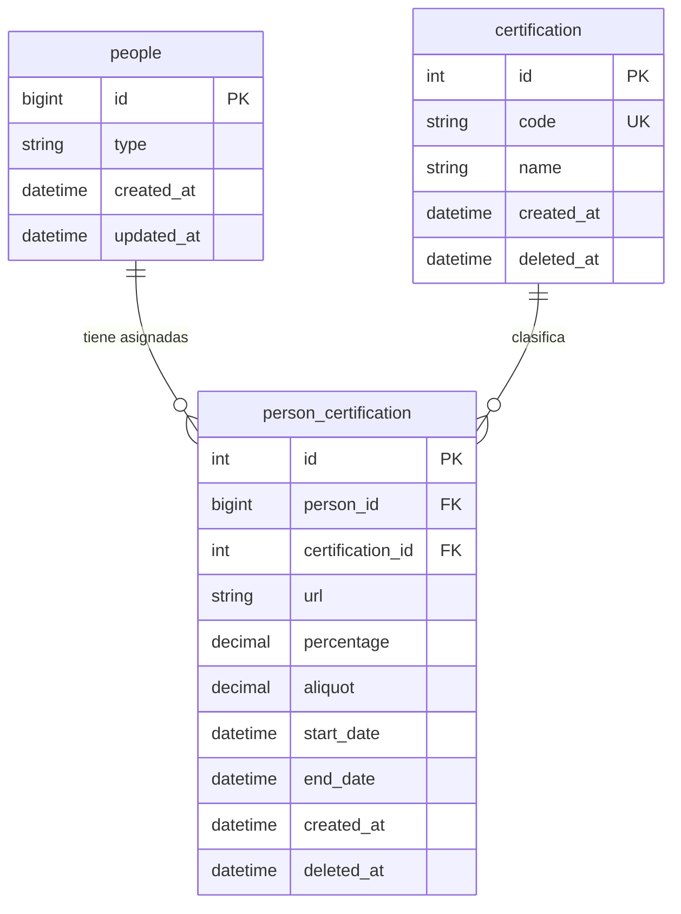
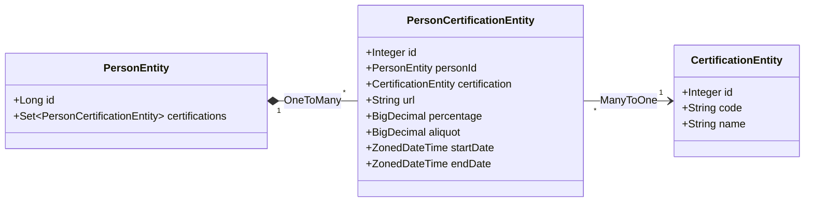

# Especificación de Implementación: Endpoint de Certificaciones

Este documento define las especificaciones técnicas y el procedimiento detallado para la implementación del recurso de **Certificaciones** en el microservicio `people-center`.

## Estructura del Proyecto

El proyecto adhiere a la arquitectura en capas estándar de Spring Boot:

```
microservice/src/main/java/ar/com/bds/people/center/
├── controller/     # Controladores REST
├── service/        # Lógica de negocio
│   └── impl/       # Implementaciones de servicios
├── repository/     # Acceso a datos (JPA)
├── entity/         # Entidades JPA
├── mapper/         # Mappers (MapStruct)
└── exception/      # Excepciones personalizadas
```

---

## Modelo de Datos

### Diagrama de Relaciones

El módulo de certificaciones se integra con el modelo de datos existente de People Center de la siguiente manera:



### Diagrama Entidad-Relación


La entidad `person_certification` actúa como tabla de vinculación con atributos adicionales entre:

- **people**: Entidad principal (mediante `person_id`).
- **certification**: Catálogo maestro (mediante `certification_id`).

### Cardinalidad y Relaciones

- **people (1) → (N) person_certification**: Una persona puede poseer múltiples certificaciones.
- **certification (1) → (N) person_certification**: Un tipo de certificación puede estar asociado a múltiples personas.
- **person_certification**: Representa la instancia concreta de una certificación para una persona específica.

> [!NOTE]
> La tabla `certification` constituye un catálogo maestro que define los tipos de certificaciones disponibles (ej: CERT_IVA, CERT_GANANCIAS), mientras que `person_certification` almacena los datos específicos de la asignación (URL del documento, vigencia, alícuotas, etc.).

---

## Procedimiento de Implementación

### 1. Migración de Esquema de Base de Datos

**Ubicación:** `microservice/src/main/resources/db/migration/`

**Archivo:** `V25__create_certification_tables.sql` (el número de versión debe ser incremental).

**Definición SQL:**

```sql
-- Tabla: certification
CREATE TABLE IF NOT EXISTS `certification`
(
    `id`         INT          NOT NULL AUTO_INCREMENT,
    `code`       VARCHAR(50)  NOT NULL,
    `name`       VARCHAR(100) NOT NULL,
    `created_at` DATETIME     NOT NULL,
    `deleted_at` DATETIME     NULL,
    PRIMARY KEY (`id`),
    UNIQUE KEY `code_unique` (`code`)
);

-- Tabla: person_certification
CREATE TABLE IF NOT EXISTS `person_certification`
(
    `id`               INT            NOT NULL AUTO_INCREMENT,
    `person_id`        BIGINT         NOT NULL,
    `url`              VARCHAR(250)   NOT NULL,
    `certification_id` INT            NOT NULL,
    `percentage`       DECIMAL(5, 4)  NULL,
    `aliquot`          DECIMAL(5, 4)  NULL,
    `start_date`       DATETIME       NULL,
    `end_date`         DATETIME       NULL,
    `created_at`       DATETIME       NOT NULL,
    `deleted_at`       DATETIME       NULL,
    PRIMARY KEY (`id`),
    KEY `person_id_certification_idx` (`person_id`),
    KEY `certification_id_idx` (`certification_id`),
    CONSTRAINT `person_id_certification_fk` FOREIGN KEY (`person_id`) REFERENCES `people` (`id`),
    CONSTRAINT `certification_id_fk` FOREIGN KEY (`certification_id`) REFERENCES `certification` (`id`)
);

-- Datos semilla iniciales (sujetos a definición final)
INSERT INTO `certification` (`code`, `name`, `created_at`)
VALUES ('CERT_IVA', 'Certificación IVA', NOW()),
       ('CERT_GANANCIAS', 'Certificación Ganancias', NOW());
```

> [!NOTE]
> Los códigos y nombres de las certificaciones deben alinearse con los requerimientos definidos por el área de Impuestos.

---

### 2. Definición de Entidades JPA

#### Diagrama de Clases



#### 2.1. Entidad `CertificationEntity`

**Ubicación:** `microservice/src/main/java/ar/com/bds/people/center/entity/CertificationEntity.java`

```java
package ar.com.bds.people.center.entity;

import lombok.*;
import org.hibernate.annotations.CreationTimestamp;
import org.hibernate.annotations.Where;

import javax.persistence.*;
import java.time.ZonedDateTime;

@Getter
@Setter
@Entity
@Table(name = "certification")
@NoArgsConstructor
@AllArgsConstructor
@Builder
@Where(clause = "deleted_at IS NULL")
public class CertificationEntity {

    @Id
    @GeneratedValue(strategy = GenerationType.IDENTITY)
    private Integer id;

    @Column(name = "code", nullable = false, unique = true, length = 50)
    private String code;

    @Column(name = "name", nullable = false, length = 100)
    private String name;

    @Column(name = "created_at", updatable = false, nullable = false)
    @CreationTimestamp
    private ZonedDateTime createdAt;

    @Column(name = "deleted_at")
    private ZonedDateTime deletedAt;
}
```

#### 2.2. Entidad `PersonCertificationEntity`

**Ubicación:** `microservice/src/main/java/ar/com/bds/people/center/entity/PersonCertificationEntity.java`

```java
package ar.com.bds.people.center.entity;

import com.fasterxml.jackson.annotation.JsonBackReference;
import lombok.*;
import org.hibernate.annotations.CreationTimestamp;
import org.hibernate.annotations.Where;

import javax.persistence.*;
import java.math.BigDecimal;
import java.time.ZonedDateTime;

@Getter
@Setter
@Entity
@Table(name = "person_certification", indexes = {
    @Index(name = "person_id_certification_idx", columnList = "person_id"),
    @Index(name = "certification_id_idx", columnList = "certification_id")
})
@NoArgsConstructor
@AllArgsConstructor
@Builder
@Where(clause = "deleted_at IS NULL")
public class PersonCertificationEntity {

    @Id
    @GeneratedValue(strategy = GenerationType.IDENTITY)
    private Integer id;

    @JoinColumn(name = "person_id", nullable = false)
    @ManyToOne
    @JsonBackReference
    private PersonEntity personId;

    @Column(name = "url", nullable = false, length = 250)
    private String url;

    @JoinColumn(name = "certification_id", nullable = false)
    @ManyToOne
    private CertificationEntity certification;

    @Column(name = "percentage", precision = 5, scale = 4)
    private BigDecimal percentage;

    @Column(name = "aliquot", precision = 5, scale = 4)
    private BigDecimal aliquot;

    @Column(name = "start_date")
    private ZonedDateTime startDate;

    @Column(name = "end_date")
    private ZonedDateTime endDate;

    @Column(name = "created_at", updatable = false, nullable = false)
    @CreationTimestamp
    private ZonedDateTime createdAt;

    @Column(name = "deleted_at")
    private ZonedDateTime deletedAt;
}
```

#### 2.3. Actualización de `PersonEntity`

**Ubicación:** `microservice/src/main/java/ar/com/bds/people/center/entity/PersonEntity.java`

Se requiere agregar la relación `@OneToMany` en `PersonEntity` para habilitar el acceso a las certificaciones:

```java
@Entity
@Table(name = "people")
public class PersonEntity implements HasCreatedAndUpdated {
    
    public static final String PERSON_ID_COLUMN_NAME = "person_id";
    
    @Id
    private Long id;
    
    // ... otras relaciones existentes ...
    
    @OneToMany(cascade = CascadeType.ALL)
    @JoinColumn(name = PERSON_ID_COLUMN_NAME)
    private Set<TaxpayersProfileEntity> taxpayersProfiles;
    
    // Relación con Certificaciones
    @OneToMany(cascade = CascadeType.ALL)
    @JoinColumn(name = PERSON_ID_COLUMN_NAME)
    private Set<PersonCertificationEntity> certifications;
    
    // ... resto de las relaciones ...
}
```

> [!IMPORTANT]
> La inclusión de esta relación en `PersonEntity` es recomendable para mantener la consistencia del modelo de dominio y permitir la navegación bidireccional, aunque el acceso principal se realice a través de los repositorios específicos.

---

### 3. Definición de Repositorios

#### 3.1. `CertificationRepository`

**Ubicación:** `microservice/src/main/java/ar/com/bds/people/center/repository/CertificationRepository.java`

```java
package ar.com.bds.people.center.repository;

import ar.com.bds.people.center.entity.CertificationEntity;
import org.springframework.data.jpa.repository.JpaRepository;
import org.springframework.stereotype.Repository;

import java.util.Optional;

@Repository
public interface CertificationRepository extends JpaRepository<CertificationEntity, Integer> {
    Optional<CertificationEntity> findByCode(String code);
}
```

#### 3.2. `PersonCertificationRepository`

**Ubicación:** `microservice/src/main/java/ar/com/bds/people/center/repository/PersonCertificationRepository.java`

```java
package ar.com.bds.people.center.repository;

import ar.com.bds.people.center.entity.PersonCertificationEntity;
import org.springframework.data.jpa.repository.JpaRepository;
import org.springframework.data.jpa.repository.Query;
import org.springframework.data.repository.query.Param;
import org.springframework.stereotype.Repository;

import java.time.ZonedDateTime;
import java.util.List;
import java.util.Optional;

@Repository
public interface PersonCertificationRepository extends JpaRepository<PersonCertificationEntity, Integer> {
    
    Optional<PersonCertificationEntity> findByIdAndPersonId_Id(Integer id, Long personId);
    
    @Query("SELECT pc FROM PersonCertificationEntity pc " +
           "WHERE pc.personId.id = :personId " +
           "AND pc.deletedAt IS NULL " +
           "AND (pc.startDate IS NULL OR pc.startDate <= :now) " +
           "AND (pc.endDate IS NULL OR pc.endDate >= :now)")
    List<PersonCertificationEntity> findValidCertifications(
        @Param("personId") Long personId, 
        @Param("now") ZonedDateTime now
    );
}
```

---

### 4. Definición de Modelos de Transferencia de Datos (DTOs)

> [!IMPORTANT]
> Los DTOs deben definirse en el módulo `library/model` para asegurar su disponibilidad para los clientes del servicio.

**Ubicación:** `library/model/src/main/java/ar/com/bds/lib/peoplecenter/model/`

#### 4.1. `Certification.java`

```java
package ar.com.bds.lib.peoplecenter.model;

import lombok.*;

@Getter
@Setter
@NoArgsConstructor
@AllArgsConstructor
@Builder
public class Certification {
    private String code;
    private String name;
}
```

#### 4.2. `PersonCertification.java`

```java
package ar.com.bds.lib.peoplecenter.model;

import com.fasterxml.jackson.annotation.JsonFormat;
import lombok.*;

import java.math.BigDecimal;
import java.time.ZonedDateTime;

@Getter
@Setter
@NoArgsConstructor
@AllArgsConstructor
@Builder
public class PersonCertification {
    private Integer id;
    private String url;
    private Certification certification;
    private BigDecimal aliquot;
    private BigDecimal percentage;
    
    @JsonFormat(shape = JsonFormat.Shape.STRING, pattern = "yyyy-MM-dd'T'HH:mm:ss.SSSXXX")
    private ZonedDateTime startDate;
    
    @JsonFormat(shape = JsonFormat.Shape.STRING, pattern = "yyyy-MM-dd'T'HH:mm:ss.SSSXXX")
    private ZonedDateTime endDate;
    
    @JsonFormat(shape = JsonFormat.Shape.STRING, pattern = "yyyy-MM-dd'T'HH:mm:ss.SSSXXX")
    private ZonedDateTime createdAt;
    
    @JsonFormat(shape = JsonFormat.Shape.STRING, pattern = "yyyy-MM-dd'T'HH:mm:ss.SSSXXX")
    private ZonedDateTime deletedAt;
}
```

#### 4.3. `CreatePersonCertificationRequest.java`

**Ubicación:** `library/model/src/main/java/ar/com/bds/lib/peoplecenter/model/requests/`

```java
package ar.com.bds.lib.peoplecenter.model.requests;

import com.fasterxml.jackson.annotation.JsonFormat;
import lombok.*;

import javax.validation.constraints.DecimalMax;
import javax.validation.constraints.DecimalMin;
import javax.validation.constraints.NotBlank;
import java.math.BigDecimal;
import java.time.ZonedDateTime;

@Getter
@Setter
@NoArgsConstructor
@AllArgsConstructor
@Builder
public class CreatePersonCertificationRequest {
    
    @NotBlank(message = "URL is required")
    private String url;
    
    @NotBlank(message = "Certification code is required")
    private String certificationCode;
    
    @DecimalMin(value = "0.0", inclusive = true, message = "Aliquot must be >= 0")
    @DecimalMax(value = "1.0", inclusive = true, message = "Aliquot must be <= 1")
    private BigDecimal aliquot;
    
    @DecimalMin(value = "0.0", inclusive = true, message = "Percentage must be >= 0")
    @DecimalMax(value = "1.0", inclusive = true, message = "Percentage must be <= 1")
    private BigDecimal percentage;
    
    @JsonFormat(shape = JsonFormat.Shape.STRING, pattern = "yyyy-MM-dd'T'HH:mm:ss.SSSXXX")
    private ZonedDateTime startDate;
    
    @JsonFormat(shape = JsonFormat.Shape.STRING, pattern = "yyyy-MM-dd'T'HH:mm:ss.SSSXXX")
    private ZonedDateTime endDate;
}
```

---

### 5. Actualización de la Librería Compartida

Para facilitar el consumo del nuevo endpoint por otros microservicios, se debe actualizar la clase de constantes `PathV2.java` en la `library`.

#### 5.1. Definición de Constantes de Ruta

**Ubicación:** `library/model/src/main/java/ar/com/bds/lib/peoplecenter/api/PathV2.java`

Se debe agregar la constante `CERTIFICATIONS_PATH` respetando el orden alfabético:

```java
package ar.com.bds.lib.peoplecenter.api;

import lombok.experimental.UtilityClass;

@UtilityClass
public final class PathV2 {

    public static final String CUSTOMER_PATH = "/v2/customers";
    private static final String BASE_PATH = "/v2/people";

    public static final String ACCEPTED_TERMS_PATH = BASE_PATH + "/{id}/accepted-terms";
    public static final String ADDRESS_PATH = BASE_PATH + "/{id}/addresses";
    
    // Constante para el recurso de certificaciones
    public static final String CERTIFICATIONS_PATH = BASE_PATH + "/{id}/certifications";
    
    public static final String CHANNELS_PATH = BASE_PATH + "/{id}/channels";
    public static final String CONTACTS_PATH = BASE_PATH + "/{id}/contacts";
    // ... resto de constantes ...
}
```

#### 5.2. Justificación Arquitectónica

El uso de constantes para las rutas proporciona los siguientes beneficios:

1. **Consistencia:** Garantiza que todos los clientes utilicen exactamente la misma ruta definida.
2. **Mantenibilidad:** Centraliza la definición de la ruta, facilitando futuras modificaciones.
3. **Seguridad de Tipos:** Reduce la probabilidad de errores tipográficos en las cadenas de URL.

#### 5.3. Ejemplo de Implementación en Clientes

```java
// Ejemplo en microservicio consumidor
public List<PersonCertification> getPersonCertifications(Long personId) {
    // Uso de la constante centralizada
    String url = baseUrl + PathV2.CERTIFICATIONS_PATH
        .replace("{id}", personId.toString());
    
    return restTemplate.exchange(
        url,
        HttpMethod.GET,
        null,
        new ParameterizedTypeReference<List<PersonCertification>>() {}
    ).getBody();
}
```

#### 5.4. Extensiones Potenciales de la Librería

Dependiendo de los requerimientos específicos de integración, se pueden considerar las siguientes extensiones:

**A. Inclusión en DTO `Person`**

- **Descripción:** Agregar la lista de certificaciones al DTO principal `Person`.
- **Caso de Uso:** Cuando se requiere que el endpoint `GET /v2/people/{id}` retorne la información completa de la persona, incluyendo sus certificaciones.

**B. Enum `CertificationType`**

- **Descripción:** Crear un Enum para los códigos de certificación.
- **Caso de Uso:** Cuando el conjunto de códigos de certificación es estático y se requiere validación estricta en tiempo de compilación.

**C. Métodos en `PeopleCenterClient`**

- **Descripción:** Agregar métodos específicos en el cliente HTTP compartido.
- **Caso de Uso:** Cuando múltiples microservicios requieren consumir el endpoint de certificaciones, evitando la duplicación de lógica de cliente.

> [!TIP]
> Se recomienda iniciar la implementación sin estas extensiones opcionales, incorporándolas únicamente cuando se identifique una necesidad concreta en el proyecto.

---

### 6. Implementación del Mapper

**Ubicación:** `microservice/src/main/java/ar/com/bds/people/center/mapper/PersonCertificationMapper.java`

```java
package ar.com.bds.people.center.mapper;

import ar.com.bds.lib.peoplecenter.model.Certification;
import ar.com.bds.lib.peoplecenter.model.PersonCertification;
import ar.com.bds.people.center.entity.CertificationEntity;
import ar.com.bds.people.center.entity.PersonCertificationEntity;
import org.mapstruct.*;

@Mapper(
    componentModel = MappingConstants.ComponentModel.SPRING,
    nullValueCheckStrategy = NullValueCheckStrategy.ALWAYS
)
public interface PersonCertificationMapper {

    @Mapping(target = "certification", source = "certification")
    PersonCertification toDto(PersonCertificationEntity entity);
    
    Certification certificationToDto(CertificationEntity entity);
}
```

---

### 7. Implementación de la Capa de Servicio

**Ubicación:** `microservice/src/main/java/ar/com/bds/people/center/service/PersonCertificationService.java`

```java
package ar.com.bds.people.center.service;

import ar.com.bds.lib.peoplecenter.model.requests.CreatePersonCertificationRequest;
import ar.com.bds.lib.peoplecenter.model.PersonCertification;

import java.util.List;

public interface PersonCertificationService {
    Integer create(Long personId, CreatePersonCertificationRequest request);
    List<PersonCertification> getValidCertifications(Long personId);
    PersonCertification getById(Long personId, Integer certificationId);
    Integer delete(Long personId, Integer certificationId);
}
```

#### 7.1. Implementación Concreta

**Ubicación:** `microservice/src/main/java/ar/com/bds/people/center/service/impl/PersonCertificationServiceImpl.java`

```java
package ar.com.bds.people.center.service.impl;

import ar.com.bds.exception.ResourceNotFoundException;
import ar.com.bds.lib.peoplecenter.model.requests.CreatePersonCertificationRequest;
import ar.com.bds.lib.peoplecenter.model.PersonCertification;
import ar.com.bds.people.center.entity.CertificationEntity;
import ar.com.bds.people.center.entity.PersonCertificationEntity;
import ar.com.bds.people.center.entity.PersonEntity;
import ar.com.bds.people.center.mapper.PersonCertificationMapper;
import ar.com.bds.people.center.repository.CertificationRepository;
import ar.com.bds.people.center.repository.PersonCertificationRepository;
import ar.com.bds.people.center.repository.PeopleCenterRepository;
import ar.com.bds.people.center.service.PersonCertificationService;
import lombok.RequiredArgsConstructor;
import lombok.extern.slf4j.Slf4j;
import org.springframework.stereotype.Service;
import org.springframework.transaction.annotation.Transactional;

import java.time.ZonedDateTime;
import java.util.List;
import java.util.stream.Collectors;

@Service
@Slf4j
@RequiredArgsConstructor
public class PersonCertificationServiceImpl implements PersonCertificationService {

    private final PersonCertificationRepository personCertificationRepository;
    private final CertificationRepository certificationRepository;
    private final PeopleCenterRepository peopleCenterRepository;
    private final PersonCertificationMapper mapper;

    @Override
    @Transactional
    public Integer create(Long personId, CreatePersonCertificationRequest request) {
        log.info("Creando certificación para persona id: {} con código: {}", personId, request.getCertificationCode());

        PersonEntity person = peopleCenterRepository.findById(personId)
                .orElseThrow(() -> new ResourceNotFoundException("Persona no encontrada con id: " + personId));

        CertificationEntity certification = certificationRepository.findByCode(request.getCertificationCode())
                .orElseThrow(() -> new ResourceNotFoundException("Certificación no encontrada con código: " + request.getCertificationCode()));

        PersonCertificationEntity entity = PersonCertificationEntity.builder()
                .personId(person)
                .certification(certification)
                .url(request.getUrl())
                .percentage(request.getPercentage())
                .aliquot(request.getAliquot())
                .startDate(request.getStartDate())
                .endDate(request.getEndDate())
                .build();

        PersonCertificationEntity savedEntity = personCertificationRepository.save(entity);
        return savedEntity.getId();
    }

    @Override
    @Transactional(readOnly = true)
    public List<PersonCertification> getValidCertifications(Long personId) {
        return personCertificationRepository.findValidCertifications(personId, ZonedDateTime.now())
                .stream()
                .map(mapper::toDto)
                .collect(Collectors.toList());
    }
    
    @Override
    @Transactional(readOnly = true)
    public PersonCertification getById(Long personId, Integer certificationId) {
        return personCertificationRepository.findByIdAndPersonId_Id(certificationId, personId)
                .map(mapper::toDto)
                .orElseThrow(() -> new ResourceNotFoundException("Certificación no encontrada con id: " + certificationId));
    }

    @Override
    @Transactional
    public Integer delete(Long personId, Integer certificationId) {
        PersonCertificationEntity entity = personCertificationRepository.findByIdAndPersonId_Id(certificationId, personId)
                .orElseThrow(() -> new ResourceNotFoundException("Certificación no encontrada con id: " + certificationId));
        
        entity.setDeletedAt(ZonedDateTime.now());
        personCertificationRepository.save(entity);
        return entity.getId();
    }
}
```

---

### 8. Implementación del Controlador REST

**Ubicación:** `microservice/src/main/java/ar/com/bds/people/center/controller/PersonCertificationController.java`

El controlador expone los recursos a través de la API REST, delegando la lógica de negocio a la capa de servicio.

```java
package ar.com.bds.people.center.controller;

import ar.com.bds.lib.peoplecenter.api.PathV2;
import ar.com.bds.lib.peoplecenter.model.requests.CreatePersonCertificationRequest;
import ar.com.bds.lib.peoplecenter.model.PersonCertification;
import ar.com.bds.people.center.service.PersonCertificationService;
import io.swagger.v3.oas.annotations.Operation;
import io.swagger.v3.oas.annotations.tags.Tag;
import lombok.RequiredArgsConstructor;
import org.springframework.http.HttpStatus;
import org.springframework.http.ResponseEntity;
import org.springframework.web.bind.annotation.*;

import javax.validation.Valid;
import java.util.List;

@RestController
@RequiredArgsConstructor
@Tag(name = "Certificaciones", description = "Gestión de certificaciones impositivas y legales de personas")
public class PersonCertificationController {

    private final PersonCertificationService service;

    @Operation(summary = "Crear certificación", description = "Asigna una nueva certificación a una persona existente")
    @PostMapping(PathV2.CERTIFICATIONS_PATH)
    public ResponseEntity<Integer> create(
            @PathVariable Long id,
            @RequestBody @Valid CreatePersonCertificationRequest request) {
        
        Integer certificationId = service.create(id, request);
        return new ResponseEntity<>(certificationId, HttpStatus.CREATED);
    }

    @Operation(summary = "Listar certificaciones válidas", description = "Obtiene las certificaciones vigentes de una persona")
    @GetMapping(PathV2.CERTIFICATIONS_PATH)
    public ResponseEntity<List<PersonCertification>> getValidCertifications(@PathVariable Long id) {
        return ResponseEntity.ok(service.getValidCertifications(id));
    }

    @Operation(summary = "Obtener certificación por ID", description = "Recupera el detalle de una certificación específica")
    @GetMapping(PathV2.CERTIFICATIONS_PATH + "/{certificationId}")
    public ResponseEntity<PersonCertification> getById(
            @PathVariable Long id,
            @PathVariable Integer certificationId) {
        return ResponseEntity.ok(service.getById(id, certificationId));
    }

    @Operation(summary = "Eliminar certificación", description = "Realiza el borrado lógico de una certificación")
    @DeleteMapping(PathV2.CERTIFICATIONS_PATH + "/{certificationId}")
    public ResponseEntity<Void> delete(
            @PathVariable Long id,
            @PathVariable Integer certificationId) {
        service.delete(id, certificationId);
        return ResponseEntity.noContent().build();
    }
}
```

---

### 9. Manejo de Excepciones

El sistema utiliza un manejador global de excepciones (`@ControllerAdvice`). Para este módulo, se deben considerar las siguientes excepciones estándar:

| Excepción | Código HTTP | Escenario |
|-----------|-------------|-----------|
| `ResourceNotFoundException` | 404 Not Found | Persona o Certificación no encontrada. |
| `MethodArgumentNotValidException` | 400 Bad Request | Error en validación de campos (ej: URL vacía, porcentajes inválidos). |
| `DataIntegrityViolationException` | 409 Conflict | Violación de restricciones de base de datos (ej: código duplicado). |

**Ejemplo de respuesta de error:**

```json
{
  "timestamp": "2023-10-27T10:30:00.000Z",
  "status": 404,
  "error": "Not Found",
  "message": "Certificación no encontrada con código: CERT_INEXISTENTE",
  "path": "/v2/people/123/certifications"
}
```

---

### 10. Verificación y Pruebas

Para garantizar la calidad de la implementación, se requiere la ejecución de las siguientes pruebas:

1. **Pruebas Unitarias (`@ExtendWith(MockitoExtension.class)`):**
    - Verificar la lógica de negocio en `PersonCertificationServiceImpl`.
    - Validar el mapeo correcto en `PersonCertificationMapper`.

2. **Pruebas de Integración (`@SpringBootTest`):**
    - Verificar el flujo completo desde el Controlador hasta la Base de Datos.
    - Validar las restricciones de base de datos (Foreign Keys, Unique Constraints).

3. **Validación de API:**
    - Verificar que los endpoints responden correctamente a las rutas definidas en `PathV2`.
    - Confirmar que la documentación Swagger/OpenAPI se genera correctamente.

---

## Conclusión

La implementación del módulo de Certificaciones debe seguir estrictamente esta especificación para asegurar la consistencia con la arquitectura de `people-center`. Cualquier desviación de este diseño debe ser discutida y aprobada por el equipo de arquitectura.
