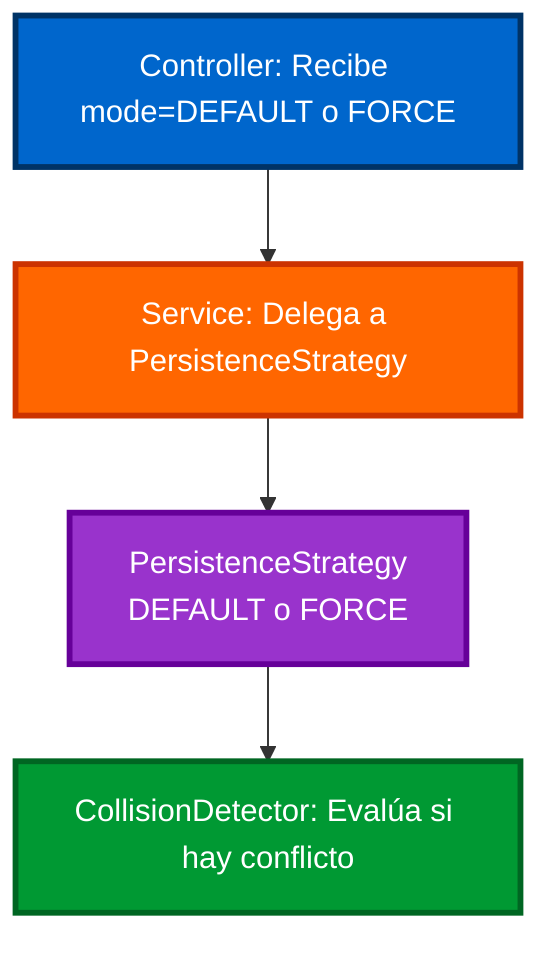
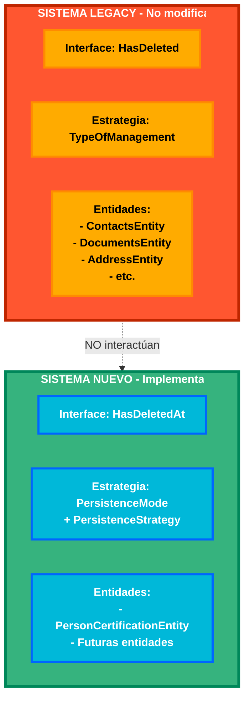
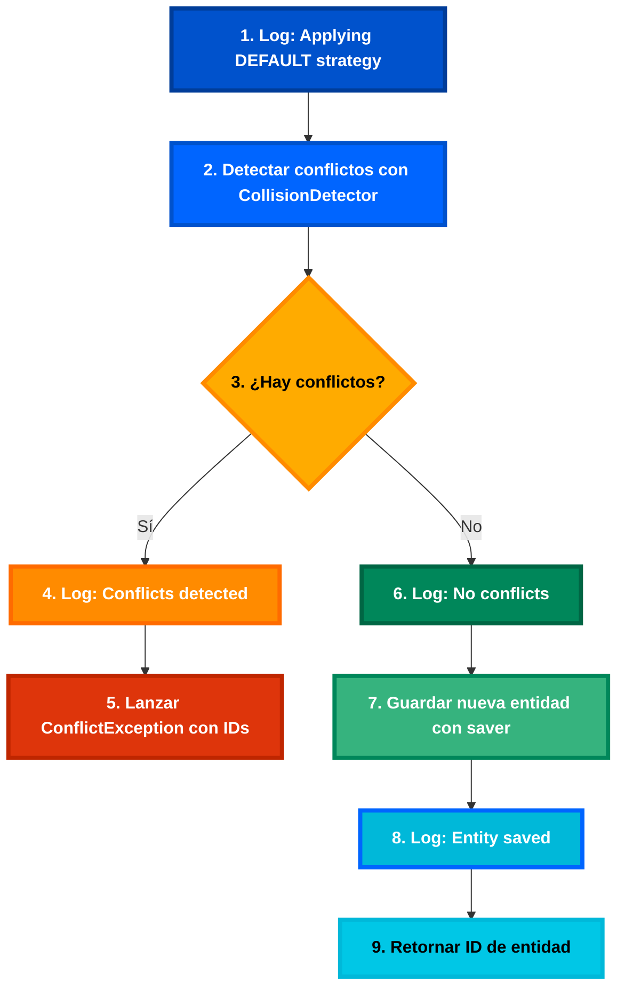
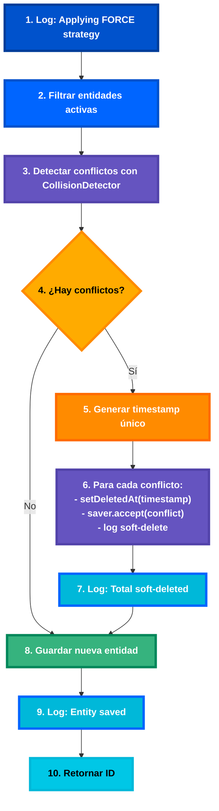
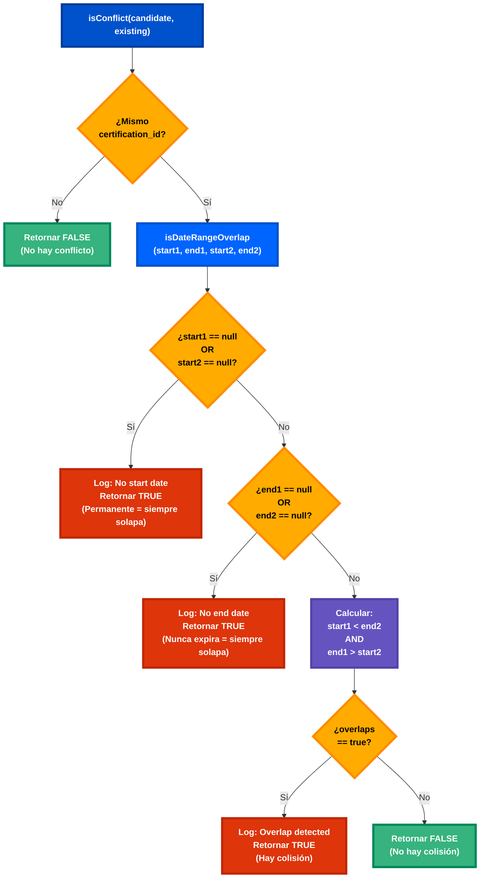
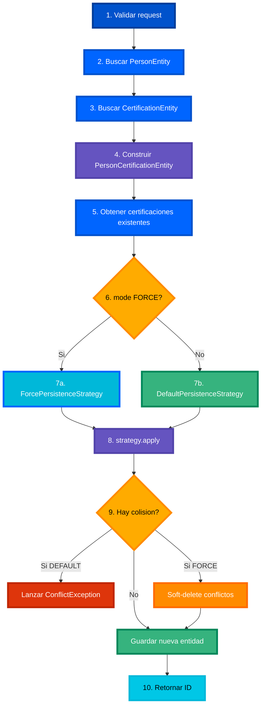
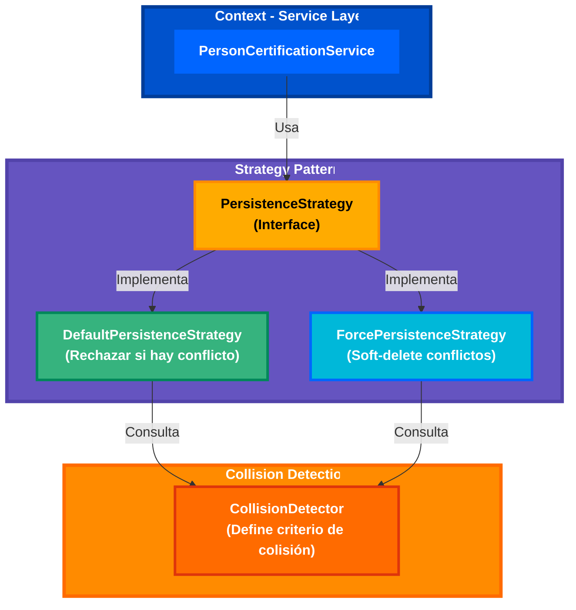

# Guía de Implementación: Estrategia Force/Default para Certificaciones

## Información del Documento
- **Propuesta Base**: [PROPUESTA_NUEVA_ESTRATEGIA_V2.md](https://github.com/raulburgosbds/documentos_bds/blob/main/research/Propuesta_nueva_estrategia_Force_Default/PROPUESTA_NUEVA_ESTRATEGIA_V2.md)
- **Entidad Objetivo**: `PersonCertificationEntity`
- **Objetivo**: Implementar estrategia de persistencia flexible con detección de colisiones
- **Sistema**: Nuevo (independiente de `TypeOfManagement` legacy)
- **Autor**: Equipo de Desarrollo
- **Versión**: 1.0
- **Fecha**: 2024

---

## Tabla de Contenidos

### Introducción
- [Visión General](#visión-general)
  - [Problema Actual](#problema-actual)
  - [Solución Propuesta](#solución-propuesta)
  - [Arquitectura de Convivencia](#arquitectura-de-convivencia)

### Implementación Paso a Paso
- [Paso 0: Crear Interface HasDeletedAt](#paso-0-crear-interface-hasdeletedAt-prerequisito)
- [Paso 1: Actualizar PersonCertificationEntity](#paso-1-actualizar-personcertificationentity-y-repositorio)
- [Paso 2: Interfaces Base](#paso-2-interfaces-base-infraestructura-genérica)
- [Paso 3: Excepción Personalizada](#paso-3-excepción-personalizada)
- [Paso 4: Implementación de Estrategias](#paso-4-implementación-de-estrategias)
- [Paso 5: Detector de Colisiones](#paso-5-detector-de-colisiones-para-certificaciones)
- [Paso 6: Enum PersistenceMode](#paso-6-enum-persistencemode)
- [Paso 7: Integración en el Service](#paso-7-integración-en-el-service)
- [Paso 8: Controller](#paso-8-controller)

### Verificación y Testing
- [Checklist de Implementación](#checklist-de-implementación)
- [Ejemplos de Tests](#ejemplos-de-tests)

### Referencia
- [Análisis Comparativo](#análisis-comparativo-con-sistema-anterior)
- [Próximos Pasos](#próximos-pasos)

---

## Visión General

### Problema Actual

El sistema actual utiliza `TypeOfManagement` con 4 modos (`ONLY`, `REMOVING_SAME_TYPE`, `REMOVING_REST`, `REMOVING_SAME_TYPE_AND_ORIGIN`) que mezcla:
- Criterio de detección de colisiones
- Acción a tomar cuando hay colisión
- Lógica repetida en cada servicio

Esta arquitectura presenta las siguientes limitaciones:
- Alta complejidad ciclomática en los servicios
- Duplicación de código entre servicios
- Dificultad para extender con nuevas reglas de negocio
- Acoplamiento entre criterio de detección y acción

### Solución Propuesta

Se propone separar responsabilidades utilizando el **Patrón Strategy**:

1. **CollisionDetector** (El Criterio) - Define qué constituye una colisión
2. **PersistenceStrategy** (La Acción) - Define qué hacer cuando hay colisión
3. **HasDeletedAt** (Interface Nueva) - Provee acceso directo a `deletedAt` para timestamp consistente

**Flujo de Ejecución:**



### Arquitectura de Convivencia

**Importante:** El nuevo sistema NO reemplaza el sistema legacy. Ambos conviven independientemente:



**Características clave:**
- No hay interacción entre ambos sistemas
- Convivencia sin conflictos
- Migración gradual opcional

---

## Paso 0: Crear Interface HasDeletedAt (Prerequisito)

### Ubicación
`library/model/src/main/java/ar/com/bds/lib/peoplecenter/model/interfaces/HasDeletedAt.java`

### Justificación

**Problema con `HasDeleted` existente:**

La interface `HasDeleted` solo provee métodos booleanos para soft-delete:
```java
public interface HasDeleted {
    boolean isDeleted();
    void setDeleted(boolean deleted);  // Genera timestamp automáticamente
}
```

Esto presenta una limitación: no es posible controlar el timestamp de eliminación, resultando en timestamps diferentes para múltiples entidades eliminadas en la misma operación:
```java
entity1.setDeleted(true);  // deletedAt = 10:00:00.123
entity2.setDeleted(true);  // deletedAt = 10:00:00.456  // Diferentes timestamps
```

**Solución con `HasDeletedAt`:**

La nueva interface permite acceso directo al campo `deletedAt`:
```java
ZonedDateTime timestamp = ZonedDateTime.now();
entity1.setDeletedAt(timestamp);  // deletedAt = 10:00:00.123
entity2.setDeletedAt(timestamp);  // deletedAt = 10:00:00.123  // Mismo timestamp
```

### Decisión de Diseño: Independencia de HasDeleted

`HasDeletedAt` es independiente de `HasDeleted` por las siguientes razones:

1. **Separación clara**: Sistema nuevo vs sistema legacy
2. **Simplicidad**: Solo un método para soft-delete (`setDeletedAt()`)
3. **Sin redundancia**: No hay métodos innecesarios
4. **No hay necesidad de compatibilidad**: Los dos sistemas no interactúan

### Código

```java
package ar.com.bds.lib.peoplecenter.model.interfaces;

import java.time.ZonedDateTime;

/**
 * Interface for entities that support soft-delete with direct access to deletedAt timestamp.
 * 
 * This interface is used by the new PersistenceStrategy system (Force/Default modes).
 * For legacy TypeOfManagement system, entities should continue using HasDeleted.
 * 
 * This interface allows setting a consistent timestamp across multiple entities,
 * which is important for audit trails and data consistency.
 */
public interface HasDeletedAt {
    
    /**
     * Get the soft-delete timestamp.
     * @return ZonedDateTime when the entity was deleted, or null if not deleted
     */
    ZonedDateTime getDeletedAt();
    
    /**
     * Set the soft-delete timestamp directly.
     * This allows setting a consistent timestamp across multiple entities.
     * 
     * @param deletedAt Timestamp when the entity was deleted, or null to mark as not deleted
     */
    void setDeletedAt(ZonedDateTime deletedAt);
    
    /**
     * Check if the entity is soft-deleted.
     * @return true if deletedAt is not null, false otherwise
     */
    default boolean isDeleted() {
        return getDeletedAt() != null;
    }
}
```

### Beneficios

| Característica | Beneficio |
|----------------|-----------|
| **Timestamp consistente** | Múltiples entidades pueden tener el mismo `deletedAt` |
| **Independiente** | No depende del sistema legacy `HasDeleted` |
| **Minimalista** | Solo 3 métodos: `getDeletedAt()`, `setDeletedAt()`, `isDeleted()` |
| **Default method** | `isDeleted()` se implementa automáticamente |

---

## Paso 1: Actualizar PersonCertificationEntity y Repositorio

### Parte A: Actualizar Repositorio

**Qué se hará:** Se cambiará la interface base del repositorio de `JpaRepositoryWithTypeOfManagement` (sistema legacy) a `JpaRepository` estándar de Spring Data.

**Por qué:** El repositorio actual extiende `JpaRepositoryWithTypeOfManagement`, que es parte del sistema `TypeOfManagement` que estamos reemplazando. Esta interface legacy impone restricciones innecesarias, específicamente requiere que la entidad implemente `HasType`. Al cambiar a `JpaRepository` estándar, eliminamos esta dependencia y simplificamos tanto el repositorio como la entidad.

**Cambio específico:** Solo se modifica la línea `extends`, cambiando de `JpaRepositoryWithTypeOfManagement<PersonCertificationEntity, Long>` a `JpaRepository<PersonCertificationEntity, Long>`. Los métodos personalizados (`findByIdAndPersonId_Id`, `findByPersonId`, `findValidCertifications`) permanecen sin cambios.

#### Ubicación
`microservice/src/main/java/ar/com/bds/people/center/repository/PersonCertificationRepository.java`

#### Cambios Necesarios

**Estado Anterior:**
```java
@Repository
public interface PersonCertificationRepository extends
    JpaRepositoryWithTypeOfManagement<PersonCertificationEntity, Long> {
    
    Optional<PersonCertificationEntity> findByIdAndPersonId_Id(Long id, Long personId);
    Set<PersonCertificationEntity> findByPersonId(PersonEntity personId);
    
    @Query("SELECT pc FROM PersonCertificationEntity pc " +
           "WHERE pc.personId.id = :personId " +
           "AND pc.deletedAt IS NULL " +
           "AND (pc.startDate IS NULL OR pc.startDate <= :now) " +
           "AND (pc.endDate IS NULL OR pc.endDate >= :now)")
    List<PersonCertificationEntity> findValidCertifications(
        @Param("personId") Long personId,
        @Param("now") ZonedDateTime now);
}
```

**Estado Posterior:**
```java
@Repository
public interface PersonCertificationRepository extends
    JpaRepository<PersonCertificationEntity, Long> {  // Cambio: JpaRepository estándar
    
    Optional<PersonCertificationEntity> findByIdAndPersonId_Id(Long id, Long personId);
    Set<PersonCertificationEntity> findByPersonId(PersonEntity personId);
    
    @Query("SELECT pc FROM PersonCertificationEntity pc " +
           "WHERE pc.personId.id = :personId " +
           "AND pc.deletedAt IS NULL " +
           "AND (pc.startDate IS NULL OR pc.startDate <= :now) " +
           "AND (pc.endDate IS NULL OR pc.endDate >= :now)")
    List<PersonCertificationEntity> findValidCertifications(
        @Param("personId") Long personId,
        @Param("now") ZonedDateTime now);
}
```

#### Justificación

El cambio de `JpaRepositoryWithTypeOfManagement` a `JpaRepository` estándar es necesario porque:

1. **Elimina dependencia del sistema legacy**: `JpaRepositoryWithTypeOfManagement` es parte del sistema `TypeOfManagement` que se está reemplazando
2. **Simplifica la entidad**: `JpaRepositoryWithTypeOfManagement` requiere que la entidad implemente `HasType`, lo cual ya no es necesario
3. **Reduce acoplamiento**: El repositorio estándar no impone restricciones sobre las interfaces de la entidad
4. **Facilita testing**: Repositorios estándar son más fáciles de mockear

---

### Parte B: Actualizar Entidad

**Qué se hará:** Se simplificará la entidad `PersonCertificationEntity` eliminando las interfaces `HasDeleted` y `HasType`, y reemplazándolas con `HasDeletedAt`. También se eliminarán los métodos `isDeleted()`, `setDeleted()` y `getType()` que actualmente se implementan manualmente.

**Por qué:** Con el cambio del repositorio a `JpaRepository` estándar, ya no es necesario implementar `HasType`. Además, la nueva interface `HasDeletedAt` provee un método default para `isDeleted()` y Lombok genera automáticamente `getDeletedAt()` y `setDeletedAt()`, eliminando la necesidad de implementar manualmente `isDeleted()` y `setDeleted()`.

**Cambios específicos:**
1. **Imports:** Eliminar `HasDeleted` y `HasType`, agregar `HasDeletedAt`
2. **Implements:** Cambiar de `HasId, HasDeleted, HasType` a `HasId, HasDeletedAt`
3. **Métodos eliminados:** `isDeleted()`, `setDeleted()`, `getType()` (aproximadamente 15 líneas de código)
4. **Campo `deletedAt`:** Permanece sin cambios (Lombok genera los getters/setters)

#### Ubicación
`microservice/src/main/java/ar/com/bds/people/center/entity/PersonCertificationEntity.java`

#### Cambios Necesarios

**Estado Anterior:**
```java
import ar.com.bds.lib.peoplecenter.model.interfaces.HasDeleted;
import ar.com.bds.lib.peoplecenter.model.interfaces.HasId;
import ar.com.bds.lib.peoplecenter.model.interfaces.HasType;

@Getter
@Setter
@Entity
@Table(name = "person_certification")
@NoArgsConstructor
@AllArgsConstructor
@Builder
@Where(clause = "deleted_at IS NULL")
public class PersonCertificationEntity implements HasId, HasDeleted, HasType {
    
    @Id
    @GeneratedValue(strategy = GenerationType.IDENTITY)
    private Long id;
    
    @JoinColumn(name = "person_id", nullable = false)
    @ManyToOne
    @JsonBackReference
    private PersonEntity personId;
    
    @Column(name = "url", nullable = false, length = 250)
    private String url;
    
    @JoinColumn(name = "certification_id", nullable = false)
    @ManyToOne
    private CertificationEntity certification;
    
    @Column(name = "percentage", precision = 5, scale = 4)
    private BigDecimal percentage;
    
    @Column(name = "aliquot", precision = 5, scale = 4)
    private BigDecimal aliquot;
    
    @Column(name = "start_date")
    private ZonedDateTime startDate;
    
    @Column(name = "end_date")
    private ZonedDateTime endDate;
    
    @Column(name = "created_at", updatable = false, nullable = false)
    @CreationTimestamp
    private ZonedDateTime createdAt;
    
    @Column(name = "deleted_at")
    private ZonedDateTime deletedAt;
    
    @Override
    public boolean isDeleted() {
        return deletedAt != null;
    }
    
    @Override
    public void setDeleted(boolean deleted) {
        this.deletedAt = deleted ? ZonedDateTime.now() : null;
    }
    
    @Override
    public String getType() {
        return certification.getCode();
    }
}
```

**Estado Posterior:**
```java
import ar.com.bds.lib.peoplecenter.model.interfaces.HasDeletedAt;
import ar.com.bds.lib.peoplecenter.model.interfaces.HasId;

@Getter
@Setter
@Entity
@Table(name = "person_certification")
@NoArgsConstructor
@AllArgsConstructor
@Builder
@Where(clause = "deleted_at IS NULL")
public class PersonCertificationEntity implements HasId, HasDeletedAt {
    
    @Id
    @GeneratedValue(strategy = GenerationType.IDENTITY)
    private Long id;
    
    @JoinColumn(name = "person_id", nullable = false)
    @ManyToOne
    @JsonBackReference
    private PersonEntity personId;
    
    @Column(name = "url", nullable = false, length = 250)
    private String url;
    
    @JoinColumn(name = "certification_id", nullable = false)
    @ManyToOne
    private CertificationEntity certification;
    
    @Column(name = "percentage", precision = 5, scale = 4)
    private BigDecimal percentage;
    
    @Column(name = "aliquot", precision = 5, scale = 4)
    private BigDecimal aliquot;
    
    @Column(name = "start_date")
    private ZonedDateTime startDate;
    
    @Column(name = "end_date")
    private ZonedDateTime endDate;
    
    @Column(name = "created_at", updatable = false, nullable = false)
    @CreationTimestamp
    private ZonedDateTime createdAt;
    
    @Column(name = "deleted_at")
    private ZonedDateTime deletedAt;
    
    // Lombok (@Getter/@Setter) genera automáticamente:
    //    - public ZonedDateTime getDeletedAt() { return this.deletedAt; }
    //    - public void setDeletedAt(ZonedDateTime deletedAt) { this.deletedAt = deletedAt; }
    // HasDeletedAt provee como default method:
    //    - public boolean isDeleted() { return getDeletedAt() != null; }
}
```

### Resumen de Cambios

| Aspecto | Antes (HasDeleted + HasType) | Después (HasDeletedAt) |
|---------|------------------------------|------------------------|
| **Repositorio** | `JpaRepositoryWithTypeOfManagement` | `JpaRepository` |
| **Import HasDeleted** | Sí | No |
| **Import HasType** | Sí | No |
| **Import HasDeletedAt** | No | Sí |
| **Implements** | `HasId, HasDeleted, HasType` | `HasId, HasDeletedAt` |
| **Método isDeleted()** | Implementar manualmente | Default method |
| **Método setDeleted()** | Implementar manualmente | No necesario |
| **Método getType()** | Implementar manualmente | No necesario |
| **Líneas de código** | ~15 líneas de métodos | 0 líneas (todo automático) |

### Beneficios

- Reducción de código boilerplate
- Código más mantenible
- Acceso directo a timestamp
- Separación clara del sistema legacy

---

## Paso 2: Interfaces Base (Infraestructura Genérica)

### Archivo 1: CollisionDetector

**Qué se hará:** Se creará una interface funcional `CollisionDetector` que define la lógica para detectar colisiones entre entidades.

**Por qué:** Esta interface separa la responsabilidad de "qué es una colisión" de "qué hacer cuando hay una colisión". Esto permite que diferentes entidades tengan diferentes criterios de colisión (por ejemplo, certificaciones se basan en fechas solapadas, mientras que otros tipos de entidades podrían tener criterios diferentes) sin duplicar la lógica de persistencia.

**Características clave:**
- Es una `@FunctionalInterface`, lo que permite usarla como lambda para casos simples
- Recibe dos entidades: la candidata (nueva) y la existente
- Retorna `true` si hay conflicto, `false` si no lo hay
- Es genérica (`<T>`), funciona con cualquier tipo de entidad

**Ubicación:** `microservice/src/main/java/ar/com/bds/people/center/strategy/CollisionDetector.java`

### Código

```java
package ar.com.bds.people.center.strategy;

/**
 * Functional interface that defines collision detection logic.
 * Separates the "what is a collision" from "what to do about it".
 * 
 * @param <T> Entity type
 */
@FunctionalInterface
public interface CollisionDetector<T> {
    
    /**
     * Evaluates if the candidate entity conflicts with an existing entity.
     * 
     * @param candidate New entity to be saved
     * @param existing Existing entity in the database
     * @return true if there is a conflict (overlap, duplicate, etc.), false otherwise
     */
    boolean isConflict(T candidate, T existing);
}
```

### Justificación

- **Separación de responsabilidades**: El criterio de colisión es independiente de la acción
- **Reusabilidad**: El mismo detector puede usarse con diferentes estrategias
- **Testeable**: Fácil de probar en aislamiento
- **Functional Interface**: Puede usarse como lambda para casos simples

**Ejemplo de uso:**
```java
// Como lambda
CollisionDetector<PersonCertificationEntity> detector = 
    (candidate, existing) -> candidate.getCertification().equals(existing.getCertification());

// Como clase
@Component
public class CertificationCollisionDetector implements CollisionDetector<PersonCertificationEntity> {
    @Override
    public boolean isConflict(PersonCertificationEntity candidate, PersonCertificationEntity existing) {
        // Lógica compleja aquí
    }
}
```

---

### Archivo 2: PersistenceStrategy

**Qué se hará:** Se creará una interface `PersistenceStrategy` que define cómo persistir una entidad cuando se detectan conflictos.

**Por qué:** Esta interface implementa el patrón Strategy, permitiendo diferentes comportamientos de persistencia (DEFAULT rechaza, FORCE sobrescribe) sin modificar el código del servicio. Separa la responsabilidad de "qué hacer cuando hay colisión" de la lógica de negocio principal.

**Características clave:**
- Genérica: funciona con cualquier entidad que implemente `HasId` y `HasDeletedAt`
- Recibe 4 parámetros:
  1. `newEntity`: La entidad a guardar
  2. `storedEntities`: Entidades existentes en la BD
  3. `saver`: Función para persistir (típicamente `repository::save`)
  4. `detector`: Lógica de detección de colisiones
- Retorna el ID de la entidad guardada
- Puede lanzar `ConflictException` si la estrategia es DEFAULT y hay conflictos

**Ubicación:** `microservice/src/main/java/ar/com/bds/people/center/strategy/PersistenceStrategy.java`

### Código

```java
package ar.com.bds.people.center.strategy;

import ar.com.bds.lib.peoplecenter.model.interfaces.HasDeletedAt;
import ar.com.bds.lib.peoplecenter.model.interfaces.HasId;

import java.util.Collection;
import java.util.function.Consumer;

/**
 * Strategy pattern for handling entity persistence with collision detection.
 * Defines HOW to persist an entity when conflicts are detected.
 * 
 * @param <T> Entity type (must have ID and support soft-delete with timestamp access)
 */
public interface PersistenceStrategy<T extends HasId & HasDeletedAt> {
    
    /**
     * Apply the persistence strategy.
     * 
     * @param newEntity Entity to be saved
     * @param storedEntities Existing entities in the database
     * @param saver Function to save/update entities (typically repository::save)
     * @param detector Collision detection logic
     * @return ID of the saved entity
     * @throws ConflictException if strategy is DEFAULT and conflicts are detected
     */
    Long apply(
        T newEntity,
        Collection<T> storedEntities,
        Consumer<T> saver,
        CollisionDetector<T> detector
    );
}
```

### Justificación

- **Genérico**: Funciona con cualquier entidad que implemente `HasId` y `HasDeletedAt`
- **Flexible**: El `saver` puede ser cualquier método de persistencia
- **Desacoplado**: No depende de repositorios específicos
- **Timestamp consistente**: `HasDeletedAt` permite acceso directo a `setDeletedAt()`

**Parámetros:**
- `newEntity`: La entidad a guardar
- `storedEntities`: Las entidades existentes en la base de datos
- `saver`: Función para persistir (ejemplo: `repository::save`)
- `detector`: Lógica que define qué constituye una colisión

---

## Paso 3: Excepción Personalizada

**Qué se hará:** Se creará una excepción personalizada `ConflictException` que se lanza cuando la estrategia DEFAULT detecta conflictos.

**Por qué:** Una excepción personalizada permite transportar información rica sobre el conflicto (no solo un mensaje de texto). Específicamente, incluye los IDs de los registros conflictivos, lo cual es invaluable para debugging y para que el cliente de la API sepa exactamente qué registros están causando el problema.

**Características clave:**
- Extiende `RuntimeException` (no requiere declaración explícita en firmas de métodos)
- Usa `@Getter` de Lombok para generar automáticamente el getter de `conflictingIds`
- Almacena una lista de IDs (`List<Long>`) de los registros en conflicto
- Tiene dos constructores:
  1. Con colección de entidades: extrae automáticamente los IDs
  2. Solo con mensaje: para casos donde no hay IDs específicos
- Genérica en el constructor: acepta cualquier `Collection<T extends HasId>`

**Uso en la API:**
Esta excepción será capturada por el `ControllerExceptionHandler` y convertida en una respuesta HTTP 409 (Conflict) con un JSON que incluye tanto el mensaje como los IDs conflictivos.

### Ubicación
`microservice/src/main/java/ar/com/bds/people/center/exception/ConflictException.java`

### Código

```java
package ar.com.bds.people.center.exception;

import ar.com.bds.lib.peoplecenter.model.interfaces.HasId;
import lombok.Getter;

import java.util.Collection;
import java.util.List;
import java.util.stream.Collectors;

/**
 * Exception thrown when a conflict is detected in DEFAULT mode.
 * Contains metadata about the conflicting entities.
 */
@Getter
public class ConflictException extends RuntimeException {
    
    private final List<Long> conflictingIds;
    
    public <T extends HasId> ConflictException(String message, Collection<T> conflicts) {
        super(message);
        this.conflictingIds = conflicts.stream()
                .map(HasId::getId)
                .collect(Collectors.toList());
    }
    
    public ConflictException(String message) {
        super(message);
        this.conflictingIds = List.of();
    }
}
```

### Justificación

- **Metadatos enriquecidos**: Incluye IDs de registros conflictivos
- **Facilita debugging**: Permite identificar qué registros causan el conflicto
- **Integración con API**: Puede incluirse en la respuesta HTTP

---

### Actualización de ControllerExceptionHandler

**Ubicación del archivo:**
```
microservice/src/main/java/ar/com/bds/people/center/controller/exception/ControllerExceptionHandler.java
```

**Qué se hará:** Se agregará un nuevo método `@ExceptionHandler` para capturar `ConflictException` y convertirla en una respuesta HTTP 409 (Conflict) con metadatos enriquecidos.

**Dónde agregar:** El nuevo método debe agregarse **después del handler de `TooManyChannelExistException`** (línea 57-62) y **antes del handler de `DocumentNotFoundException`** (línea 64-68).

**Por qué esta posición:** Se mantiene el orden lógico agrupando todos los handlers de HTTP 409 (Conflict) juntos.

#### Contexto del Archivo

El archivo actualmente tiene esta estructura:

```java
@ControllerAdvice
@Order(Ordered.HIGHEST_PRECEDENCE)
@Slf4j
public class ControllerExceptionHandler {
    
    // ... otros handlers ...
    
    @ExceptionHandler(TooManyChannelExistException.class)
    public ResponseEntity<BdsApiError> handleTooManyChannelExistException(...) {
        // Handler existente
    }
    
    // ← AGREGAR NUEVO HANDLER AQUÍ (después de línea 62)
    
    @ExceptionHandler(DocumentNotFoundException.class)
    public ResponseEntity<BdsApiError> handleException(...) {
        // Handler existente
    }
    
    // ... otros handlers ...
}
```

#### Código a Agregar

Insertar el siguiente método **después de la línea 62**:

```java
@ExceptionHandler(ConflictException.class)
public ResponseEntity<BdsApiError> handleConflictException(
        ConflictException exception, WebRequest request) {
    
    BdsApiError error = this.buildError(exception, request);
    
    // Add conflict metadata
    error.addError("CONFLICT_DETECTED", exception.getMessage());
    error.addError("CONFLICTING_IDS", exception.getConflictingIds().toString());
    
    return new ResponseEntity<>(error, HttpStatus.CONFLICT);
}
```

#### Archivo Completo (Sección Relevante)

Así quedará el archivo después de agregar el nuevo handler:

```java
    @ExceptionHandler(TooManyChannelExistException.class)
    public ResponseEntity<BdsApiError> handleTooManyChannelExistException(
            TooManyChannelExistException exception, WebRequest request) {
        BdsApiError error = this.buildError(exception, request);
        error.addError(exception.getMessage(), exception.getErrorMessage());
        return new ResponseEntity<>(error, HttpStatus.CONFLICT);
    }

    @ExceptionHandler(ConflictException.class)  // ← NUEVO HANDLER
    public ResponseEntity<BdsApiError> handleConflictException(
            ConflictException exception, WebRequest request) {
        
        BdsApiError error = this.buildError(exception, request);
        
        // Add conflict metadata
        error.addError("CONFLICT_DETECTED", exception.getMessage());
        error.addError("CONFLICTING_IDS", exception.getConflictingIds().toString());
        
        return new ResponseEntity<>(error, HttpStatus.CONFLICT);
    }

    @ExceptionHandler(DocumentNotFoundException.class)
    public ResponseEntity<BdsApiError> handleException(
            DocumentNotFoundException exception, WebRequest request) {
        BdsApiError error = this.buildError(exception, request);
        return new ResponseEntity<>(error, HttpStatus.NOT_FOUND);
    }
```

#### Notas Importantes

1. **No se requieren imports adicionales**: El archivo ya tiene `import ar.com.bds.people.center.exception.*;` en la línea 5, lo cual incluye automáticamente `ConflictException`.

2. **Método `buildError()`**: Este método privado ya existe en el archivo (línea 78-84) y se reutiliza para construir el objeto `BdsApiError` base.

3. **Metadatos adicionales**: El método agrega dos campos al error:
   - `CONFLICT_DETECTED`: El mensaje de la excepción
   - `CONFLICTING_IDS`: Lista de IDs de registros conflictivos

4. **HTTP Status**: Retorna `HttpStatus.CONFLICT` (409), que es el código apropiado para conflictos de recursos.

#### Respuesta HTTP Ejemplo

Cuando se lanza una `ConflictException`, el cliente recibirá:

```json
{
  "status": 409,
  "error": "Conflict",
  "message": "Cannot save entity: conflicts detected with existing records [IDs: 123, 456]. Use mode=FORCE to override.",
  "errors": {
    "CONFLICT_DETECTED": "Cannot save entity: conflicts detected with existing records [IDs: 123, 456]. Use mode=FORCE to override.",
    "CONFLICTING_IDS": "[123, 456]"
  },
  "timestamp": "2024-01-15T10:30:00Z",
  "path": "/api/v1/people/789/certifications"
}
```

#### Verificación

Después de agregar el método, verificar que:
-  El archivo compila sin errores
-  El método está entre los handlers de `TooManyChannelExistException` y `DocumentNotFoundException`
-  La indentación es consistente con el resto del archivo
-  No hay imports faltantes (ya están todos)

---

## Paso 4: Implementación de Estrategias

### Archivo 1: DefaultPersistenceStrategy

**Qué se hará:** Se implementará la estrategia DEFAULT que rechaza la persistencia si detecta cualquier colisión con registros existentes.

**Por qué:** Esta es la estrategia "segura" que protege la integridad de datos. Se usa en operaciones normales donde no se debe permitir duplicados o solapamientos. Si hay conflicto, lanza una excepción con información detallada sobre qué registros están en conflicto.

**Flujo de ejecución:**
1. Filtra las entidades existentes para quedarse solo con las activas (no eliminadas)
2. Usa el `CollisionDetector` para identificar conflictos
3. Si encuentra conflictos: construye un mensaje de error con los IDs conflictivos y lanza `ConflictException`
4. Si NO hay conflictos: persiste la nueva entidad y retorna su ID

**Características clave:**
- Anotada con `@Component("defaultPersistenceStrategy")` para inyección de dependencias
- Genérica: funciona con cualquier entidad `<T extends HasId & HasDeletedAt>`
- Logging detallado para trazabilidad
- Mensaje de error informativo que incluye IDs de registros conflictivos
- Sugiere usar `mode=FORCE` en el mensaje de error

**Ubicación:** `microservice/src/main/java/ar/com/bds/people/center/strategy/impl/DefaultPersistenceStrategy.java`

### Código

```java
package ar.com.bds.people.center.strategy.impl;

import ar.com.bds.lib.peoplecenter.model.interfaces.HasDeletedAt;
import ar.com.bds.lib.peoplecenter.model.interfaces.HasId;
import ar.com.bds.people.center.exception.ConflictException;
import ar.com.bds.people.center.strategy.CollisionDetector;
import ar.com.bds.people.center.strategy.PersistenceStrategy;
import lombok.extern.slf4j.Slf4j;
import org.springframework.stereotype.Component;

import java.util.Collection;
import java.util.List;
import java.util.function.Consumer;
import java.util.stream.Collectors;

/**
 * DEFAULT Strategy: Strict validation.
 * Rejects persistence if any collision is detected.
 * 
 * Use case: Normal operations where data integrity is critical.
 */
@Component("defaultPersistenceStrategy")
@Slf4j
public class DefaultPersistenceStrategy<T extends HasId & HasDeletedAt>
        implements PersistenceStrategy<T> {

    @Override
    public Long apply(
            T newEntity,
            Collection<T> storedEntities,
            Consumer<T> saver,
            CollisionDetector<T> detector) {
        
        log.info("Applying DEFAULT strategy for entity type: {}", 
                 newEntity.getClass().getSimpleName());

        // Detect conflicts (only check active records)
        List<T> conflicts = storedEntities.stream()
                .filter(existing -> !existing.isDeleted())
                .filter(existing -> detector.isConflict(newEntity, existing))
                .collect(Collectors.toList());

        // Reject if conflicts exist
        if (!conflicts.isEmpty()) {
            log.warn("DEFAULT strategy: {} conflict(s) detected. Rejecting persistence.", 
                     conflicts.size());
            
            // Build detailed error message
            String conflictIds = conflicts.stream()
                    .map(c -> String.valueOf(c.getId()))
                    .collect(Collectors.joining(", "));
            
            throw new ConflictException(
                String.format("Cannot save entity: conflicts detected with existing records [IDs: %s]. " +
                             "Use mode=FORCE to override.", conflictIds),
                conflicts
            );
        }

        // No conflicts: proceed with save
        log.info("DEFAULT strategy: No conflicts detected. Proceeding with save.");
        saver.accept(newEntity);
        return newEntity.getId();
    }
}
```

### Comportamiento



### Características

- **Fail-fast**: Detecta y rechaza inmediatamente si hay colisiones
- **Información detallada**: La excepción incluye IDs de registros conflictivos
- **Logging completo**: Trazabilidad para auditoría
- **Protección de integridad**: Garantiza consistencia de datos

---

### Archivo 2: ForcePersistenceStrategy

**Qué se hará:** Se implementará la estrategia FORCE que soft-delete los registros conflictivos antes de persistir la nueva entidad.

**Por qué:** Esta estrategia se usa cuando se necesita "forzar" la creación de un registro, sobrescribiendo conflictos existentes. Es útil para correcciones administrativas, migraciones de datos, o cuando el usuario explícitamente quiere reemplazar datos existentes. La clave de esta implementación es que todos los registros eliminados en la misma operación reciben el MISMO timestamp, facilitando la auditoría.

**Flujo de ejecución:**
1. Filtra las entidades existentes para quedarse solo con las activas (no eliminadas)
2. Usa el `CollisionDetector` para identificar conflictos
3. Si encuentra conflictos:
   - Genera UN SOLO timestamp (`ZonedDateTime.now()`)
   - Aplica ese mismo timestamp a TODOS los registros conflictivos usando `setDeletedAt()`
   - Persiste cada registro conflictivo (soft-deleted)
   - Registra en logs cada eliminación
4. Persiste la nueva entidad
5. Retorna el ID de la nueva entidad

**Características clave:**
- Anotada con `@Component("forcePersistenceStrategy")` para inyección de dependencias
- **Timestamp consistente**: CRÍTICO - todos los conflictos tienen el mismo `deletedAt`
- Acceso directo a `setDeletedAt()` sin necesidad de casting (gracias a `HasDeletedAt`)
- Logging detallado: registra cuántos conflictos se eliminaron y cuándo
- Nunca falla: siempre persiste la nueva entidad, eliminando conflictos si es necesario

**Diferencia clave con DEFAULT:** DEFAULT rechaza si hay conflictos, FORCE los elimina y continúa.

**Ubicación:** `microservice/src/main/java/ar/com/bds/people/center/strategy/impl/ForcePersistenceStrategy.java`

### Código

```java
package ar.com.bds.people.center.strategy.impl;

import ar.com.bds.lib.peoplecenter.model.interfaces.HasDeletedAt;
import ar.com.bds.lib.peoplecenter.model.interfaces.HasId;
import ar.com.bds.people.center.strategy.CollisionDetector;
import ar.com.bds.people.center.strategy.PersistenceStrategy;
import lombok.extern.slf4j.Slf4j;
import org.springframework.stereotype.Component;

import java.time.ZonedDateTime;
import java.util.Collection;
import java.util.List;
import java.util.function.Consumer;
import java.util.stream.Collectors;

/**
 * FORCE Strategy: Soft-delete conflicts and proceed.
 * Ensures the new entity takes precedence by soft-deleting conflicting records.
 * 
 * Use case: Override operations, data migrations, admin corrections.
 */
@Component("forcePersistenceStrategy")
@Slf4j
public class ForcePersistenceStrategy<T extends HasId & HasDeletedAt>
        implements PersistenceStrategy<T> {

    @Override
    public Long apply(
            T newEntity,
            Collection<T> storedEntities,
            Consumer<T> saver,
            CollisionDetector<T> detector) {
        
        log.info("Applying FORCE strategy for entity type: {}", 
                 newEntity.getClass().getSimpleName());

        // Detect conflicts (only check active records)
        List<T> conflicts = storedEntities.stream()
                .filter(existing -> !existing.isDeleted())
                .filter(existing -> detector.isConflict(newEntity, existing))
                .collect(Collectors.toList());

        // Soft-delete conflicts with consistent timestamp
        if (!conflicts.isEmpty()) {
            log.info("FORCE strategy: {} conflict(s) detected. Applying soft-delete.", 
                     conflicts.size());
            
            // CRITICAL: Use consistent timestamp for all deletions
            ZonedDateTime deletionTimestamp = ZonedDateTime.now();
            
            conflicts.forEach(conflict -> {
                conflict.setDeletedAt(deletionTimestamp);
                saver.accept(conflict);
                log.info("FORCE strategy: Soft-deleted conflicting entity ID: {}", 
                         conflict.getId());
            });
            
            log.info("FORCE strategy: Soft-deleted {} conflicting record(s) at {}.", 
                     conflicts.size(), deletionTimestamp);
        } else {
            log.info("FORCE strategy: No conflicts detected.");
        }

        // Save new entity
        saver.accept(newEntity);
        log.info("FORCE strategy: New entity saved with ID: {}", newEntity.getId());
        return newEntity.getId();
    }
}
```

### Comportamiento



**Nota importante:** El paso 6 ejecuta soft-delete + save **dentro del mismo loop** para cada conflicto, garantizando que todos tengan el mismo timestamp pero se persistan inmediatamente.

### Características Clave

- **Timestamp consistente**: Todos los soft-deletes utilizan el mismo timestamp
- **Sin type casting**: `HasDeletedAt` permite acceso directo a `setDeletedAt()`
- **Logging detallado**: Registra cada soft-delete para auditoría
- **Precedencia clara**: El nuevo registro siempre prevalece
- **Trazabilidad**: Fácil identificar registros eliminados en la misma operación

**Ejemplo de timestamp consistente:**
```java
// Con FORCE strategy:
conflict1.setDeletedAt(deletionTimestamp);  // deletedAt = 2024-01-01 10:00:00.123
conflict2.setDeletedAt(deletionTimestamp);  // deletedAt = 2024-01-01 10:00:00.123
conflict3.setDeletedAt(deletionTimestamp);  // deletedAt = 2024-01-01 10:00:00.123
// Todos tienen el mismo timestamp - facilita auditoría
```

---

## Paso 5: Detector de Colisiones para Certificaciones

**Qué se hará:** Se implementará `CertificationCollisionDetector`, la lógica específica que determina cuándo dos certificaciones están en conflicto.

**Por qué:** Las certificaciones tienen reglas de negocio específicas: no puede haber dos certificaciones del mismo tipo con fechas solapadas para la misma persona. Este detector encapsula esa lógica de negocio en un componente reutilizable y testeable.

**Reglas de negocio implementadas:**
1. **Mismo tipo de certificación**: Solo hay conflicto si ambas certificaciones son del mismo tipo (mismo `certification_id`)
2. **Fechas solapadas**: Las fechas deben solaparse para que haya conflicto
   - Si cualquier `startDate` es NULL: certificación permanente (siempre hay solapamiento)
   - Si cualquier `endDate` es NULL: certificación que nunca expira (siempre hay solapamiento)
   - Si ambas tienen `startDate` y `endDate`: aplica lógica estándar de intervalos (`start1 < end2 AND end1 > start2`)

**Ejemplos de detección:**
```
Caso 1: Mismo tipo, fechas solapadas
CERT_IVA [2024-01-01 to 2024-12-31] vs CERT_IVA [2024-06-01 to 2025-06-01]
→ CONFLICTO (se solapan de junio a diciembre 2024)

Caso 2: Mismo tipo, sin end date
CERT_IVA [2024-01-01 to NULL] vs CERT_IVA [2024-06-01 to 2024-12-31]
→ CONFLICTO (NULL significa "nunca expira", siempre solapa)

Caso 3: Mismo tipo, sin start date (certificación permanente)
CERT_IVA [NULL to 2024-12-31] vs CERT_IVA [2024-06-01 to 2024-12-31]
→ CONFLICTO (NULL en startDate significa "siempre ha existido", siempre solapa)

Caso 4: Mismo tipo, sin solapamiento
CERT_IVA [2024-01-01 to 2024-06-30] vs CERT_IVA [2024-07-01 to 2024-12-31]
→ NO CONFLICTO (una termina antes de que empiece la otra)

Caso 5: Diferente tipo
CERT_IVA [2024-01-01 to 2024-12-31] vs CERT_GANANCIAS [2024-01-01 to 2024-12-31]
→ NO CONFLICTO (diferentes tipos de certificación)
```

**Características clave:**
- Anotada con `@Component` para inyección de dependencias
- Implementa `CollisionDetector<PersonCertificationEntity>`
- Logging de debug para troubleshooting
- Método privado `isDateRangeOverlap()` con lógica de intervalos bien documentada
- Maneja casos edge: startDate NULL y endDate NULL

### Ubicación
`microservice/src/main/java/ar/com/bds/people/center/strategy/detectors/CertificationCollisionDetector.java`

### Código

```java
package ar.com.bds.people.center.strategy.detectors;

import ar.com.bds.people.center.entity.PersonCertificationEntity;
import ar.com.bds.people.center.strategy.CollisionDetector;
import lombok.extern.slf4j.Slf4j;
import org.springframework.stereotype.Component;

import java.time.ZonedDateTime;

/**
 * Collision detector for PersonCertificationEntity.
 * 
 * Collision Rules:
 * 1. Same certification type (certification_id)
 * 2. Date ranges overlap
 * 
 * Date Overlap Logic:
 * - If either endDate is NULL, certification never expires (always overlaps)
 * - Otherwise: startDate1 < endDate2 AND endDate1 > startDate2
 */
@Component
@Slf4j
public class CertificationCollisionDetector implements CollisionDetector<PersonCertificationEntity> {

    @Override
    public boolean isConflict(PersonCertificationEntity candidate, PersonCertificationEntity existing) {

        // Rule 1: Must be same certification type
        if (!candidate.getCertification().getId().equals(existing.getCertification().getId())) {
            return false; // Different types never conflict
        }

        // Rule 2: Date ranges must overlap
        return isDateRangeOverlap(
                candidate.getStartDate(), candidate.getEndDate(),
                existing.getStartDate(), existing.getEndDate());
    }

    /**
     * Check if two date ranges overlap.
     * 
     * Cases:
     * 1. If either startDate is NULL - permanent certification (always overlaps)
     * 2. If either endDate is NULL - never expires (always overlaps)
     * 3. Otherwise - standard interval overlap check
     */
    private boolean isDateRangeOverlap(
            ZonedDateTime start1, ZonedDateTime end1,
            ZonedDateTime start2, ZonedDateTime end2) {

        // Case 1: Either range has no start date (permanent certification)
        if (start1 == null || start2 == null) {
            log.debug("Date overlap detected: One or both ranges have no start date (permanent certification)");
            return true;
        }

        // Case 2: Either range has no end date (never expires)
        if (end1 == null || end2 == null) {
            log.debug("Date overlap detected: One or both ranges have no end date");
            return true;
        }

        // Case 3: Standard interval overlap
        // Overlap if: start1 < end2 AND end1 > start2  
        boolean overlaps = start1.isBefore(end2) && end1.isAfter(start2);

        if (overlaps) {
            log.debug("Date overlap detected: [{} to {}] overlaps with [{} to {}]",
                    start1, end1, start2, end2);
        }

        return overlaps;
    }
}
```

### Diagrama de Flujo



### Ejemplos Visuales del Flujo

#### **Ejemplo 1: Diferentes tipos de certificación**
```
Input:
  candidate.certification.id = 1 (CERT_IVA)
  existing.certification.id = 2 (CERT_GANANCIAS)

Flujo:
  isConflict() → ¿Mismo certification_id? → NO
  ↓
  Retornar FALSE (No hay conflicto)
```

#### **Ejemplo 2: Mismo tipo, sin start date (certificación permanente)**
```
Input:
  candidate: CERT_IVA [NULL to 2024-12-31]
  existing:  CERT_IVA [2024-06-01 to 2024-12-31]

Flujo:
  isConflict() → ¿Mismo certification_id? → SÍ
  ↓
  isDateRangeOverlap() → ¿start1 == null OR start2 == null? → SÍ
  ↓
  Log: "One or both ranges have no start date (permanent certification)"
  ↓
  Retornar TRUE (Hay colisión - certificación permanente)
```

#### **Ejemplo 3: Mismo tipo, sin end date**
```
Input:
  candidate: CERT_IVA [2024-01-01 to NULL]
  existing:  CERT_IVA [2024-06-01 to 2024-12-31]

Flujo:
  isConflict() → ¿Mismo certification_id? → SÍ
  ↓
  isDateRangeOverlap() → ¿start1 == null OR start2 == null? → NO
  ↓
  ¿end1 == null OR end2 == null? → SÍ
  ↓
  Log: "One or both ranges have no end date"
  ↓
  Retornar TRUE (Hay colisión - nunca expira)
```

#### **Ejemplo 4: Mismo tipo, fechas solapadas**
```
Input:
  candidate: CERT_IVA [2024-01-01 to 2024-12-31]
  existing:  CERT_IVA [2024-06-01 to 2025-06-01]

Flujo:
  isConflict() → ¿Mismo certification_id? → SÍ
  ↓
  isDateRangeOverlap() → ¿start1 == null OR start2 == null? → NO
  ↓
  ¿end1 == null OR end2 == null? → NO
  ↓
  Calcular: start1 < end2 AND end1 > start2
  → 2024-01-01 < 2025-06-01 ✓ AND 2024-12-31 > 2024-06-01 ✓
  ↓
  overlaps = TRUE
  ↓
  Log: "Date overlap detected: [2024-01-01 to 2024-12-31] overlaps with [2024-06-01 to 2025-06-01]"
  ↓
  Retornar TRUE (Hay colisión)
```

#### **Ejemplo 5: Mismo tipo, sin solapamiento**
```
Input:
  candidate: CERT_IVA [2024-01-01 to 2024-06-30]
  existing:  CERT_IVA [2024-07-01 to 2024-12-31]

Flujo:
  isConflict() → ¿Mismo certification_id? → SÍ
  ↓
  isDateRangeOverlap() → ¿start1 == null OR start2 == null? → NO
  ↓
  ¿end1 == null OR end2 == null? → NO
  ↓
  Calcular: start1 < end2 AND end1 > start2
  → 2024-01-01 < 2024-12-31 ✓ AND 2024-06-30 > 2024-07-01 ✗
  ↓
  overlaps = FALSE
  ↓
  Retornar FALSE (No hay colisión - una termina antes de que empiece la otra)
```

### Lógica de Detección

**Regla 1: Mismo tipo de certificación**
```java
// Solo hay colisión si es el mismo tipo
CERT_IVA vs CERT_IVA → Puede haber colisión (continuar a Regla 2)
CERT_IVA vs CERT_GANANCIAS → NO hay colisión (diferentes tipos)
```

**Regla 2: Fechas solapadas**
```java
// Caso 1: startDate NULL (certificación permanente)
[NULL to 2024-12-31] vs [2024-06-01 to 2024-12-31] → Colisión

// Caso 2: endDate NULL (nunca expira)
[2024-01-01 to NULL] vs [2024-06-01 to 2024-12-31] → Colisión

// Caso 3: Solapamiento estándar
[2024-01-01 to 2024-12-31] vs [2024-06-01 to 2025-06-01] → Colisión
[2024-01-01 to 2024-06-30] vs [2024-07-01 to 2024-12-31] → NO colisión
```

### Características

- **Lógica centralizada**: Un solo lugar para definir criterios de colisión
- **Testeable**: Fácil de probar con diferentes combinaciones de fechas
- **Bien documentado**: Casos edge (null dates) claramente explicados
- **Logging**: Debug logs para troubleshooting

---

## Paso 6: Enum PersistenceMode

**Qué se hará:** Se creará un enum `PersistenceMode` con dos valores: `DEFAULT` y `FORCE`.

**Por qué:** Este enum reemplaza el complejo `TypeOfManagement` (que tenía 4 valores confusos) con una API más simple y clara. Solo define la "acción" a tomar cuando hay conflictos, mientras que el "criterio" de qué es un conflicto está en el `CollisionDetector`. Esta separación hace el sistema más flexible y fácil de entender.

**Valores:**
1. **DEFAULT**: Modo estricto
   - Rechaza la operación si detecta conflictos
   - Lanza `ConflictException` con detalles
   - Uso: Operaciones normales donde la integridad es crítica
   - Ejemplo: Usuario creando una certificación desde la UI

2. **FORCE**: Modo override
   - Soft-delete los conflictos y continúa
   - Nunca falla (siempre persiste la nueva entidad)
   - Uso: Correcciones administrativas, migraciones, overrides explícitos
   - Ejemplo: Admin corrigiendo datos erróneos

**Comparación con TypeOfManagement:**
- TypeOfManagement: 4 modos (ONLY, REMOVING_SAME_TYPE, REMOVING_REST, REMOVING_SAME_TYPE_AND_ORIGIN)
- PersistenceMode: 2 modos (DEFAULT, FORCE)
- Más simple, más claro, más mantenible

**Ubicación:** Este enum va en `library/model` porque es parte del contrato de la API (se usa en requests HTTP).

### Ubicación
`library/model/src/main/java/ar/com/bds/lib/peoplecenter/model/enums/PersistenceMode.java`

### Código

```java
package ar.com.bds.lib.peoplecenter.model.enums;

/**
 * Persistence mode for handling entity conflicts.
 * 
 * Replaces the legacy TypeOfManagement enum with a simpler, clearer API.
 * This enum is used by the new PersistenceStrategy system.
 */
public enum PersistenceMode {
    
    /**
     * DEFAULT: Strict validation.
     * Rejects persistence if conflicts are detected.
     * Use for normal operations where data integrity is critical.
     */
    DEFAULT,
    
    /**
     * FORCE: Override conflicts.
     * Soft-deletes conflicting records and proceeds with save.
     * Use for admin overrides, data migrations, or corrections.
     */
    FORCE
}
```

### Comparación con TypeOfManagement

| Aspecto | TypeOfManagement (Legacy) | PersistenceMode (Nuevo) |
|---------|---------------------------|-------------------------|
| **Número de modos** | 4 | 2 |
| **Nombres** | ONLY, REMOVING_SAME_TYPE, etc. | DEFAULT, FORCE |
| **Claridad semántica** | Limitada | Alta |
| **Mezcla de concerns** | Sí (criterio + acción) | No (solo acción) |
| **Sistema** | Legacy | Nuevo |

### Beneficios

- **Simplicidad**: Solo 2 modos en lugar de 4
- **Claridad**: Nombres más descriptivos e intuitivos
- **Separación**: El criterio está en el `CollisionDetector`, no en el enum
- **Coexistencia**: Puede coexistir con `TypeOfManagement` durante migración

---

## Paso 7: Integración en el Service

**Qué se hará:** Se actualizará `PersonCertificationServiceImpl` para usar el nuevo sistema de estrategias en lugar de lógica hardcodeada.

**Por qué:** Actualmente el servicio no tiene lógica de detección de conflictos. Con esta integración, el servicio delegará toda la lógica de persistencia a las estrategias, manteniendo el código del servicio limpio y enfocado en orquestar las operaciones de negocio (validar, buscar entidades relacionadas, mapear DTOs).

**Cambios en el servicio:**
1. **Inyección de dependencias**: Se agregan 3 nuevas dependencias via constructor:
   - `defaultStrategy`: Implementación de la estrategia DEFAULT
   - `forceStrategy`: Implementación de la estrategia FORCE
   - `collisionDetector`: Detector específico para certificaciones

2. **Firma del método `create()`**: Se agrega parámetro `PersistenceMode mode`
   - Antes: `create(Long personId, CreatePersonCertificationRequest request)`
   - Después: `create(Long personId, CreatePersonCertificationRequest request, PersistenceMode mode)`

3. **Lógica de persistencia**: Se reemplaza el simple `repository.save()` con:
   - Obtener certificaciones existentes de la persona
   - Seleccionar estrategia según el `mode` (ternario: `mode == FORCE ? forceStrategy : defaultStrategy`)
   - Delegar a la estrategia con: `strategy.apply(newEntity, existingCertifications, repository::save, collisionDetector)`

---

### Archivo 1: Interface PersonCertificationService

**Qué se hará:** Se actualizará la firma del método `create()` en la interface para usar `PersistenceMode` en lugar de `TypeOfManagement`.

**Por qué:** La interface define el contrato del servicio. Al cambiar el parámetro a `PersistenceMode`, estamos migrando del sistema legacy al nuevo sistema de estrategias.

**Ubicación:** `microservice/src/main/java/ar/com/bds/people/center/service/PersonCertificationService.java`

#### Cambios Necesarios

**Antes:**
```java
package ar.com.bds.people.center.service;

import ar.com.bds.lib.peoplecenter.model.enums.TypeOfManagement;  // ← Legacy
import ar.com.bds.lib.peoplecenter.model.requests.CreatePersonCertificationRequest;
import ar.com.bds.lib.peoplecenter.model.PersonCertification;

import java.util.List;

public interface PersonCertificationService {
    Long create(Long personId, CreatePersonCertificationRequest request, TypeOfManagement typeOfManagement);
    
    List<PersonCertification> getValidCertifications(Long personId);
    PersonCertification getById(Long personId, Long certificationId);
    Long delete(Long personId, Long certificationId);
}
```

**Después:**
```java
package ar.com.bds.people.center.service;

import ar.com.bds.lib.peoplecenter.model.enums.PersistenceMode;  // ← Nuevo
import ar.com.bds.lib.peoplecenter.model.requests.CreatePersonCertificationRequest;
import ar.com.bds.lib.peoplecenter.model.PersonCertification;

import java.util.List;

public interface PersonCertificationService {
    Long create(Long personId, CreatePersonCertificationRequest request, PersistenceMode mode);  // ← Nuevo
    
    List<PersonCertification> getValidCertifications(Long personId);
    PersonCertification getById(Long personId, Long certificationId);
    Long delete(Long personId, Long certificationId);
}
```

#### Resumen de Cambios

| Aspecto | Antes | Después |
|---------|-------|---------|
| **Import** | `import ar.com.bds.lib.peoplecenter.model.enums.TypeOfManagement;` | `import ar.com.bds.lib.peoplecenter.model.enums.PersistenceMode;` |
| **Parámetro del método** | `TypeOfManagement typeOfManagement` | `PersistenceMode mode` |
| **Nombre de variable** | `typeOfManagement` (largo) | `mode` (conciso) |

---

### Archivo 2: Implementación PersonCertificationServiceImpl

**Ubicación:** `microservice/src/main/java/ar/com/bds/people/center/service/impl/PersonCertificationServiceImpl.java`

**Flujo completo del método:**
1. Validar request (reglas de negocio)
2. Buscar person (verificar que existe)
3. Buscar certification type (verificar que existe)
4. Construir nueva entidad (mapear DTO a entity)
5. Obtener certificaciones existentes de la persona
6. **NUEVO**: Seleccionar estrategia según mode
7. **NUEVO**: Aplicar estrategia (detecta conflictos y persiste según corresponda)
8. Retornar ID de la entidad guardada

**Ventajas de esta arquitectura:**
- El servicio NO conoce la lógica de detección de conflictos
- El servicio NO conoce la lógica de soft-delete
- Fácil agregar nuevas estrategias sin modificar el servicio
- Fácil testear: mockear strategies y detector

### Ubicación
`microservice/src/main/java/ar/com/bds/people/center/service/impl/PersonCertificationServiceImpl.java`

### Código

**⚠️ Nota Importante sobre Inyección de Dependencias:**

Como hay **dos beans del mismo tipo** `PersistenceStrategy<PersonCertificationEntity>`:
- `defaultPersistenceStrategy` (implementado por `DefaultPersistenceStrategy`)
- `forcePersistenceStrategy` (implementado por `ForcePersistenceStrategy`)

Spring **no puede determinar automáticamente** cuál inyectar. Por eso:
-  **NO podemos usar** `@RequiredArgsConstructor` de Lombok
-  **Debemos crear** un constructor explícito con `@Qualifier`

```java
@Service
@Slf4j  // ← NO usar @RequiredArgsConstructor
public class PersonCertificationServiceImpl implements PersonCertificationService {

    private final PersonCertificationRepository personCertificationRepository;
    private final CertificationRepository certificationRepository;
    private final PeopleCenterRepository peopleCenterRepository;
    private final PersonCertificationMapper mapper;
    private final CertificationValidator validator;
    
    // Inject strategies (requiere @Qualifier en el constructor)
    private final PersistenceStrategy<PersonCertificationEntity> defaultStrategy;
    private final PersistenceStrategy<PersonCertificationEntity> forceStrategy;
    
    // Inject detector
    private final CertificationCollisionDetector collisionDetector;

    //  Constructor explícito con @Qualifier para disambiguar las estrategias
    public PersonCertificationServiceImpl(
            PersonCertificationRepository personCertificationRepository,
            CertificationRepository certificationRepository,
            PeopleCenterRepository peopleCenterRepository,
            PersonCertificationMapper mapper,
            CertificationValidator validator,
            @Qualifier("defaultPersistenceStrategy") PersistenceStrategy<PersonCertificationEntity> defaultStrategy,
            @Qualifier("forcePersistenceStrategy") PersistenceStrategy<PersonCertificationEntity> forceStrategy,
            CertificationCollisionDetector collisionDetector) {
        
        this.personCertificationRepository = personCertificationRepository;
        this.certificationRepository = certificationRepository;
        this.peopleCenterRepository = peopleCenterRepository;
        this.mapper = mapper;
        this.validator = validator;
        this.defaultStrategy = defaultStrategy;
        this.forceStrategy = forceStrategy;
        this.collisionDetector = collisionDetector;
    }

    @Override
    @Transactional
    public Long create(Long personId, CreatePersonCertificationRequest request, 
                      PersistenceMode mode) {
        
        log.info("Creating certification for person: {} with mode: {}", personId, mode);

        // 1. Validate business rules
        validator.validateRequest(request);

        // 2. Find person
        PersonEntity person = peopleCenterRepository.findById(personId)
                .orElseThrow(() -> new ResourceNotFoundException(
                        "Person not found with id: " + personId));

        // 3. Find certification type
        CertificationEntity certification = certificationRepository
                .findByCode(request.getCertificationCode())
                .orElseThrow(() -> new ResourceNotFoundException(
                        "Certification not found with code: " + request.getCertificationCode()));

        // 4. Build entity
        PersonCertificationEntity entity = PersonCertificationEntity.builder()
                .personId(person)
                .url(request.getUrl())
                .certification(certification)
                .percentage(request.getPercentage())
                .aliquot(request.getAliquot())
                .startDate(request.getStartDate())
                .endDate(request.getEndDate())
                .build();

        // 5. Get existing certifications
        Set<PersonCertificationEntity> existingCertifications = 
                personCertificationRepository.findByPersonId(person);

        // 6. Select strategy based on mode
        PersistenceStrategy<PersonCertificationEntity> strategy = 
                mode == PersistenceMode.FORCE ? forceStrategy : defaultStrategy;

        // 7. Apply strategy
        Long savedId = strategy.apply(
            entity,
            existingCertifications,
            personCertificationRepository::save,  // Saver function
            collisionDetector                     // Collision detector
        );

        log.info("Certification created with ID: {}", savedId);
        return savedId;
    }
}
```

**Imports Necesarios:**
```java
import org.springframework.beans.factory.annotation.Qualifier;  // ← REQUERIDO
import org.springframework.stereotype.Service;
import org.springframework.transaction.annotation.Transactional;
import lombok.extern.slf4j.Slf4j;
//  NO importar: import lombok.RequiredArgsConstructor;
```

**¿Por qué @Qualifier es necesario?**

Sin `@Qualifier`, Spring lanzará este error al iniciar la aplicación:

```
***************************
APPLICATION FAILED TO START
***************************

Description:

Parameter 5 of constructor in PersonCertificationServiceImpl 
required a single bean, but 2 were found:
	- defaultPersistenceStrategy
	- forcePersistenceStrategy

Action:

Consider marking one of the beans as @Primary, updating the consumer 
to accept multiple beans, or using @Qualifier to identify the bean 
that should be consumed
```

**Cómo funciona @Qualifier:**

El `@Qualifier("nombreDelBean")` le dice a Spring **exactamente qué bean inyectar**:

| @Qualifier | Bean Inyectado | Clase |
|------------|----------------|-------|
| `@Qualifier("defaultPersistenceStrategy")` | `defaultStrategy` | `DefaultPersistenceStrategy` |
| `@Qualifier("forcePersistenceStrategy")` | `forceStrategy` | `ForcePersistenceStrategy` |

Los nombres coinciden con los definidos en `@Component("nombreDelBean")` de cada estrategia.


### Flujo de Ejecución



### Características

- **Inyección de dependencias**: Strategies y detector son beans de Spring
- **Selección dinámica**: Estrategia se elige en runtime según el `mode`
- **Bajo acoplamiento**: Service no conoce la lógica interna de las estrategias
- **Alta testabilidad**: Fácil mockear strategies y detector

---

## Paso 8: Controller

**Qué se hará:** Se actualizará el endpoint `createCertification` en `CertificationsController` para aceptar el parámetro `mode` y pasarlo al servicio.

**Por qué:** El controller es la capa de entrada de la API REST. Necesita exponer el nuevo parámetro `mode` para que los clientes puedan elegir entre DEFAULT y FORCE. Esta es la única capa que cambia en términos de API pública.

**Cambios en el endpoint:**
1. **Nuevo parámetro `@RequestParam`**:
   - Nombre: `mode`
   - Tipo: `PersistenceMode` (enum)
   - Default: `DEFAULT` (comportamiento seguro por defecto)
   - Opcional: Sí (si no se especifica, usa DEFAULT)

2. **Documentación OpenAPI/Swagger**:
   - Se agrega `@Parameter` con descripción clara
   - Se especifica `schema` con valores permitidos: `{"DEFAULT", "FORCE"}`
   - Se agrega `@ApiResponse` para HTTP 409 (Conflict) cuando mode=DEFAULT

3. **Llamada al servicio**:
   - Antes: `certificationService.create(personId, request)`
   - Después: `certificationService.create(personId, request, mode)`

**Ejemplos de uso de la API:**

```bash
# Modo DEFAULT (por defecto) - rechaza si hay conflicto
POST /api/v1/people/123/certifications
POST /api/v1/people/123/certifications?mode=DEFAULT

# Modo FORCE - sobrescribe conflictos
POST /api/v1/people/123/certifications?mode=FORCE
```

**Respuestas HTTP:**
- **201 Created**: Certificación creada exitosamente (ambos modos)
- **409 Conflict**: Conflicto detectado (solo mode=DEFAULT)
  - Body incluye IDs de registros conflictivos
  - Mensaje sugiere usar `mode=FORCE`
- **400 Bad Request**: Datos inválidos en el request
- **404 Not Found**: Person o certification type no existe

**Ventajas:**
- API clara y autodocumentada (Swagger)
- Comportamiento seguro por defecto (DEFAULT)
- Flexibilidad para casos especiales (FORCE)
- Retrocompatible: si no se especifica mode, funciona como DEFAULT

### Ubicación
`microservice/src/main/java/ar/com/bds/people/center/controller/CertificationsController.java`

### Imports Necesarios

Asegúrate de tener estos imports en el controller:

```java
import ar.com.bds.lib.peoplecenter.model.enums.PersistenceMode;  // ← Nuevo enum
import org.springframework.http.MediaType;                        // ← Para consumes/produces
import org.springframework.http.HttpStatus;
import org.springframework.http.ResponseEntity;
import io.swagger.v3.oas.annotations.Parameter;
import io.swagger.v3.oas.annotations.media.Schema;
import io.swagger.v3.oas.annotations.responses.ApiResponse;
import io.swagger.v3.oas.annotations.responses.ApiResponses;
```

### Código del Endpoint

```java
@PostMapping(consumes = MediaType.APPLICATION_JSON_VALUE, 
             produces = MediaType.APPLICATION_JSON_VALUE)
@Operation(summary = "Create a new certification for a person")
@ApiResponses(value = {
        @ApiResponse(responseCode = "201", description = "Certification created successfully"),
        @ApiResponse(responseCode = "400", description = "Invalid request data"),
        @ApiResponse(responseCode = "404", description = "Person or certification type not found"),
        @ApiResponse(responseCode = "409", description = "Conflict detected (DEFAULT mode)"),
        @ApiResponse(responseCode = "500", description = "Internal server error")
})
public ResponseEntity<Long> createCertification(
        @PathVariable Long personId,
        @Parameter(description = "Persistence mode: DEFAULT (strict) or FORCE (override)", 
                   schema = @Schema(allowableValues = {"DEFAULT", "FORCE"}))
        @RequestParam(name = "mode", defaultValue = "DEFAULT") PersistenceMode mode,
        @Valid @RequestBody CreatePersonCertificationRequest request) {

    log.info("POST /v2/people/{}/certifications - Mode: {} - CertificationCode: {}", 
             personId, mode, request.getCertificationCode());
    
    Long certificationId = certificationService.create(personId, request, mode);
    
    log.info("Certification created successfully with ID: {} for person: {}", 
             certificationId, personId);
    
    return ResponseEntity.status(HttpStatus.CREATED).body(certificationId);
}
```

**Logging Strategy:**
- **Entrada**: Loguea personId, mode y certificationCode (datos clave del request)
- **Salida**: Loguea el ID de la certificación creada
- **Nivel INFO**: Operaciones normales de negocio
- **No loguea**: Datos sensibles o todo el request (evita logs excesivos)
- **Excepciones**: Manejadas automáticamente por `ControllerExceptionHandler` (ya loguea allí)
```

### Ejemplos de Uso

**Modo DEFAULT (validación estricta):**
```bash
POST /api/v1/people/123/certifications?mode=DEFAULT
{
  "certificationCode": "CERT_IVA",
  "startDate": "2024-01-01T00:00:00Z",
  "endDate": "2024-12-31T23:59:59Z"
}

# Si hay colisión: HTTP 409 Conflict
```

**Modo FORCE (override):**
```bash
POST /api/v1/people/123/certifications?mode=FORCE
{
  "certificationCode": "CERT_IVA",
  "startDate": "2024-01-01T00:00:00Z",
  "endDate": "2024-12-31T23:59:59Z"
}

# Si hay colisión: Soft-delete y crea nueva - HTTP 201 Created
```

### Características

- **API clara**: `mode=DEFAULT` vs `mode=FORCE` es semánticamente claro
- **Documentación OpenAPI**: Swagger muestra claramente las opciones
- **Default seguro**: DEFAULT es el comportamiento por defecto
- **HTTP status apropiado**: 409 Conflict para colisiones

---

## Checklist de Implementación

### Paso 0: Prerequisito - Interface HasDeletedAt

- [ ] **Crear interface** `HasDeletedAt` en `library/model/src/main/java/ar/com/bds/lib/peoplecenter/model/interfaces/HasDeletedAt.java`
  - [ ] Métodos: `getDeletedAt()`, `setDeletedAt(ZonedDateTime)`, `isDeleted()` (default)
  - [ ] Verificar que NO extiende `HasDeleted`
  - [ ] Documentación Javadoc completa

### Paso 1: Actualizar PersonCertificationEntity y Repositorio

#### Parte A: Repositorio
- [ ] **Migrar** `PersonCertificationRepository` de `JpaRepositoryWithTypeOfManagement` a `JpaRepository<PersonCertificationEntity, Long>`
  - [ ] Cambiar extends en la declaración
  - [ ] Verificar que `findByPersonId()` retorna `Set<PersonCertificationEntity>`
  - [ ] Eliminar métodos relacionados con `TypeOfManagement` si existen

#### Parte B: Entidad
- [ ] **Actualizar** `PersonCertificationEntity`
  - [ ] Implementar `HasDeletedAt` (agregar `implements HasDeletedAt`)
  - [ ] Eliminar `implements HasDeleted`
  - [ ] Eliminar `implements HasType`
  - [ ] Eliminar métodos manuales: `isDeleted()`, `setDeleted()`, `getType()`
  - [ ] Verificar anotaciones Lombok: `@Getter`, `@Setter`, `@Builder`
  - [ ] Verificar campo `deletedAt` existe en la entidad

### Paso 2: Interfaces Base (Infraestructura Genérica)

- [ ] **Crear** `CollisionDetector<T>` en `microservice/.../strategy/CollisionDetector.java`
  - [ ] Método: `boolean isConflict(T candidate, T existing)`
  - [ ] Functional interface (`@FunctionalInterface`)
  - [ ] Documentación Javadoc

- [ ] **Crear** `PersistenceStrategy<T>` en `microservice/.../strategy/PersistenceStrategy.java`
  - [ ] Método: `Long apply(T newEntity, Collection<T> storedEntities, Consumer<T> saver, CollisionDetector<T> detector)`
  - [ ] Constraint genérico: `<T extends HasId & HasDeletedAt>`
  - [ ] Documentación de parámetros

### Paso 3: Excepción Personalizada

- [ ] **Crear** `ConflictException` en `microservice/.../exception/ConflictException.java`
  - [ ] Extiende `RuntimeException`
  - [ ] Campo: `List<Long> conflictingIds` con `@Getter`
  - [ ] Constructor: `ConflictException(String message, Collection<T> conflicts)`
  - [ ] Constructor sobrecargado: `ConflictException(String message)`
  - [ ] Extrae IDs usando `stream().map(HasId::getId)`

- [ ] **Actualizar** `ControllerExceptionHandler`
  - [ ] Agregar método `handleConflictException(ConflictException, WebRequest)`
  - [ ] Ubicación: Después de `TooManyChannelExistException` (línea ~62)
  - [ ] Retorna HTTP 409 (Conflict)
  - [ ] Agrega metadatos: `CONFLICT_DETECTED` y `CONFLICTING_IDS`
  - [ ] Verificar que NO requiere imports adicionales (ya existe `import ar.com.bds.people.center.exception.*;`)

### Paso 4: Implementación de Estrategias

#### DefaultPersistenceStrategy
- [ ] **Crear** `DefaultPersistenceStrategy` en `microservice/.../strategy/impl/DefaultPersistenceStrategy.java`
  - [ ] Anotación: `@Component("defaultPersistenceStrategy")`
  - [ ] Implementa: `PersistenceStrategy<T extends HasId & HasDeletedAt>`
  - [ ] Lógica: Filtra activos → Detecta conflictos → Si hay, lanza `ConflictException`
  - [ ] Logging: INFO al inicio, WARN si hay conflictos
  - [ ] Mensaje de excepción sugiere usar `mode=FORCE`

#### ForcePersistenceStrategy
- [ ] **Crear** `ForcePersistenceStrategy` en `microservice/.../strategy/impl/ForcePersistenceStrategy.java`
  - [ ] Anotación: `@Component("forcePersistenceStrategy")`
  - [ ] Implementa: `PersistenceStrategy<T extends HasId & HasDeletedAt>`
  - [ ] Lógica: Filtra activos → Detecta conflictos → Soft-delete con timestamp único → Guarda nueva entidad
  - [ ] **CRÍTICO**: `ZonedDateTime deletionTimestamp = ZonedDateTime.now()` UNA SOLA VEZ
  - [ ] Loop: `conflict.setDeletedAt(deletionTimestamp)` + `saver.accept(conflict)`
  - [ ] Logging: INFO al inicio, INFO por cada soft-delete, INFO con total

### Paso 5: Detector de Colisiones para Certificaciones

- [ ] **Crear** `CertificationCollisionDetector` en `microservice/.../strategy/detectors/CertificationCollisionDetector.java`
  - [ ] Anotación: `@Component`
  - [ ] Implementa: `CollisionDetector<PersonCertificationEntity>`
  - [ ] Regla 1: Mismo `certification.getId()`
  - [ ] Regla 2: Fechas solapadas (método privado `isDateRangeOverlap`)
  - [ ] Caso especial: `endDate == null` → siempre solapa
  - [ ] Logging: DEBUG para troubleshooting

### Paso 6: Enum PersistenceMode

- [ ] **Crear** `PersistenceMode` en `library/model/.../enums/PersistenceMode.java`
  - [ ] Valores: `DEFAULT`, `FORCE`
  - [ ] Javadoc para cada valor
  - [ ] Ubicación: Mismo paquete que `TypeOfManagement`

### Paso 7: Integración en el Service

#### Interface
- [ ] **Actualizar** `PersonCertificationService` interface
  - [ ] Cambiar import: `TypeOfManagement` → `PersistenceMode`
  - [ ] Cambiar firma: `create(Long personId, CreatePersonCertificationRequest request, PersistenceMode mode)`

#### Implementación
- [ ] **Actualizar** `PersonCertificationServiceImpl`
  - [ ] Cambiar import: `TypeOfManagement` → `PersistenceMode`
  - [ ] **⚠️ IMPORTANTE**: NO usar `@RequiredArgsConstructor` (hay ambigüedad en la inyección)
  - [ ] Agregar import: `import org.springframework.beans.factory.annotation.Qualifier;`
  - [ ] Remover: `import lombok.RequiredArgsConstructor;`
  - [ ] Crear constructor explícito con `@Qualifier`:
    - [ ] `@Qualifier("defaultPersistenceStrategy") PersistenceStrategy<PersonCertificationEntity> defaultStrategy`
    - [ ] `@Qualifier("forcePersistenceStrategy") PersistenceStrategy<PersonCertificationEntity> forceStrategy`
    - [ ] `CertificationCollisionDetector collisionDetector`
    - [ ] Asignar todos los campos en el constructor
  - [ ] Actualizar método `create()`:
    - [ ] Cambiar parámetro a `PersistenceMode mode`
    - [ ] Obtener certificaciones existentes: `Set<PersonCertificationEntity> existingCertifications`
    - [ ] Seleccionar estrategia: `mode == FORCE ? forceStrategy : defaultStrategy`
    - [ ] Aplicar estrategia: `strategy.apply(entity, existingCertifications, repository::save, collisionDetector)`
  - [ ] Logging: INFO al inicio con mode, INFO al final con ID creado
  - [ ] **NO usar try-catch genérico** (excepciones manejadas por `ControllerExceptionHandler`)

### Paso 8: Controller

- [ ] **Actualizar** `CertificationsController`
  - [ ] Imports necesarios:
    - [ ] `import ar.com.bds.lib.peoplecenter.model.enums.PersistenceMode;`
    - [ ] `import org.springframework.http.MediaType;`
  - [ ] Actualizar `@PostMapping`:
    - [ ] Agregar: `consumes = MediaType.APPLICATION_JSON_VALUE`
    - [ ] Agregar: `produces = MediaType.APPLICATION_JSON_VALUE`
  - [ ] Actualizar parámetro:
    - [ ] Nombre: `mode` (antes: `create-type`)
    - [ ] Tipo: `PersistenceMode` (antes: `TypeOfManagement`)
    - [ ] Default: `DEFAULT`
    - [ ] `@Parameter` con descripción y `allowableValues = {"DEFAULT", "FORCE"}`
  - [ ] Actualizar `@ApiResponses`:
    - [ ] Agregar: `@ApiResponse(responseCode = "409", description = "Conflict detected (DEFAULT mode)")`
  - [ ] Logging mejorado:
    - [ ] Entrada: `log.info("POST /v2/people/{}/certifications - Mode: {} - CertificationCode: {}", personId, mode, request.getCertificationCode())`
    - [ ] Salida: `log.info("Certification created successfully with ID: {} for person: {}", certificationId, personId)`

###  Tests

#### Tests Unitarios (Pendientes de implementación)

- [ ] **Tests del Detector (CertificationCollisionDetector)**
  - [ ] Mismo tipo + fechas solapadas → `true`
  - [ ] Mismo tipo + sin solapamiento → `false`
  - [ ] Diferente tipo → `false`
  - [ ] `endDate == null` → `true`

- [ ] **Tests de DefaultPersistenceStrategy**
  - [ ] Sin conflictos → guarda exitosamente
  - [ ] Con conflictos → lanza `ConflictException`
  - [ ] Verifica IDs en la excepción

- [ ] **Tests de ForcePersistenceStrategy**
  - [ ] Sin conflictos → guarda exitosamente
  - [ ] Con conflictos → soft-delete + guarda nueva
  - [ ] **CRÍTICO**: Verificar timestamp consistente en todos los soft-deletes

#### Tests de Integración (Pendientes de implementación)

- [ ] **Tests de Integración del Endpoint**
  - [ ] Endpoint con `mode=DEFAULT` + conflicto → HTTP 409
  - [ ] Endpoint con `mode=FORCE` + conflicto → HTTP 201 + soft-delete
  - [ ] Endpoint sin conflicto → HTTP 201 (ambos modos)

#### Tests Existentes ( ACTUALIZADOS Y COMPILANDO)

- [x] **PersonCertificationServiceTest** -  ACTUALIZADO
  - [x] Imports cambiados: `TypeOfManagement` → `PersistenceMode`
  - [x] Mocks agregados: `defaultStrategy`, `forceStrategy`, `collisionDetector`
  - [x] Tests actualizados para usar `PersistenceMode.DEFAULT`
  - [x] Verificaciones cambiadas: `repository.saveWithTypeOfManagement()` → `strategy.apply()`
  - [x] **Compilación**:  SUCCESS

- [x] **CertificationsControllerTest** -  ACTUALIZADO
  - [x] Imports cambiados: `TypeOfManagement` → `PersistenceMode`
  - [x] Parámetro HTTP cambiado: `create-type` → `mode`
  - [x] Valores actualizados: `ONLY` → `DEFAULT`, `REMOVING_SAME_TYPE` → `FORCE`
  - [x] **Compilación**:  SUCCESS

- [ ] **PersonCertificationRepository Tests**
  - [ ] Verificar que siguen funcionando después del cambio de `JpaRepositoryWithTypeOfManagement` a `JpaRepository`

###  Documentación

- [ ] **Swagger/OpenAPI**
  - [ ] Verificar que `/v2/people/{personId}/certifications` muestra parámetro `mode`
  - [ ] Verificar valores permitidos: DEFAULT, FORCE
  - [ ] Verificar respuesta 409 documentada

- [x] **Guía de Implementación** -  ACTUALIZADA
  - [x] Ejemplos de tests con código real y funcional
  - [x] Tabla comparativa Legacy vs Nuevo en tests
  - [x] Verificación de compilación incluida

- [ ] **README o Docs del Proyecto**
  - [ ] Documentar nuevo sistema de persistencia
  - [ ] Ejemplos de uso con `mode=DEFAULT` y `mode=FORCE`
  - [ ] Diferencias con sistema legacy


---

## Ejemplos de Tests

### Test del Detector (CertificationCollisionDetector)

```java
@Test
@DisplayName("Should detect collision when date ranges overlap")
void shouldDetectCollision_WhenDateRangesOverlap() {
    // Arrange
    PersonCertificationEntity existing = createCertification(
        "CERT_IVA",
        "2024-01-01T00:00:00Z",
        "2024-12-31T23:59:59Z"
    );
    
    PersonCertificationEntity candidate = createCertification(
        "CERT_IVA",
        "2024-06-01T00:00:00Z",  // Overlaps with existing
        "2025-06-01T00:00:00Z"
    );
    
    // Act
    boolean isConflict = detector.isConflict(candidate, existing);
    
    // Assert
    assertTrue(isConflict, "Should detect overlap");
}

@Test
@DisplayName("Should NOT detect collision when different certification types")
void shouldNotDetectCollision_WhenDifferentTypes() {
    // Arrange
    PersonCertificationEntity existing = createCertification(
        "CERT_IVA",
        "2024-01-01T00:00:00Z",
        "2024-12-31T23:59:59Z"
    );
    
    PersonCertificationEntity candidate = createCertification(
        "CERT_GANANCIAS",  // Different type
        "2024-01-01T00:00:00Z",
        "2024-12-31T23:59:59Z"
    );
    
    // Act
    boolean isConflict = detector.isConflict(candidate, existing);
    
    // Assert
    assertFalse(isConflict, "Different types should not conflict");
}
```

### Test de Estrategias (Unit Tests)

```java
@Test
@DisplayName("DEFAULT strategy should throw exception when conflict exists")
void defaultStrategy_ShouldThrowException_WhenConflictExists() {
    // Arrange
    PersonCertificationEntity newEntity = createCertification(...);
    List<PersonCertificationEntity> existing = List.of(createCertification(...));
    
    // Act & Assert
    assertThrows(ConflictException.class, () -> {
        defaultStrategy.apply(
            newEntity,
            existing,
            entity -> {}, // Mock saver
            (candidate, exist) -> true // Always conflict
        );
    });
}

@Test
@DisplayName("FORCE strategy should soft-delete conflicts with consistent timestamp")
void forceStrategy_ShouldSoftDeleteConflicts_WithConsistentTimestamp() {
    // Arrange
    PersonCertificationEntity newEntity = createCertification(...);
    PersonCertificationEntity conflict1 = createCertification(...);
    PersonCertificationEntity conflict2 = createCertification(...);
    List<PersonCertificationEntity> existing = List.of(conflict1, conflict2);
    
    List<PersonCertificationEntity> savedEntities = new ArrayList<>();
    
    // Act
    Long savedId = forceStrategy.apply(
        newEntity,
        existing,
        savedEntities::add, // Capture saved entities
        (candidate, exist) -> true // Always conflict
    );
    
    // Assert
    assertNotNull(savedId);
    assertTrue(conflict1.isDeleted(), "Conflict1 should be soft-deleted");
    assertTrue(conflict2.isDeleted(), "Conflict2 should be soft-deleted");
    
    // Verify consistent timestamp
    assertEquals(conflict1.getDeletedAt(), conflict2.getDeletedAt(), 
                "Both conflicts should have same deletedAt timestamp");
    
    assertEquals(3, savedEntities.size(), "Should save 2 deleted + 1 new");
}
```

### Test del Service (PersonCertificationServiceTest)

**Configuración de mocks:**

```java
@ExtendWith(MockitoExtension.class)
@DisplayName("PersonCertificationService - Unit Tests")
class PersonCertificationServiceTest {

    @Mock
    private PersonCertificationRepository personCertificationRepository;
    @Mock
    private CertificationRepository certificationRepository;
    @Mock
    private PeopleCenterRepository peopleCenterRepository;
    @Mock
    private PersonCertificationMapper mapper;
    @Mock
    private CertificationValidator validator;
    
    //  Implementación: Mocks de las estrategias
    @Mock
    private PersistenceStrategy<PersonCertificationEntity> defaultStrategy;
    @Mock
    private PersistenceStrategy<PersonCertificationEntity> forceStrategy;
    @Mock
    private CertificationCollisionDetector collisionDetector;

    // No se utiliza @InjectMocks porque necesitamos controlar la inyección de estrategias
    private PersonCertificationServiceImpl service;
    
    @BeforeEach
    void setUp() {
        //  Instanciación explícita para inyectar los mocks específicos
        service = new PersonCertificationServiceImpl(
            personCertificationRepository,
            certificationRepository,
            peopleCenterRepository,
            mapper,
            validator,
            defaultStrategy, 
            forceStrategy,
            collisionDetector
        );
        // ... resto del setup ...
    }
}
```

**Test de creación exitosa (DEFAULT mode):**

```java
@Test
@DisplayName("create() - Debe retornar ID cuando los datos son válidos (DEFAULT mode)")
void create_ShouldReturnId_WhenDataIsValid() {
    // Arrange
    when(peopleCenterRepository.findById(1L)).thenReturn(Optional.of(mockPerson));
    when(certificationRepository.findByCode("CERT_IVA")).thenReturn(Optional.of(mockCertification));
    when(personCertificationRepository.findByPersonId(mockPerson)).thenReturn(Collections.emptySet());
    
    // Configuración del mock de estrategia con matchers específicos
    when(defaultStrategy.apply(
            any(PersonCertificationEntity.class), 
            any(), 
            any(), 
            any(CertificationCollisionDetector.class)
    )).thenReturn(500L);

    // Act
    Long result = service.create(1L, mockRequest, PersistenceMode.DEFAULT);

    // Assert
    assertNotNull(result);
    assertEquals(500L, result);
    
    verify(defaultStrategy).apply(
            any(PersonCertificationEntity.class), 
            any(), 
            any(), 
            any(CertificationCollisionDetector.class)
    );
    verify(forceStrategy, never()).apply(any(), any(), any(), any());
    verify(peopleCenterRepository).findById(1L);
    verify(certificationRepository).findByCode("CERT_IVA");
}
```

**Test de error cuando persona no existe:**

```java
@Test
@DisplayName("create() - Debe lanzar ResourceNotFoundException cuando la persona no existe")
void create_ShouldThrowException_WhenPersonNotFound() {
    // Arrange
    when(peopleCenterRepository.findById(999L)).thenReturn(Optional.empty());

    // Act & Assert
    ResourceNotFoundException exception = assertThrows(
        ResourceNotFoundException.class,
        () -> service.create(999L, mockRequest, PersistenceMode.DEFAULT));

    assertTrue(exception.getMessage().contains("Person not found"));
    verify(defaultStrategy, never()).apply(any(), any(), any(), any());
    verify(forceStrategy, never()).apply(any(), any(), any(), any());
}
```

### Test del Controller (CertificationsControllerTest)

**Test con modo DEFAULT (por defecto):**

```java
@Test
@DisplayName("POST /certifications - Should return 201 and certification ID when request is valid")
void createCertification_ShouldReturn201_WhenRequestIsValid() throws Exception {
    // Arrange
    CreatePersonCertificationRequest request = CreatePersonCertificationRequest.builder()
        .certificationCode("CERT_IVA")
        .url("http://example.com/cert.pdf")
        .aliquot(new BigDecimal("0.21"))
        .startDate(ZonedDateTime.parse("2024-01-01T00:00:00Z"))
        .build();

    //  Implementación: Mock con PersistenceMode
    when(certificationService.create(anyLong(), any(CreatePersonCertificationRequest.class),
        any(PersistenceMode.class)))
        .thenReturn(CERTIFICATION_ID);

    // Act & Assert
    mockMvc.perform(post(BASE_URL, PERSON_ID)
        .contentType(MediaType.APPLICATION_JSON)
        .content(objectMapper.writeValueAsString(request)))
        .andExpect(status().isCreated())
        .andExpect(content().contentType(MediaType.APPLICATION_JSON))
        .andExpect(content().string(CERTIFICATION_ID.toString()));

    //  Implementación: Verificar que se usó PersistenceMode.DEFAULT
    verify(certificationService, times(1)).create(eq(PERSON_ID),
        any(CreatePersonCertificationRequest.class), eq(PersistenceMode.DEFAULT));
}
```

**Test con modo FORCE:**

```java
@Test
@DisplayName("POST /certifications - Should pass mode parameter (FORCE)")
void createCertification_ShouldPassMode_WhenParamIsPresent() throws Exception {
    // Arrange
    CreatePersonCertificationRequest request = CreatePersonCertificationRequest.builder()
        .certificationCode("CERT_IVA")
        .url("http://example.com/cert.pdf")
        .aliquot(new BigDecimal("0.21"))
        .startDate(ZonedDateTime.parse("2024-01-01T00:00:00Z"))
        .endDate(ZonedDateTime.parse("2024-12-31T23:59:59Z"))
        .build();

    when(certificationService.create(anyLong(), any(CreatePersonCertificationRequest.class),
        any(PersistenceMode.class)))
        .thenReturn(CERTIFICATION_ID);

    // Act & Assert -  Implementación: Parámetro "mode" en lugar de "create-type"
    mockMvc.perform(post(BASE_URL, PERSON_ID)
        .param("mode", "FORCE")  //  NUEVO nombre de parámetro
        .contentType(MediaType.APPLICATION_JSON)
        .content(objectMapper.writeValueAsString(request)))
        .andExpect(status().isCreated());

    //  Implementación: Verificar que se usó PersistenceMode.FORCE
    verify(certificationService, times(1)).create(eq(PERSON_ID),
        any(CreatePersonCertificationRequest.class), eq(PersistenceMode.FORCE));
}
```

### Resumen de Cambios en Tests

| Aspecto |  Antes (Legacy) |  Después (Nuevo) |
|---------|------------------|-------------------|
| **Import en Service Test** | `TypeOfManagement` | `PersistenceMode` |
| **Mocks en Service Test** | Solo repositorios | + `defaultStrategy`, `forceStrategy`, `collisionDetector` |
| **Mock de persistencia** | `repository.saveWithTypeOfManagement()` | `defaultStrategy.apply()` o `forceStrategy.apply()` |
| **Parámetro en create()** | `TypeOfManagement.ONLY` | `PersistenceMode.DEFAULT` |
| **Verificaciones** | `verify(repository.saveWithTypeOfManagement(...))` | `verify(defaultStrategy.apply(...))` |
| **Import en Controller Test** | `TypeOfManagement` | `PersistenceMode` |
| **Parámetro HTTP** | `create-type` | `mode` |
| **Valor DEFAULT** | `TypeOfManagement.ONLY` | `PersistenceMode.DEFAULT` |
| **Valor FORCE** | `TypeOfManagement.REMOVING_SAME_TYPE` | `PersistenceMode.FORCE` |

### Compilación Verificada 

```bash
# Compilación principal
[INFO] Compiling 209 source files
[INFO] BUILD SUCCESS

# Compilación de tests
[INFO] Compiling 47 source files
[INFO] BUILD SUCCESS
```

---

## Análisis Comparativo con Sistema Anterior

| Aspecto | TypeOfManagement (Legacy) | PersistenceMode (Nuevo) |
|---------|--------------------------|-------------------------|
| **Modos** | 4 (ONLY, REMOVING_SAME_TYPE, etc.) | 2 (DEFAULT, FORCE) |
| **Claridad** | Nombres confusos | Nombres descriptivos |
| **Lógica de colisión** | Mezclada con acción | Separada (detector) |
| **Extensibilidad** | Difícil (modificar enum y todos los services) | Fácil (crear nuevo detector) |
| **Testabilidad** | Baja (lógica acoplada) | Alta (componentes aislados) |
| **Timestamp consistente** | No garantizado | Garantizado |
| **Reusabilidad** | Baja (lógica repetida) | Alta (strategies reutilizables) |
| **Principios SOLID** | Viola varios | Cumple todos |
| **Interface de entidad** | `HasDeleted` | `HasDeletedAt` (acceso directo) |
| **Convivencia** | Sigue funcionando | Independiente |

---

## Próximos Pasos

1. **Implementar prerequisito** (HasDeletedAt interface)
2. **Migrar repositorio** (PersonCertificationRepository de JpaRepositoryWithTypeOfManagement a JpaRepository)
3. **Actualizar entidad** (PersonCertificationEntity - eliminar HasDeleted y HasType, agregar HasDeletedAt)
4. **Implementar infraestructura** (interfaces y strategies)
5. **Crear detector** para certificaciones
6. **Actualizar service** para usar strategies
7. **Actualizar controller** con nuevo enum
8. **Escribir tests** completos
9. **Verificar tests existentes** después del cambio de repositorio
10. **Migrar otras entidades** (opcional, en el futuro)

---

## Conceptos Técnicos

### Patrón Strategy
Permite definir una familia de algoritmos, encapsular cada uno y hacerlos intercambiables.



### Separación de Concerns
- **CollisionDetector**: Define qué constituye una colisión (criterio)
- **PersistenceStrategy**: Define qué hacer cuando hay colisión (acción)

### Timestamp Consistente
Todas las entidades soft-deleted en una operación tienen el mismo `deletedAt`:
```java
ZonedDateTime timestamp = ZonedDateTime.now();
conflict1.setDeletedAt(timestamp);  // 10:00:00.123
conflict2.setDeletedAt(timestamp);  // 10:00:00.123 (mismo)
```

---

**Conclusión**

Esta arquitectura con `HasDeletedAt` proporciona una solución más limpia, testeable y mantenible que el sistema anterior, garantizando timestamps consistentes para auditoría y cumpliendo con los principios SOLID de diseño de software.
