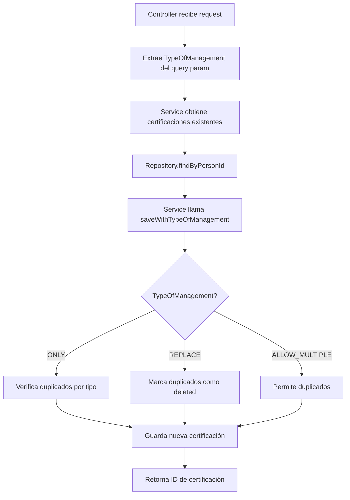

# Guía de Integración: TypeOfManagement en PersonCertification

## Introducción

Este documento explica paso a paso cómo se integró la estrategia **TypeOfManagement** en el servicio de PersonCertification para manejar duplicados de manera estandarizada.

---

## Paso 1: Preparar la Entidad PersonCertificationEntity

### 1.1 Implementar Interfaces Requeridas

La entidad debe implementar tres interfaces para que funcione con TypeOfManagement:

```java
public class PersonCertificationEntity implements HasId, HasDeleted, HasType {
    // ...
}
```

**Archivo**: [PersonCertificationEntity.java](file:///c:/repos/bds/people-center/microservice/src/main/java/ar/com/bds/people/center/entity/PersonCertificationEntity.java)

### 1.2 Agregar Imports Necesarios

```java
import ar.com.bds.lib.peoplecenter.model.interfaces.HasDeleted;
import ar.com.bds.lib.peoplecenter.model.interfaces.HasId;
import ar.com.bds.lib.peoplecenter.model.interfaces.HasType;
```

### 1.3 Implementar Métodos de las Interfaces

#### Interface `HasId`
Ya está implementado por defecto con el campo `id`:
```java
@Id
@GeneratedValue(strategy = GenerationType.IDENTITY)
private Long id;
```

#### Interface `HasDeleted`
Implementar métodos para soft delete:
```java
@Override
public boolean isDeleted() {
    return deletedAt != null;
}

@Override
public void setDeleted(boolean deleted) {
    this.deletedAt = deleted ? ZonedDateTime.now() : null;
}
```

#### Interface `HasType`
Implementar método que retorna el tipo de certificación:
```java
@Override
public String getType() {
    return certification.getCode();
}
```

> [!IMPORTANT]
> El método `getType()` retorna `certification.getCode()` porque este código identifica de manera única el tipo de certificación (ej: "CERT_IVA", "CERT_GANANCIAS").

---

## Paso 2: Actualizar el Repositorio

### 2.1 Extender JpaRepositoryWithTypeOfManagement

Cambiar la interfaz base del repositorio:

**Antes**:
```java
public interface PersonCertificationRepository extends JpaRepository<PersonCertificationEntity, Integer> {
    // ...
}
```

**Después**:
```java
public interface PersonCertificationRepository extends 
        JpaRepositoryWithTypeOfManagement<PersonCertificationEntity, Long> {
    // ...
}
```

**Archivo**: [PersonCertificationRepository.java](file:///c:/repos/bds/people-center/microservice/src/main/java/ar/com/bds/people/center/repository/PersonCertificationRepository.java)

### 2.2 Agregar Método findByPersonId

Este método es necesario para obtener las certificaciones existentes de una persona:

```java
Set<PersonCertificationEntity> findByPersonId(PersonEntity personId);
```

### 2.3 Actualizar Tipos de ID

Cambiar todos los `Integer` a `Long`:

```java
// Antes
Optional<PersonCertificationEntity> findByIdAndPersonId_Id(Integer id, Long personId);

// Después
Optional<PersonCertificationEntity> findByIdAndPersonId_Id(Long id, Long personId);
```

### 2.4 Agregar Import

```java
import java.util.Set;
```

---

## Paso 3: Actualizar la Interfaz del Servicio

### 3.1 Agregar Parámetro TypeOfManagement al Método create()

**Antes**:
```java
Integer create(Long personId, CreatePersonCertificationRequest request);
```

**Después**:
```java
Long create(Long personId, CreatePersonCertificationRequest request, TypeOfManagement typeOfManagement);
```

**Archivo**: [PersonCertificationService.java](file:///c:/repos/bds/people-center/microservice/src/main/java/ar/com/bds/people/center/service/PersonCertificationService.java)

### 3.2 Actualizar Tipos de Retorno

Cambiar `Integer` a `Long` en todos los métodos:

```java
Long create(Long personId, CreatePersonCertificationRequest request, TypeOfManagement typeOfManagement);
PersonCertification getById(Long personId, Long certificationId);
Long delete(Long personId, Long certificationId);
```

### 3.3 Agregar Import

```java
import ar.com.bds.lib.peoplecenter.model.enums.TypeOfManagement;
```

---

## Paso 4: Implementar la Lógica en el Servicio

### 4.1 Actualizar el Método create()

**Archivo**: [PersonCertificationServiceImpl.java](file:///c:/repos/bds/people-center/microservice/src/main/java/ar/com/bds/people/center/service/impl/PersonCertificationServiceImpl.java)

#### 4.1.1 Actualizar Firma del Método

```java
@Override
@Transactional
public Long create(Long personId, CreatePersonCertificationRequest request, TypeOfManagement typeOfManagement) {
    log.info("Creating certification for person: {} with strategy: {}", personId, typeOfManagement);
    // ...
}
```

#### 4.1.2 Obtener Certificaciones Existentes

Antes de guardar, obtener las certificaciones existentes de la persona:

```java
Set<PersonCertificationEntity> existingCertifications = 
    personCertificationRepository.findByPersonId(person);
```

#### 4.1.3 Usar saveWithTypeOfManagement()

Reemplazar el `save()` tradicional con el método que maneja duplicados:

**Antes**:
```java
PersonCertificationEntity saved = personCertificationRepository.save(entity);
```

**Después**:
```java
PersonCertificationEntity saved = personCertificationRepository.saveWithTypeOfManagement(
    entity, 
    existingCertifications, 
    typeOfManagement
);
```

### 4.2 Actualizar Tipos de Parámetros

Cambiar `Integer` a `Long` en los métodos `getById()` y `delete()`:

```java
@Override
public PersonCertification getById(Long personId, Long certificationId) {
    // ...
}

@Override
@Transactional
public Long delete(Long personId, Long certificationId) {
    // ...
}
```

### 4.3 Agregar Imports

```java
import ar.com.bds.lib.peoplecenter.model.enums.TypeOfManagement;
import java.util.Set;
```

---

## Paso 5: Actualizar el Controller

### 5.1 Agregar Parámetro TypeOfManagement al Endpoint POST

**Archivo**: [CertificationsController.java](file:///c:/repos/bds/people-center/microservice/src/main/java/ar/com/bds/people/center/controller/CertificationsController.java)

```java
@PostMapping
@Operation(summary = "Create a new certification for a person")
public ResponseEntity<Long> createCertification(
        @PathVariable Long personId,
        @RequestParam(name = "create-type", defaultValue = "ONLY") TypeOfManagement type,
        @Valid @RequestBody CreatePersonCertificationRequest request) {
    
    log.info("POST /v2/people/{}/certifications - Request: {} - Type: {}", personId, request, type);
    Long certificationId = certificationService.create(personId, request, type);
    return ResponseEntity.status(HttpStatus.CREATED).body(certificationId);
}
```

> [!TIP]
> El parámetro `create-type` tiene valor por defecto `ONLY`, lo que significa que si no se especifica, se comportará como antes (solo crear sin verificar duplicados).

### 5.2 Actualizar Tipos de Retorno y Parámetros

Cambiar `Integer` a `Long` en todos los endpoints:

```java
// GET by ID
public ResponseEntity<PersonCertification> getCertificationById(
        @PathVariable Long personId,
        @PathVariable Long idEntity) {
    // ...
}

// DELETE
public ResponseEntity<Long> deleteCertification(
        @PathVariable Long personId,
        @PathVariable Long idEntity) {
    // ...
}
```

### 5.3 Agregar Import

```java
import ar.com.bds.lib.peoplecenter.model.enums.TypeOfManagement;
```

---

## Paso 6: Actualizar Tests

### 6.1 Actualizar PersonCertificationServiceTest

**Archivo**: [PersonCertificationServiceTest.java](file:///c:/repos/bds/people-center/microservice/src/test/java/ar/com/bds/people/center/service/PersonCertificationServiceTest.java)

Agregar el parámetro `TypeOfManagement.ONLY` en todas las llamadas al método `create()`:

```java
// Antes
Integer id = service.create(personId, request);

// Después
Long id = service.create(personId, request, TypeOfManagement.ONLY);
```

### 6.2 Actualizar CertificationsControllerTest

**Archivo**: [CertificationsControllerTest.java](file:///c:/repos/bds/people-center/microservice/src/test/java/ar/com/bds/people/center/controller/CertificationsControllerTest.java)

#### 6.2.1 Actualizar Mocks

```java
// Antes
when(certificationService.create(eq(personId), any(CreatePersonCertificationRequest.class)))
    .thenReturn(1);

// Después
when(certificationService.create(eq(personId), any(CreatePersonCertificationRequest.class), any(TypeOfManagement.class)))
    .thenReturn(1L);
```

#### 6.2.2 Actualizar Assertions de Tipos

Cambiar `Integer` a `Long` en todas las verificaciones:

```java
// Antes
verify(certificationService).create(eq(personId), any(CreatePersonCertificationRequest.class));

// Después
verify(certificationService).create(eq(personId), any(CreatePersonCertificationRequest.class), any(TypeOfManagement.class));
```

---

## Paso 7: Corrección de Migración (Bonus)

### 7.1 Actualizar Tipos en la Migración SQL

Para que los tipos de la base de datos coincidan con las entidades Java:

**Archivo**: [V26__create_certification_tables.sql](file:///c:/repos/bds/people-center/microservice/src/main/resources/db/migration/V26__create_certification_tables.sql)

```sql
-- Antes
CREATE TABLE IF NOT EXISTS `certification` (
    `id` INT NOT NULL AUTO_INCREMENT,
    -- ...
);

-- Después
CREATE TABLE IF NOT EXISTS `certification` (
    `id` BIGINT NOT NULL AUTO_INCREMENT,
    -- ...
);
```

```sql
-- Antes
`certification_id` INT NOT NULL,

-- Después
`certification_id` BIGINT NOT NULL,
```

---

## Resumen de Cambios por Archivo

| Archivo | Cambios Principales |
|---------|---------------------|
| **PersonCertificationEntity** | Implementar `HasId`, `HasDeleted`, `HasType`; cambiar `id` a `Long` |
| **PersonCertificationRepository** | Extender `JpaRepositoryWithTypeOfManagement`; agregar `findByPersonId()` |
| **PersonCertificationService** | Agregar parámetro `TypeOfManagement` a `create()`; cambiar tipos a `Long` |
| **PersonCertificationServiceImpl** | Usar `saveWithTypeOfManagement()`; obtener certificaciones existentes |
| **CertificationsController** | Agregar `@RequestParam` para TypeOfManagement; actualizar tipos |
| **Tests** | Agregar `TypeOfManagement.ONLY` en llamadas; actualizar mocks y assertions |
| **Migración SQL** | Cambiar `INT` a `BIGINT` para consistencia con `Long` |

---

## Cómo Funciona TypeOfManagement

### Estrategias Disponibles

1. **ONLY**: Solo crea si no existe duplicado del mismo tipo
2. **REPLACE**: Reemplaza (soft delete) duplicados existentes del mismo tipo
3. **ALLOW_MULTIPLE**: Permite múltiples registros del mismo tipo

### Ejemplo de Uso en API

```bash
# Crear certificación sin verificar duplicados (comportamiento por defecto)
POST /v2/people/123/certifications

# Crear certificación solo si no existe
POST /v2/people/123/certifications?create-type=ONLY

# Reemplazar certificación existente del mismo tipo
POST /v2/people/123/certifications?create-type=REPLACE

# Permitir múltiples certificaciones del mismo tipo
POST /v2/people/123/certifications?create-type=ALLOW_MULTIPLE
```

### Flujo de Ejecución



---

## Beneficios de la Integración

✅ **Estandarización**: Mismo patrón usado en todo el proyecto  
✅ **Flexibilidad**: El cliente decide la estrategia de duplicados  
✅ **Consistencia**: Tipos de datos alineados entre DB y código  
✅ **Mantenibilidad**: Lógica centralizada en `JpaRepositoryWithTypeOfManagement`  
✅ **Retrocompatibilidad**: Valor por defecto `ONLY` mantiene comportamiento esperado
