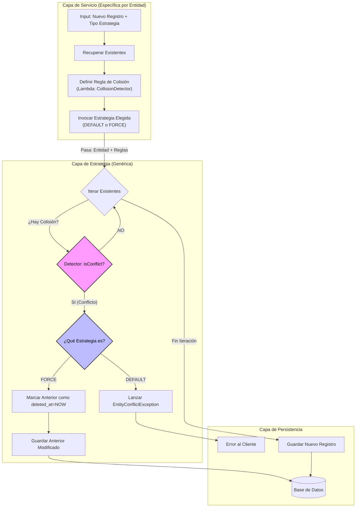
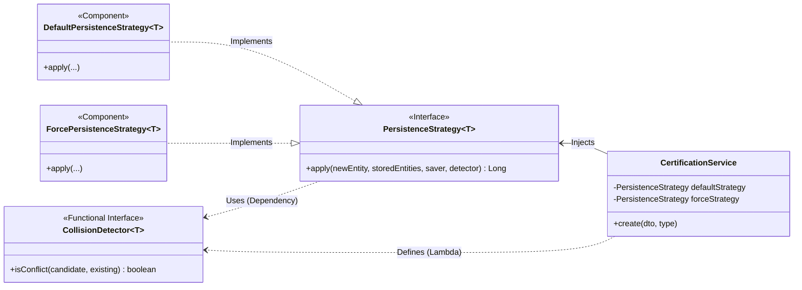
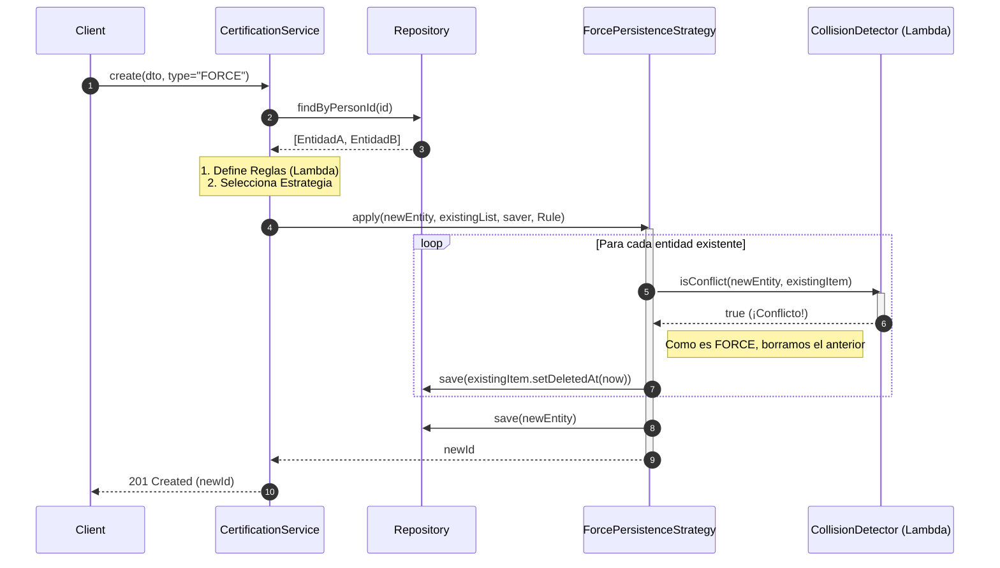

# Propuesta de Diseño Técnico: Estrategia de Persistencia Flexible por Conflictos

## Tabla de Contenidos

1. [Resumen Ejecutivo](#1-resumen-ejecutivo)
2. [Arquitectura Visual y Flujos](#2-arquitectura-visual-y-flujos)
    * [2.1. Visión Funcional](#21-visión-funcional-diagrama-de-flujo)
    * [2.2. Visión Estructural](#22-visión-estructural-diagrama-de-clases)
    * [2.3. Visión de Interacción](#23-visión-de-interacción-diagrama-de-secuencia)
3. [Justificación Arquitectónica](#3-justificación-arquitectónica-por-qué-abstraer)
    * [3.1. El problema del enfoque manual](#31-el-problema-del-enfoque-manual-código-espagueti)
    * [3.2. La Solución Técnica](#32-la-solución-técnica-estrategia-de-persistencia-centralizada)
4. [Interfaces de Abstracción](#4-interfaces-de-abstracción)
    * [4.1. Detector de Colisiones](#41-detector-de-colisiones-el-criterio)
    * [4.2. La Estrategia de Persistencia](#42-la-estrategia-de-persistencia-la-acción)
    * [4.3. Requisitos de Datos](#43-requisitos-de-datos-contractos)
    * [4.4. Capa de Datos](#44-capa-de-datos-repositorios-estándar)
5. [Implementación de las Estrategias](#5-implementación-de-las-estrategias-motor)
    * [5.1. DefaultPersistenceStrategy](#51-defaultpersistencestrategy-validación-estricta)
    * [5.2. ForcePersistenceStrategy](#52-forcepersistencestrategy-sobreescritura)
6. [Reglas de Negocio](#6-reglas-de-negocio-el-combustible)
    * [6.1. Escenario de Cambio](#61-escenario-de-cambio-evolución-del-negocio)
    * [6.2. Extensibilidad Real](#62-extensibilidad-real-agregando-una-nueva-entidad-ej-cuentas-bancarias)
    * [6.3. Convivencia con Lógica Adicional](#63-convivencia-con-lógica-de-negocio-adicional)
    * [6.4. Helper Común: Fechas](#64-helper-común-fechas)
    * [6.5. Reglas Actuales por Entidad](#65-reglas-actuales-por-entidad)
7. [Capa de Entrada: Controller](#7-capa-de-entrada-el-controller)
    * [7.1. Ejemplos de Invocación](#71-ejemplos-de-invocación)
8. [Receta Completa: Integración](#8-receta-completa-ejemplo-de-integración-servicio)
9. [Observabilidad y Errores](#9-observabilidad-y-manejo-de-errores)
    * [9.1. Excepciones Ricas](#91-excepciones-ricas-metadatos-de-conflicto)
    * [9.2. Logging Estructurado](#92-logging-estructurado)
10. [Plan de Acción](#10-plan-de-acción-siguientes-pasos)

---

## 1. Resumen Ejecutivo

### Problemática Actual

Actualmente, la persistencia de entidades complejas (Certificaciones, Jurisdicciones, etc.) requiere validaciones de duplicidad que varían según el dominio. Algunos casos validan rangos de fechas, otros códigos únicos, y otros atributos booleanos. Implementar esta lógica de control de flujo (`if exists -> then error/overwrite`) repetitivamente en cada Servicio conduce a código redundante, inconsistencias en el manejo de errores y alta deuda técnica.

### Solución Propuesta: Separación de Responsabilidades (Criterio vs. Acción)

Se propone arquitecturar una solución basada en el **Patrón Strategy**, desacoplando dos conceptos clave:

1. **Motor de Estrategia (La Acción)**: Un componente centralizado y genérico encargado de ejecutar la lógica de persistencia.
    * **Estrategia `DEFAULT`**: Garantiza la integridad de datos mediante validación estricta (falla si existe duplicado).
    * **Estrategia `FORCE`**: Garantiza la precedencia del nuevo dato, aplicando un borrado lógico (*soft-delete* estableciendo `deleted_at`) sobre los registros conflictivos previos.

2. **Definición de Conflicto (El Criterio)**: Reglas de negocio encapsuladas (Lambdas/Predicados) que definen la unicidad para cada entidad específica (ej: *"Mismo CBU"* o *"Fechas superpuestas"*).

### Justificación Técnica

Esta arquitectura permite evolucionar las reglas de negocio de cada entidad sin impactar en la infraestructura de persistencia, garantizando mantenibilidad, testabilidad y estandarización del comportamiento del sistema.

---

## 2. Arquitectura Visual y Flujos

El objetivo técnico es permitir que diferentes entidades compartan esta lógica de "portero", manteniendo sus propias reglas.

### 2.1. Visión Funcional (Diagrama de Flujo)

Ahora que entendemos el concepto, veamos cómo fluyen los datos:



**Explicación del Flujo:**

1. **El Servicio (Rosa)**: Actúa como configurador. Su única responsabilidad es decir "Para mí, un duplicado es X" (caja rosa `Definir Regla`).
2. **La Estrategia (Azul)**: Es el motor. Recibe la regla y la aplica ciegamente.
3. **El Resultado**: O los datos se guardan, o el usuario recibe un error limpio.
4. **Éxito en DEFAULT**: Observa que si el detector devuelve "NO" para todos los registros, el flujo llega a "Guardar Nuevo Registro". **`DEFAULT` guarda exitosamente siempre que no haya colisiones.**

### 2.2. Visión Estructural (Diagrama de Clases)

Este diagrama muestra cómo se desacoplan las piezas. Nota cómo el `CertificationService` depende de la interfaz `PersistenceStrategy` y define dinámicamente el `CollisionDetector`.



### 2.3. Visión de Interacción (Diagrama de Secuencia)

Este diagrama es crítico para entender el ciclo de vida de una petición (ej: caso **FORCE** con conflicto). Muestra claramente la delegación de responsabilidades en tiempo de ejecución.



---

## 3. Justificación Arquitectónica: ¿Por qué abstraer?

Es natural preguntarse si no es más fácil escribir la validación `if/else` directamente en cada `Service`. A continuación justificamos por qué la abstracción (Strategy Pattern) es superior para este caso de uso con múltiples entidades.

### 3.1. El problema del enfoque manual ("Código Espagueti")

Si implementáramos la lógica manualmente en cada servicio, estaríamos duplicando la estructura de control múltiples veces:

```java
// ANTIPATRÓN: Lógica repetida en 5+ servicios
if (type.equals("DEFAULT")) {
    // Lógica mezclada: Regla de negocio + Control de flujo + Excepción
    if (existente.getCodigo().equals(nuevo.getCodigo()) && fechasSolapadas(...)) {
        throw new EntityConflictException(...); 
    }
} else if (type.equals("FORCE")) {
    // Lógica repetida de borrado
    conflict.ifPresent(e -> {
        e.setDeletedAt(LocalDateTime.now()); 
        repo.save(e);
    });
}
```

**Problemas:**

1. **Violación de DRY**: Si cambiamos la lógica de borrado, hay que editar 5 archivos.
2. **Inconsistencia**: Riesgo de que un desarrollador use `409 Conflict` y otro `400 BadRequest`.
3. **Baja Legibilidad**: El servicio se llena de ruido, ocultando la verdadera regla de negocio importante (la comparación de fechas/códigos).

### 3.2. La Solución Técnica: Estrategia de Persistencia Centralizada

Separamos las responsabilidades en dos componentes claros, aplicando el patrón de diseño **Strategy**:

1. **QUÉ es un conflicto** (Responsabilidad del Servicio/Entidad) -> `CollisionDetector`
2. **QUÉ HACER con el conflicto** (Responsabilidad de la Arquitectura) -> `PersistenceStrategy`

---

## 4. Interfaces de Abstracción

Definimos dos interfaces que interactúan entre sí.

### 4.1. Detector de Colisiones (El Criterio)

Lambdas que definen la identidad única de cada entidad.

```java
@FunctionalInterface
public interface CollisionDetector<T> {
    /**
     * Evalúa si la 'candidate' entra en conflicto con 'existing'.
     * @return true si hay conflicto (son "iguales" o se solapan), false si no.
     */
    boolean isConflict(T candidate, T existing);
}
```

### 4.2. La Estrategia de Persistencia (La Acción)

Clases genéricas que ejecutan la lógica de guardado.

```java
public interface PersistenceStrategy<T extends HasDeletedAt & HasId> {
    Long apply(T newEntity, Collection<T> storedEntities, Consumer<T> saver, CollisionDetector<T> detector);
}
```

### 4.3. Requisitos de Datos (Contractos)

Una gran ventaja de este diseño es que **NO requiere modificar la base de datos ni las entidades existentes**. Para que una entidad pueda usar estas estrategias, solo debe implementar dos interfaces simples que ya son estándar en el proyecto:

1. **`HasId`**: Para reportar el ID en logs y excepciones.
2. **`HasDeletedAt`**: Para permitir el "Soft Delete" por fecha en la estrategia `FORCE`.

*Nota: Entidades actuales como `ContactsEntity` ya implementan estas interfaces, por lo que la integración es inmediata.*

### 4.4. Capa de Datos (Repositorios Estándar)

A diferencia del modelo legacy (`TypeOfManagement`) que obligaba a heredar de interfaces complejas, esta estrategia **utiliza Repositorios JPA estándar**.

```java
// Repositorio limpio y estándar
@Repository
public interface CertificationRepository extends JpaRepository<CertificationEntity, Long> {
    Set<CertificationEntity> findByPersonId(Long personId);
}
```

---

## 5. Implementación de las Estrategias (Motor)

Estas clases se escriben **una sola vez** y sirven para TODAS las entidades.

### 5.1. DefaultPersistenceStrategy (Validación Estricta)

*Comportamiento: "Si ya existe, lanza error".*

```java
@Component("defaultPersistenceStrategy")
@Slf4j
public class DefaultPersistenceStrategy<T extends HasDeletedAt & HasId> implements PersistenceStrategy<T> {

    @Override
    public Long apply(T newEntity, Collection<T> storedEntities, Consumer<T> saver, CollisionDetector<T> detector) {
        Optional<T> conflict = storedEntities.stream()
            .filter(e -> e.getDeletedAt() == null) 
            .filter(e -> detector.isConflict(newEntity, e))
            .findFirst();

        if (conflict.isPresent()) {
            Long conflictId = conflict.get().getId();
            log.warn("[DEFAULT-STRATEGY] Conflicto detectado. No se puede guardar la nueva entidad porque choca con ID: {}", conflictId);
            throw new EntityConflictException("La entidad entra en conflicto con un registro existente.", conflictId);
        }

        saver.accept(newEntity);
        log.debug("[DEFAULT-STRATEGY] Entidad guardada exitosamente. ID: {}", newEntity.getId());
        return newEntity.getId();
    }
}
```

### 5.2. ForcePersistenceStrategy (Sobreescritura)

*Comportamiento: "Si ya existe, bórralo y guarda el nuevo".*

```java
@Component("forcePersistenceStrategy")
@Slf4j
public class ForcePersistenceStrategy<T extends HasDeletedAt & HasId> implements PersistenceStrategy<T> {

    @Override
    public Long apply(T newEntity, Collection<T> storedEntities, Consumer<T> saver, CollisionDetector<T> detector) {
        storedEntities.stream()
            .filter(e -> e.getDeletedAt() == null)
            .filter(e -> detector.isConflict(newEntity, e))
            .forEach(conflictEntity -> {
                log.info("[FORCE-STRATEGY] Colisión detectada. Realizando Soft-Delete a entidad existente [ID: {}] para permitir la nueva inserción.", conflictEntity.getId());
                conflictEntity.setDeletedAt(LocalDateTime.now()); 
                saver.accept(conflictEntity);
            });

        saver.accept(newEntity);
        log.debug("[FORCE-STRATEGY] Nueva entidad guardada exitosamente. ID: {}", newEntity.getId());
        return newEntity.getId();
    }
}
```

---

## 6. Reglas de Negocio (El Combustible)

Aquí es donde reside la flexibilidad del sistema. Definimos los criterios de duplicidad mediante `CollisionDetectors` específicos.

### 6.1. Escenario de Cambio (Evolución del Negocio)

Una de las grandes fortalezas de este diseño es su **adaptabilidad**. Imaginemos que hoy la regla de Certificación solo valida el Código y la Fecha.

```java
// REGLA HOY: Código + Fechas
CollisionDetector<Certification> rules = (nuevo, viejo) -> 
    nuevo.getCode().equals(viejo.getCode()) && 
    fechasSeSolapan(nuevo, viejo);
```

Si mañana surge el requerimiento de validar también el **Origen**, **el cambio es quirúrgico**:

```java
// REGLA MAÑANA: Código + Fechas + Origen
CollisionDetector<Certification> rules = (nuevo, viejo) -> 
    nuevo.getCode().equals(viejo.getCode()) && 
    nuevo.getOrigin().equals(viejo.getOrigin()) && 
    fechasSeSolapan(nuevo, viejo);
```

**Resultado**: Se modificó el criterio de negocio sin riesgo de romper la lógica de borrado o error que reside en las estrategias.

### 6.2. Extensibilidad Real: Agregando una Nueva Entidad (Ej: Cuentas Bancarias)

Supongamos que en 3 meses se requiere agregar el servicio de **Cuentas Bancarias**. **NO es necesario escribir lógica de persistencia nueva**. Solo se configura la regla de identidad.

**Paso 1: Entidad nueva** (`BankAccount`: cbu, bankId, currency).

**Paso 2: Servicio nuevo (`BankAccountService`)**

```java
@Service
public class BankAccountService {
    @Autowired PersistenceStrategy<BankAccount> strategy; 

    public void addAccount(BankAccount account, String type) {
        // Regla: "Mismo CBU"
        CollisionDetector<BankAccount> rule = (newAcc, oldAcc) -> 
            newAcc.getCbu().equals(oldAcc.getCbu());

        strategy.apply(account, existing, repo::save, rule);
    }
}
```

**Resultado**: En 5 minutos tienes un servicio robusto, sin haber escrito ni testeado bucles `if/else`.

### 6.3. Convivencia con Lógica de Negocio Adicional

La Estrategia **SOLO** maneja la decisión de persistencia. Cualquier otra validación sigue viviendo en el **Servicio**.

```java
public void addAccount(BankAccount account) {
    // 1. LÓGICA PREVIA (Propia del servicio)
    if (!bancoCentralApi.isValid(account.getCbu())) {
        throw new InvalidCbuException();
    }

    // 2. PERSISTENCIA (Delegada a la estrategia)
    strategy.apply(account, existing, repo::save, rule);
    
    // 3. LÓGICA POSTERIOR (Propia del servicio)
    notificationService.sendEmail("Cuenta creada");
}
```

### 6.4. Helper Común: Fechas

```java
public class DateRangeValidator {
    public static boolean overlaps(LocalDate startA, LocalDate endA, LocalDate startB, LocalDate endB) {
        LocalDate realEndA = endA != null ? endA : LocalDate.MAX;
        LocalDate realEndB = endB != null ? endB : LocalDate.MAX;
        return (startA.isBefore(realEndB) || startA.equals(realEndB)) && 
               (realEndA.isAfter(startB) || realEndA.equals(startB));
    }
}
```

### 6.5. Reglas Actuales por Entidad

#### A. Certificaciones (`/certifications`)

*Conflicto si: Mismo código Y solapamiento de fechas.*

```java
CollisionDetector<CertificationEntity> certificationRules = (nuevo, existente) -> 
    nuevo.getCertificationCode().equals(existente.getCertificationCode()) &&
    DateRangeValidator.overlaps(nuevo.getStart(), nuevo.getEnd(), existente.getStart(), existente.getEnd());
```

#### B. Jurisdictions (`/jurisdictions`)

*Conflicto si: Misma jurisdicción Y solapamiento de fechas.*

```java
CollisionDetector<JurisdictionEntity> jurisdictionRules = (nuevo, existente) -> 
    nuevo.getJurisdictionCode().equals(existente.getJurisdictionCode()) &&
    DateRangeValidator.overlaps(nuevo.getStart(), nuevo.getEnd(), existente.getStart(), existente.getEnd());
```

#### C. Taxable Activities (`/taxable-activities`)

*Conflicto si: La nueva es principal Y ya existe otra principal.*

```java
CollisionDetector<TaxableActivityEntity> activityRules = (nuevo, existente) -> {
    if (!nuevo.isPrincipal()) return false;
    return existente.isPrincipal(); 
};
```

---

## 7. Capa de Entrada: El Controller

Es fundamental definir cómo el consumidor de la API selecciona la estrategia.

* **Parámetro**: `create-type`
* **Valor por defecto**: `DEFAULT`

```java
@RestController
@RequestMapping("/v1/people/{personId}/certifications")
public class CertificationController {

    @Autowired
    private CertificationService service;

    @PostMapping
    public ResponseEntity<Long> create(
            @PathVariable Long personId,
            @RequestBody @Valid CertificationDTO dto,
            @RequestParam(name = "create-type", defaultValue = "DEFAULT") String createType
    ) {
        Long newId = service.create(personId, dto, createType);
        return ResponseEntity.status(HttpStatus.CREATED).body(newId);
    }
}
```

### 7.1. Ejemplos de Invocación

**Caso A: Creación Estándar (Usa DEFAULT)**

```bash
POST /v1/people/123/certifications
# Si hay conflicto -> Retorna Error (409 Conflict)
```

**Caso B: Creación Forzada (Usa FORCE)**

```bash
POST /v1/people/123/certifications?create-type=FORCE
# Si hay conflicto -> Borra el anterior y crea el nuevo (201 Created)
```

---

## 8. Receta Completa: Ejemplo de Integración (Servicio)

Así de limpio queda el servicio final:

```java
@Service
public class CertificationService {

    @Autowired @Qualifier("defaultPersistenceStrategy")
    private PersistenceStrategy<CertificationEntity> defaultStrategy;
    
    @Autowired @Qualifier("forcePersistenceStrategy")
    private PersistenceStrategy<CertificationEntity> forceStrategy;
    
    @Autowired private CertificationRepository repository;

    public Long create(Long personId, CertificationDTO dto, String createType) {
        CertificationEntity entity = mapper.toEntity(dto);
        Set<CertificationEntity> existing = repository.findByPersonId(personId);

        // 1. Selector de estrategia
        PersistenceStrategy<CertificationEntity> strategy = 
            "FORCE".equalsIgnoreCase(createType) ? forceStrategy : defaultStrategy;

        // 2. Definición de la Regla
        CollisionDetector<CertificationEntity> rules = (newCert, oldCert) -> 
            newCert.getCertificationCode().equals(oldCert.getCertificationCode()) &&
            DateRangeValidator.overlaps(newCert.getStart(), newCert.getEnd(), oldCert.getStart(), oldCert.getEnd());

        // 3. Ejecución
        return strategy.apply(entity, existing, repository::save, rules);
    }
}
```

---

## 9. Observabilidad y Manejo de Errores

### 9.1. Excepciones Ricas (Metadatos de Conflicto)

```java
public class EntityConflictException extends RuntimeException {
    private final Long conflictingEntityId;
    
    public EntityConflictException(String message, Long conflictingId) { // ...
```

### 9.2. Logging Estructurado

```java
log.info("[FORCE-STRATEGY] Colisión detectada. Soft-Delete a entidad [ID: {}] ...", conflictEntity.getId());
```

---

## 10. Plan de Acción (Siguientes Pasos)

1. Crear excepción `EntityConflictException`.
2. Crear paquete `ar.com.bds.people.center.strategy.persistence`.
3. Crear interfaces `CollisionDetector` y `PersistenceStrategy`.
4. Crear implementaciones `DefaultPersistenceStrategy` y `ForcePersistenceStrategy`.
5. Crear utilitario `DateRangeValidator`.
6. Comenzar a usarlo en el primer servicio destino (ej: `CertificationService`).
