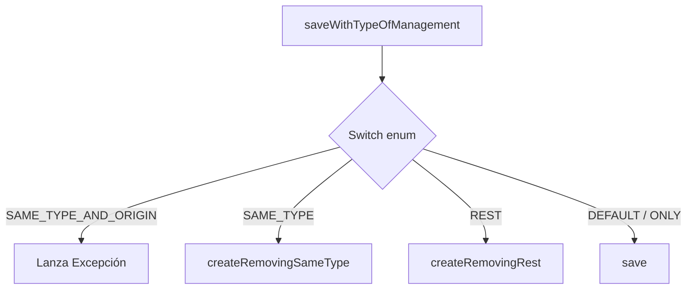
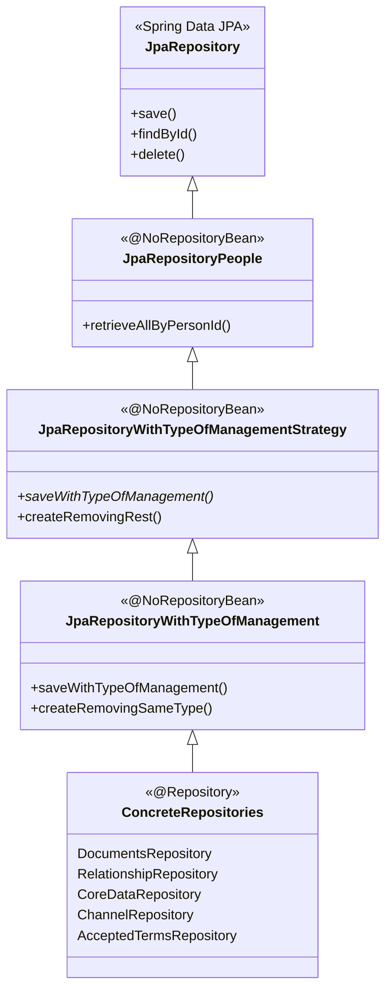

# Análisis y Propuesta: Gestión de Duplicados con TypeOfManagement

Este documento analiza el diseño actual basado en Enums y métodos `default` en repositorios, y propone una refactorización al Patrón Strategy.

---

## Tabla de Contenidos

- [PARTE 1: Diseño Actual (Enum + Default Methods)](#parte-1-diseño-actual-enum--default-methods)
  - [1.1. Arquitectura y Conceptos Clave](#11-arquitectura-y-conceptos-clave)
  - [1.2. Implementación de la Jerarquía (El Problema)](#12-implementación-de-la-jerarquía-el-problema)
  - [1.3. Diagrama de Flujo Unificado](#13-diagrama-de-flujo-unificado)
  - [1.4. Pros del Diseño Actual](#14-pros-del-diseño-actual)
  - [1.5. Contras del Diseño Actual](#15-contras-del-diseño-actual)
- [PARTE 2: Propuesta con Strategy Pattern](#parte-2-propuesta-con-strategy-pattern)
  - [2.1. La Interfaz (El Contrato)](#21-la-interfaz-el-contrato)
  - [2.2. Las Estrategias Concretas](#22-las-estrategias-concretas)
  - [2.3. Estrategia de Migración Paso a Paso](#23-estrategia-de-migración-paso-a-paso)
  - [2.4. Integración con APIs Legacy (create-type)](#24-integración-con-apis-legacy-create-type)
  - [2.5. Ejemplo Completo de Uso](#25-ejemplo-completo-de-uso)
  - [2.6. Ejemplo de Test Unitario](#26-ejemplo-de-test-unitario)
- [PARTE 3: Comparación de Ventajas](#parte-3-comparación-de-ventajas)
  - [3.1. Tabla Comparativa](#31-tabla-comparativa)
  - [3.2. Ventajas Específicas del Strategy Pattern](#32-ventajas-específicas-del-strategy-pattern)
  - [3.3. ¿Cuándo NO Refactorizar?](#33-cuándo-no-refactorizar)
  - [3.4. Riesgos y Mitigaciones](#34-riesgos-y-mitigaciones)
  - [3.5. Métricas de Éxito (KPIs)](#35-métricas-de-éxito-kpis)
- [Conclusión](#conclusión)
- [Apéndice A: Formas de Usar las Estrategias](#apéndice-a-formas-de-usar-las-estrategias)
  - [A.1. Inyección Directa (Más Moderna - Recomendada)](#a1-inyección-directa-más-moderna---recomendada)
  - [A.2. Con Factory (Más Flexible)](#a2-con-factory-más-flexible)
  - [A.3. Con Enum (Compatibilidad Legacy)](#a3-con-enum-compatibilidad-legacy)
  - [A.4. Tabla Comparativa de Enfoques](#a4-tabla-comparativa-de-enfoques)
  - [A.5. Recomendación de Uso](#a5-recomendación-de-uso)
- [Apéndice B: Glosario de Términos](#apéndice-b-glosario-de-términos)

---

## PARTE 1: Diseño Actual (Enum + Default Methods)

### 1.1. Arquitectura y Conceptos Clave

El sistema actual utiliza un **Anti-Patrón** donde la lógica de negocio (reglas de borrado) se mezcla con la capa de acceso a datos (Repositorios) controlada por un Enum.

#### El Controlador: TypeOfManagement

Todo comienza con este Enum que define "qué hacer" con los duplicados:

```java
public enum TypeOfManagement {
    ONLY,                           // Solo guarda, no toca nada
    REMOVING_SAME_TYPE,             // Borra del mismo tipo
    REMOVING_REST,                  // Borra todo lo demás
    REMOVING_SAME_TYPE_AND_ORIGIN   // Borra mismo tipo y origen
}
```

### 1.2. Implementación de la Jerarquía (El Problema)

En lugar de usar clases separadas (Strategy Pattern), se implementaron interfaces de repositorio que heredan unas de otras. Esto causa problemas de **Excepciones en Runtime** porque no todas las interfaces soportan todas las estrategias.

A continuación, analizamos los dos niveles principales de esta jerarquía:

#### Nivel 1: La Interfaz Base (`JpaRepositoryWithTypeOfManagement`) -- Limitada

Esta es la interfaz más común. Define el método principal `saveWithTypeOfManagement`.

**Problema Crítico:** Esta interfaz **DESCONOCE** el campo `Origin`. Solo sabe de `Type` e `Id`.
Por lo tanto, si intentas usar la estrategia `REMOVING_SAME_TYPE_AND_ORIGIN`, explota.

```java
@NoRepositoryBean
public interface JpaRepositoryWithTypeOfManagement<T extends HasDeleted & HasType & HasId, ID> 
        extends JpaRepositoryWithTypeOfManagementStrategy<T, ID> {

    @Override
    default T saveWithTypeOfManagement(T entity, Set<T> listEntities, TypeOfManagement typeOfManagement) {
        switch (typeOfManagement) {
            case REMOVING_SAME_TYPE_AND_ORIGIN:
                // CRITICO:
                // Al no tener acceso al campo 'origin', se ve forzada a lanzar una excepción en runtime.
                throw new TypeOfManagementNotSupportedException(MANAGMENT_NOT_SUPPORTED_MESSAGE);
                
            case REMOVING_SAME_TYPE:
                return this.createRemovingSameType(entity, listEntities);
                
            case REMOVING_REST:
                return this.createRemovingRest(entity, listEntities);
                
            default:
                return save(entity);
        }
    }
    
    // Lógica para borrar por tipo e ID
    default T createRemovingSameType(T entity, Set<T> listEntities) {
         listEntities.stream()
            .filter(e -> e.getType().equals(entity.getType()) && !Objects.equals(e.getId(), entity.getId()))
            .forEach(e -> { e.setDeleted(true); save(e); });
        return save(entity);
    }
}
```

#### Nivel 2: La Interfaz Extendida (`JpaRepositoryWithTypeAndOriginManagement`) -- Completa

Para solucionar la limitación anterior, se creó esta interfaz hija que añade el requisito `HasOrigin`.

**Solución Parcial:** Sobreescribe el método anterior para interceptar el caso problemático.

#### Diagrama de Flujo del Método `saveWithTypeOfManagement`



#### Nota sobre el nombre "Strategy"

A pesar de que una de las interfaces se llama `JpaRepositoryWithTypeOfManagementStrategy`, este diseño **no implementa el patrón Strategy de diseño**.

**Implementación actual:**

- La decisión de qué lógica ejecutar se realiza mediante un switch statement
- Toda la lógica está centralizada en un solo método
- Las diferentes "estrategias" están acopladas a la interfaz del repositorio

**Patrón Strategy real:**

- Cada estrategia sería una clase independiente que implementa una interfaz común
- La decisión se realiza mediante polimorfismo, no mediante estructuras condicionales
- Las estrategias son intercambiables y desacopladas del contexto

### 1.2. Jerarquía de Interfaces del Repositorio

El diseño actual utiliza una jerarquía de interfaces que extienden progresivamente la funcionalidad. A continuación se muestran las implementaciones clave en orden de herencia:

#### Nivel 1: JpaRepositoryWithTypeOfManagement (Base)

Esta interfaz define el comportamiento base pero **desconoce** el concepto de "Origen".

```java
@NoRepositoryBean
public interface JpaRepositoryWithTypeOfManagement<T extends HasDeleted & HasType & HasId, ID> 
        extends JpaRepositoryWithTypeOfManagementStrategy<T, ID> {

    @Override
    default T saveWithTypeOfManagement(T entity, Set<T> listEntities, TypeOfManagement typeOfManagement) {
        switch (typeOfManagement) {
            case REMOVING_SAME_TYPE_AND_ORIGIN:
                // ERROR: Esta interfaz NO sabe qué es "Origin", por tanto no puede filtrar por él.
                // Lanza excepción para avisar al desarrollador que use la interfaz correcta.
                throw new TypeOfManagementNotSupportedException(MANAGMENT_NOT_SUPPORTED_MESSAGE);
                
            case REMOVING_SAME_TYPE:
                return this.createRemovingSameType(entity, listEntities);
                
            case REMOVING_REST:
                return this.createRemovingRest(entity, listEntities);
                
            default:
                return save(entity);
        }
    }
    // ... implementación de createRemovingSameType ...
}
```

```java
@NoRepositoryBean
public interface JpaRepositoryWithTypeAndOriginManagement<T extends HasDeleted & HasType & HasId & HasOrigin, ID> 
        extends JpaRepositoryWithTypeOfManagement<T, ID> {

    @Override
    default T saveWithTypeOfManagement(T entity, Set<T> listEntities, TypeOfManagement typeOfManagement) {
        switch (typeOfManagement) {
            case REMOVING_SAME_TYPE_AND_ORIGIN:
                // CORRECTO: Conoce el campo 'origin' y puede ejecutar la lógica correcta.
                return this.createRemovingSameTypeAndOrigin(entity, listEntities);
                
            default:
                // Para el resto, delega al padre (super) para no repetir código
                return super.saveWithTypeOfManagement(entity, listEntities, typeOfManagement);
        }
    }

    // Lógica específica que SÍ usa getOrigin()
    default T createRemovingSameTypeAndOrigin(T newEntity, Set<T> listEntitiesSaved) {
        listEntitiesSaved.stream()
                .filter(entitySaved -> 
                       entitySaved.getOrigin().equals(newEntity.getOrigin()) && 
                       entitySaved.getType().equals(newEntity.getType()) && 
                       !Objects.equals(entitySaved.getId(), newEntity.getId()))
                .forEach(e -> { entitySaved.setDeleted(true); save(entitySaved); });
        return save(newEntity);
    }
}
```

### 1.3. Diagrama de la Jerarquía Completa



#### Explicación de la Jerarquía

##### Nivel 1: JpaRepository (Spring Data JPA)

- Interfaz estándar de Spring que proporciona operaciones CRUD básicas
- Todos los repositorios del sistema heredan de aquí

##### Nivel 2: JpaRepositoryPeople

- Primera capa de personalización específica del dominio
- Agrega consultas para filtrar por `personId` (todas las entidades pertenecen a una persona)
- Marcada con `@NoRepositoryBean` para que Spring no intente crear una implementación

##### Nivel 3: JpaRepositoryWithTypeOfManagementStrategy

#### ¿Por qué se lanza `TypeOfManagementNotSupportedException`?

La excepción ocurre cuando intentas usar la estrategia `REMOVING_SAME_TYPE_AND_ORIGIN` en un repositorio que **solo implementa el Nivel 1**.

Como esa interfaz base solo garantiza que la entidad tenga `Type` e `Id`, pero no `Origin`, físicamente **no puede compilar ni ejecutar** un filtro por origen (`e.getOrigin()`). La excepción es una validación en tiempo de ejecución (Runtime Check) para prevenir un uso incorrecto de la jerarquía.

---

#### Métodos Heredados por los Repositorios Concretos

Cada repositorio concreto (ej: `DocumentsRepository`) tiene acceso a:

```java
// De JpaRepository (Spring)
save(entity)
findById(id)
delete(entity)
findAll()
// ... y 15+ métodos más

// De JpaRepositoryPeople
retrieveAllByPersonId(Long personId)
findByIdAndPersonId(Long id, Long personId)

// De JpaRepositoryWithTypeOfManagementStrategy
createRemovingRest(entity, listEntities)

// De JpaRepositoryWithTypeOfManagement
saveWithTypeOfManagement(entity, listEntities, typeOfManagement)
createRemovingSameType(entity, listEntities)
```

#### Repositorios que Implementan Esta Interfaz

En el proyecto se encontraron **7 repositorios** que heredan de `JpaRepositoryWithTypeOfManagement`:

1. **DocumentsRepository**
   - **Propósito**: Gestión de documentos de identidad (DNI, pasaporte, etc.)
   - **Ubicación**: `repository/DocumentsRepository.java`
   - **Entidad**: `DocumentsEntity`

2. **RelationshipRepository**
   - **Propósito**: Gestión de relaciones entre personas
   - **Ubicación**: `repository/RelationshipRepository.java`
   - **Entidad**: `RelationshipEntity`

3. **CoreDataRepository**
   - **Propósito**: Datos centrales y fundamentales de personas
   - **Ubicación**: `repository/CoreDataRepository.java`
   - **Entidad**: `CoreDataEntity`

4. **ChannelRepository**
   - **Propósito**: Canales de comunicación
   - **Ubicación**: `repository/ChannelRepository.java`
   - **Entidad**: `ChannelEntity`

5. **AcceptedTermsRepository**
   - **Propósito**: Términos y condiciones aceptados por las personas
   - **Ubicación**: `repository/AcceptedTermsRepository.java`
   - **Entidad**: `AcceptedTermsEntity`

**Extensiones de la Interfaz:**

6. **JpaRepositoryWithTypeAndOriginManagement**
   - **Tipo**: Extensión de `JpaRepositoryWithTypeOfManagement`
   - **Propósito**: Agrega gestión por origen de datos
   - **Agrega soporte para**: `REMOVING_SAME_TYPE_AND_ORIGIN`
   - **Requiere**: Entidades que implementen `HasOrigin`

7. **JpaRepositoryWithoutTypeOfManagement**
   - **Tipo**: Variante de `JpaRepositoryWithTypeOfManagementStrategy`
   - **Propósito**: Para entidades que NO tienen el campo `type`
   - **Comportamiento**: Lanza excepción si se intenta usar estrategias que requieren tipo

**Todos estos repositorios heredan automáticamente:**

- Métodos CRUD de `JpaRepository`
- Consultas por `personId` de `JpaRepositoryPeople`
- Estrategias de gestión de duplicados (`saveWithTypeOfManagement`, `createRemovingSameType`, `createRemovingRest`)

### 1.3. Flujo de Ejecución Actual

**Ejemplo: Agregar un nuevo email**

1. **Servicio (`PersonServiceImpl`)**:

   ```java
   contactsService.saveWithTypeOfManagement(
       nuevoEmail, 
       listaExistentes, 
       TypeOfManagement.REMOVING_SAME_TYPE
   );
   ```

2. **Servicio de Contactos (`ContactsServiceImpl`)**:

   ```java
   public ContactsEntity saveWithTypeOfManagement(...) {
       return this.contactsRepository.saveWithTypeOfManagement(...);
   }
   ```

3. **Repositorio (`ContactsRepository` → hereda de `JpaRepositoryWithTypeOfManagement`)**:
   - El método `default` evalúa el `switch`
   - Llama a `createRemovingSameType()`
   - Ejecuta la lógica de borrado + guardado

### 1.4. Pros del Diseño Actual

- **Centralización**: La lógica está en un solo lugar (la interfaz base del repositorio)
- **Reutilización**: Todos los repositorios heredan automáticamente el comportamiento
- **Enum Type-Safe**: El compilador garantiza que solo se usen valores válidos
- **Funciona**: El sistema está en producción y cumple su función

### 1.5. Contras del Diseño Actual

- **Violación de SRP (Single Responsibility Principle)**:
  - Los repositorios tienen lógica de negocio mezclada con acceso a datos
  - `JpaRepositoryWithTypeOfManagement` hace demasiadas cosas
- **Acoplamiento Fuerte**:
  - La lógica está "atrapada" en la interfaz del repositorio
  - No se puede reutilizar fuera del contexto JPA
- **Difícil de Testear**:
  - Para probar `createRemovingSameType()` necesitas mockear un repositorio completo
  - No puedes probar la lógica de forma aislada
- **Rigidez para Extensión**:
  - Agregar una nueva estrategia requiere modificar la interfaz base
  - Todos los repositorios se ven afectados aunque no usen la nueva estrategia
- **Switch Statement Anti-Pattern**:
  - El `switch` crece con cada nueva estrategia
  - Viola el principio Open/Closed (abierto a extensión, cerrado a modificación)
- **Excepciones en Runtime**:
  - `REMOVING_SAME_TYPE_AND_ORIGIN` lanza excepción en algunos repositorios
  - No hay forma de saber en tiempo de compilación qué estrategias son válidas para cada entidad

---

## PARTE 2: Propuesta con Strategy Pattern

### 2.1. La Interfaz (El Contrato)

Definimos una interfaz genérica que acepta cualquier entidad que tenga Tipo e ID. Esto la hace reutilizable para `Contact`, `Document`, `Address`, etc.

```java
package ar.com.bds.lib.peoplecenter.model.strategy;

import ar.com.bds.lib.peoplecenter.model.interfaces.HasId;
import ar.com.bds.lib.peoplecenter.model.interfaces.HasType;
import java.util.Set;
import java.util.function.Consumer;

public interface ManagementStrategy<T extends HasType & HasId> {
    /**
     * Aplica la estrategia de gestión de duplicados.
     * @param newEntity La nueva entidad a guardar.
     * @param existingEntities El conjunto de entidades ya existentes en la BD.
     * @param saveFunction Función para persistir los cambios (ej: repository::save).
     */
    void apply(T newEntity, Set<T> existingEntities, Consumer<T> saveFunction);
}
```

### 2.2. Las Estrategias Concretas

Estas tres estrategias cubren el 95% de los casos de uso con nombres intuitivos:

#### A. NewStrategy - Agregar sin afectar existentes

Equivalente a `ONLY`. Simplemente agrega la nueva entidad sin tocar las existentes.

```java
@Component
public class NewStrategy<T extends HasDeleted & HasId> implements ManagementStrategy<T> {
    @Override
    public void apply(T newEntity, Set<T> existingEntities, Consumer<T> saveFunction) {
        // Solo guarda la nueva entidad
        saveFunction.accept(newEntity);
    }
}
```

**Casos de uso:**

- Agregar un teléfono adicional
- Agregar una dirección nueva sin eliminar las anteriores
- Historial de cambios (mantener todas las versiones)

#### B. NewAndReplaceStrategy - Reemplazar entidades del mismo tipo

Equivalente a `REMOVING_SAME_TYPE`. Desactiva las anteriores del mismo tipo y guarda la nueva.

```java
@Component
public class NewAndReplaceStrategy<T extends HasDeleted & HasType & HasId> implements ManagementStrategy<T> {
    @Override
    public void apply(T newEntity, Set<T> existingEntities, Consumer<T> saveFunction) {
        // Desactiva las entidades del mismo tipo
        existingEntities.stream()
            .filter(e -> e.getType().equals(newEntity.getType()) && !e.getId().equals(newEntity.getId()))
            .forEach(e -> {
                e.setDeleted(true);
                saveFunction.accept(e);
            });
        
        // Guarda la nueva
        saveFunction.accept(newEntity);
    }
}
```

**Casos de uso:**

- Actualizar el email principal (solo uno activo)
- Cambiar el documento de identidad vigente
- Actualizar información que debe ser única por tipo

#### C. NewAndReplaceByOriginStrategy - Reemplazar por tipo y origen

Equivalente a `REMOVING_SAME_TYPE_AND_ORIGIN`. Para sistemas con múltiples fuentes de datos.

```java
@Component
public class NewAndReplaceByOriginStrategy<T extends HasDeleted & HasType & HasId & HasOrigin> 
        implements ManagementStrategy<T> {
    @Override
    public void apply(T newEntity, Set<T> existingEntities, Consumer<T> saveFunction) {
        // Desactiva solo las del mismo tipo Y origen
        existingEntities.stream()
            .filter(e -> e.getType().equals(newEntity.getType()) 
                      && e.getOrigin().equals(newEntity.getOrigin())
                      && !e.getId().equals(newEntity.getId()))
            .forEach(e -> {
                e.setDeleted(true);
                saveFunction.accept(e);
            });
        
        saveFunction.accept(newEntity);
    }
}
```

**Casos de uso:**

- Datos que vienen de diferentes canales (Web, App, Call Center)
- Mantener independencia entre fuentes de datos

#### Ejemplo de Uso: Inyección Directa

La forma moderna y recomendada de usar estas estrategias es mediante **inyección directa**. No requiere enum ni Factory.

```java
@Service
public class ContactsServiceImpl {

    @Autowired
    private NewStrategy<ContactsEntity> newStrategy;
    
    @Autowired
    private NewAndReplaceStrategy<ContactsEntity> newAndReplaceStrategy;
    
    @Autowired
    private ContactsRepository contactsRepository;

    public void addAdditionalContact(Contact contactDTO, Set<ContactsEntity> existingContacts) {
        ContactsEntity newContact = contactMapper.toEntity(contactDTO);
        
        // Usas directamente la estrategia que necesitas
        newStrategy.apply(newContact, existingContacts, contactsRepository::save);
    }
    
    public void updateMainEmail(Contact contactDTO, Set<ContactsEntity> existingContacts) {
        ContactsEntity newContact = contactMapper.toEntity(contactDTO);
        
        // Otra estrategia según el caso de uso
        newAndReplaceStrategy.apply(newContact, existingContacts, contactsRepository::save);
    }
}
```

**Ventajas de este enfoque:**

- Código más limpio y directo
- Type-safe en tiempo de compilación
- No necesitas Factory ni enum
- Ideal cuando sabes exactamente qué estrategia usar en cada método

### 2.3. Estrategia de Migración Paso a Paso

Esta sección describe cómo migrar gradualmente del diseño actual (enum + switch) al nuevo diseño con Strategy Pattern.

#### Fase 1: Preparación (1 día)

**Objetivo**: Crear las nuevas estrategias sin tocar el código existente.

**Pasos**:

1. **Crear el paquete de estrategias**:

   ```
   ar.com.bds.lib.peoplecenter.model.strategy/
   ├── ManagementStrategy.java (interfaz)
   ├── NewStrategy.java
   ├── NewAndReplaceStrategy.java
   └── NewAndReplaceByOriginStrategy.java
   ```

2. **Implementar las 3 estrategias** (código mostrado en sección 2.2)

3. **Registrarlas como Spring Beans** con `@Component`

4. **Escribir tests unitarios** para cada estrategia

**Resultado**: Las estrategias están listas pero nadie las usa todavía. El código existente sigue funcionando.

---

#### Fase 2: Nuevos Desarrollos (Continuo)

**Objetivo**: Todo código nuevo usa el enfoque moderno.

**Regla**: A partir de ahora, **NO** usar `TypeOfManagement` enum en código nuevo.

**Ejemplo de código nuevo**:

```java
@Service
public class NewFeatureService {
    
    @Autowired
    private NewAndReplaceStrategy<ContactsEntity> strategy;
    
    @Autowired
    private ContactsRepository contactsRepository;
    
    public void addContact(Contact contact, Set<ContactsEntity> existing) {
        ContactsEntity entity = mapper.toEntity(contact);
        strategy.apply(entity, existing, contactsRepository::save);
    }
}
```

**Resultado**: Código nuevo y viejo coexisten sin problemas.

---

#### Fase 3: Migración Gradual de Servicios (2-3 semanas)

**Objetivo**: Migrar cada servicio del enum a inyección directa.

**Estrategia**: Migrar un servicio completo por vez, no por partes.

**ANTES** (`ContactsServiceImpl`):

```java
@Service
public class ContactsServiceImpl {
    
    @Autowired
    private ContactsRepository contactsRepository; // Extiende JpaRepositoryWithTypeOfManagement
    
    public void updateEmail(Contact newEmail, Set<ContactsEntity> existing) {
        contactsRepository.saveWithTypeOfManagement(
            newEmail, 
            existing, 
            TypeOfManagement.REMOVING_SAME_TYPE  // ← ENUM
        );
    }
}
```

**DESPUÉS** (`ContactsServiceImpl`):

```java
@Service
public class ContactsServiceImpl {
    
    @Autowired
    private ContactsRepository contactsRepository; // Ahora extiende solo JpaRepository
    
    @Autowired
    private NewAndReplaceStrategy<ContactsEntity> strategy; // ← NUEVA INYECCIÓN
    
    public void updateEmail(Contact newEmail, Set<ContactsEntity> existing) {
        ContactsEntity entity = mapper.toEntity(newEmail);
        strategy.apply(entity, existing, contactsRepository::save); // ← NUEVA LLAMADA
    }
}
```

**Mapeo de enum a estrategia**:

| Enum Actual | Estrategia Nueva | Cuándo Usar |
|-------------|------------------|-------------|
| `ONLY` | `NewStrategy` | Agregar sin afectar existentes |
| `REMOVING_SAME_TYPE` | `NewAndReplaceStrategy` | Reemplazar del mismo tipo |
| `REMOVING_REST` | *(Evaluar caso por caso)* | Generalmente no se necesita |
| `REMOVING_SAME_TYPE_AND_ORIGIN` | `NewAndReplaceByOriginStrategy` | Reemplazar por tipo y origen |

**Checklist por servicio**:

- [ ] Identificar todas las llamadas a `saveWithTypeOfManagement()`
- [ ] Determinar qué estrategia usar
- [ ] Inyectar la estrategia correspondiente
- [ ] Reemplazar las llamadas
- [ ] Ejecutar tests del servicio
- [ ] Commit y push

---

#### Fase 4: Migración de Repositorios (1 semana)

**Objetivo**: Eliminar la lógica de negocio de los repositorios.

**Cuándo**: Después de migrar TODOS los servicios que usan un repositorio.

**ANTES** (`ContactsRepository`):

```java
@Repository
public interface ContactsRepository extends JpaRepositoryWithTypeOfManagement<ContactsEntity, Long> {
    // Hereda saveWithTypeOfManagement() con el switch
}
```

**DESPUÉS** (`ContactsRepository`):

```java
@Repository
public interface ContactsRepository extends JpaRepository<ContactsEntity, Long> {
    // Solo acceso a datos, sin lógica de negocio
}
```

**Checklist por repositorio**:

- [ ] Verificar que ningún servicio llama a `saveWithTypeOfManagement()`
- [ ] Cambiar la herencia de `JpaRepositoryWithTypeOfManagement` a `JpaRepository`
- [ ] Ejecutar todos los tests
- [ ] Commit y push

---

#### Fase 5: Limpieza Final (1 día)

**Objetivo**: Eliminar todo el código legacy.

**Qué eliminar**:

1. **Enum**:

   ```java
   // ELIMINAR
   public enum TypeOfManagement { ... }
   ```

2. **Interfaces JPA con lógica**:

   ```java
   // ELIMINAR
   JpaRepositoryWithTypeOfManagementStrategy.java
   JpaRepositoryWithTypeOfManagement.java
   JpaRepositoryWithTypeAndOriginManagement.java
   JpaRepositoryWithoutTypeOfManagement.java
   ```

3. **Excepción personalizada** (si ya no se usa):

   ```java
   // ELIMINAR (si ya no se usa)
   TypeOfManagementNotSupportedException.java
   ```

**Checklist final**:

- [ ] Buscar referencias al enum en todo el proyecto (`grep -r "TypeOfManagement"`)
- [ ] Eliminar archivos
- [ ] Ejecutar suite completa de tests
- [ ] Commit con mensaje descriptivo
- [ ] Crear PR de limpieza

**Resultado**: Código limpio, sin deuda técnica, solo las 3 estrategias modernas.

---

#### Resumen de Tiempos Estimados

| Fase | Duración | Esfuerzo |
|------|----------|----------|
| Fase 1: Preparación | 1 día | 1 desarrollador |
| Fase 2: Nuevos desarrollos | Continuo | Todo el equipo |
| Fase 3: Migración servicios | 2-3 semanas | 1-2 desarrolladores |
| Fase 4: Migración repositorios | 1 semana | 1 desarrollador |
| Fase 5: Limpieza | 1 día | 1 desarrollador |
| **TOTAL** | **4-5 semanas** | **Migración gradual** |

**Nota**: Estos tiempos asumen un proyecto con ~7 repositorios y ~20-30 servicios.

---

### 2.4. Integración con APIs Legacy (create-type)

Un requisito común en este proyecto es mantener la retrocompatibilidad con clientes existentes que envían la estrategia como un parámetro de consulta (query param), por ejemplo:

`POST /v2/people/123/certifications?create-type=REMOVING_SAME_TYPE`

Para soportar este escenario dinámico donde la estrategia no se conoce hasta el tiempo de ejecución (runtime), reintroducir el uso de una **Factory** o **Resolver** es la solución ideal.

#### 2.4.1. La Fábrica (Strategy Factory)

Esta clase mapea el identificador antiguo (Enum) a la nueva implementación de estrategia.

```java
@Component
public class ManagementStrategyFactory {
    
    // Inyectamos todas las estrategias viables
    // Spring mapea automáticamente los beans que implementan la interfaz en un Map si usamos los nombres de los beans
    // O podemos construirlos manualmente para mayor control:
    
    private final Map<TypeOfManagement, ManagementStrategy> strategyMap;

    public ManagementStrategyFactory(
            NewStrategy newStrategy,
            NewAndReplaceStrategy newAndReplaceStrategy,
            NewAndReplaceByOriginStrategy newAndReplaceByOriginStrategy) {
            
        this.strategyMap = Map.of(
            TypeOfManagement.ONLY, newStrategy,
            TypeOfManagement.REMOVING_SAME_TYPE, newAndReplaceStrategy,
            TypeOfManagement.REMOVING_SAME_TYPE_AND_ORIGIN, newAndReplaceByOriginStrategy,
            // Mapeo legacy para fallback:
            TypeOfManagement.REMOVING_REST, newStrategy // O la implementación específica si existe
        );
    }

    public <T extends HasType & HasId> ManagementStrategy<T> resolve(TypeOfManagement type) {
        return strategyMap.getOrDefault(type, strategyMap.get(TypeOfManagement.ONLY));
    }
}
```

#### 2.4.2. Implementación en el Controller

El controlador recibe el Enum antiguo y utiliza la Factory para obtener la lógica correcta.

```java
@RestController
@RequestMapping("/v2/people")
public class CertificationsController {

    @Autowired
    private CertificationService certificationService;
    
    // Inyectamos la Factory
    @Autowired
    private ManagementStrategyFactory strategyFactory; 

    @PostMapping("/{personId}/certifications")
    public ResponseEntity<Long> createCertification(
            @PathVariable Long personId,
            @RequestParam(name = "create-type", defaultValue = "ONLY") TypeOfManagement createType,
            @RequestBody CertificationRequest request) {
        
        // 1. Resolvemos la estrategia basada en el parámetro URL
        ManagementStrategy<CertificationEntity> strategy = strategyFactory.resolve(createType);
        
        // 2. Pasamos la estrategia resuelta al servicio
        // NOTA: El servicio debe actualizarse para aceptar 'ManagementStrategy' en lugar de 'TypeOfManagement'
        Long id = certificationService.create(personId, request, strategy);
        
        return ResponseEntity.status(HttpStatus.CREATED).body(id);
    }
}
```

**Beneficios de este enfoque híbrido:**

1. **Retrocompatibilidad Total**: La API externa no cambia.
2. **Core Moderno**: El servicio y el dominio usan el nuevo patrón Strategy.
3. **Adaptación en la Frontera**: La conversión de Enum -> Strategy ocurre en la capa de Controlador (o una capa de adaptación), manteniendo limpio el dominio.

---

### 2.5. Ejemplo Completo de Uso

Vamos a ver el flujo completo de ejecución con un ejemplo real: **Agregar un nuevo email a Juan**.

#### Estado Inicial

**Base de Datos (Tabla `contact`):**

| ID | person_id | type | value | origin | deleted |
|----|-----------|------|-------|--------|---------|
| 101 | 500 | EMAIL | <juan.viejo@mail.com> | WEB | false |
| 102 | 500 | PHONE | 123456789 | APP | false |

**Petición HTTP:**

```http
POST /people-center/persons/500/contacts
Content-Type: application/json

{
  "type": "EMAIL",
  "value": "juan.nuevo@empresa.com",
  "origin": "ONBOARDING"
}
```

#### Flujo de Ejecución

**Paso 1: Controller recibe la petición**

```java
@RestController
public class ContactsController {
    
    @Autowired
    private ContactsService contactsService;
    
    @PostMapping("/persons/{personId}/contacts")
    public ResponseEntity<Long> addContact(
            @PathVariable Long personId,
            @RequestBody Contact newContact) {
        
        contactsService.updateContact(personId, newContact);
        return ResponseEntity.ok(newContact.getId());
    }
}
```

**Paso 2: ContactsServiceImpl usa la Strategy**

```java
@Service
public class ContactsServiceImpl {

    @Autowired
    private NewAndReplaceStrategy<ContactsEntity> strategy;
    
    @Autowired
    private ContactsRepository contactsRepository;
    
    @Autowired
    private PeopleCenterRepository peopleCenterRepository;

    public void updateContact(Long personId, Contact contactDTO) {
        // 1. Obtenemos la persona y sus contactos existentes
        PersonEntity person = peopleCenterRepository.getById(personId);
        Set<ContactsEntity> existingContacts = person.getContacts();
        
        // 2. Convertimos el DTO a Entity
        ContactsEntity newContact = contactMapper.toEntity(contactDTO);
        
        // 3. Aplicamos la estrategia
        strategy.apply(newContact, existingContacts, contactsRepository::save);
    }
}
```

**Paso 3: NewAndReplaceStrategy ejecuta la lógica**

```java
public class NewAndReplaceStrategy<T extends HasDeleted & HasType & HasId> {
    
    public void apply(T newEntity, Set<T> existingEntities, Consumer<T> saveFunction) {
        // 1. Filtramos las entidades del mismo tipo
        existingEntities.stream()
            .filter(e -> e.getType().equals(newEntity.getType()) 
                      && !e.getId().equals(newEntity.getId()))
            // Resultado: [ContactEntity{id:101, type:EMAIL, value:"juan.viejo@mail.com"}]
            
            // 2. Marcamos como borrado y guardamos
            .forEach(e -> {
                e.setDeleted(true);
                saveFunction.accept(e);
                // SQL: UPDATE contact SET deleted=true WHERE id=101
            });
        
        // 3. Guardamos la nueva entidad
        saveFunction.accept(newEntity);
        // SQL: INSERT INTO contact (...) VALUES (...)
    }
}
```

#### Estado Final

**Base de Datos (Tabla `contact`):**

| ID | person_id | type | value | origin | deleted |
|----|-----------|------|-------|--------|---------|
| 101 | 500 | EMAIL | <juan.viejo@mail.com> | WEB | **true** |
| 102 | 500 | PHONE | 123456789 | APP | false |
| 103 | 500 | EMAIL | <juan.nuevo@empresa.com> | ONBOARDING | false |

#### Ventajas Clave de este Diseño

1. **Separación de Responsabilidades:**
   - `Controller`: Maneja HTTP
   - `Service`: Coordina la operación
   - `Strategy`: Contiene SOLO la lógica de borrado/guardado
   - `Repository`: Solo acceso a datos

2. **Flexibilidad:**
   - Cambiar de estrategia es solo cambiar la inyección
   - Agregar una nueva estrategia no requiere tocar código existente

3. **Testabilidad:**
   - Se Puede probar `NewAndReplaceStrategy` sin Spring, sin BD, solo con objetos en memoria

### 2.6. Ejemplo de Test Unitario

Una gran ventaja es poder probar la lógica sin base de datos.

```java
class NewAndReplaceStrategyTest {

    @Test
    void shouldMarkSameTypeAsDeleted() {
        // GIVEN
        var strategy = new NewAndReplaceStrategy<Contact>();
        var nuevo = new Contact(ID_2, EMAIL, "nuevo@mail.com");
        var existente = new Contact(ID_1, EMAIL, "viejo@mail.com"); // Mismo tipo
        var otro = new Contact(ID_3, PHONE, "123456"); // Otro tipo
        
        var lista = Set.of(existente, otro);
        var guardados = new ArrayList<Contact>();

        // WHEN
        strategy.apply(nuevo, lista, guardados::add); // Simulamos el save

        // THEN
        assertTrue(existente.isDeleted()); // El viejo debe estar borrado
        assertFalse(otro.isDeleted());     // El teléfono no se toca
        assertTrue(guardados.contains(nuevo)); // El nuevo se guardó
    }
}
```

---

---

## PARTE 3: Comparación de Ventajas

### 3.1. Tabla Comparativa

| Aspecto | Diseño Actual (Enum + Default) | Strategy Pattern |
|---------|--------------------------------|------------------|
| **Separación de Responsabilidades** | (-) Repositorio hace acceso a datos + lógica de negocio | (+) Cada clase tiene una sola responsabilidad |
| **Testabilidad** | (-) Requiere mockear repositorio completo | (+) Tests unitarios puros sin mocks |
| **Extensibilidad** | (-) Modificar interfaz base afecta a todos | (+) Agregar nueva estrategia sin tocar código existente |
| **Acoplamiento** | (-) Lógica atada a JPA | (+) Lógica independiente del framework |
| **Type Safety** | (~) Excepciones en runtime si usas estrategia no soportada | (+) Type-safe en tiempo de compilación |
| **Complejidad Inicial** | (+) Más simple al inicio | (~) Requiere más clases |
| **Mantenibilidad** | (-) Switch crece indefinidamente | (+) Cada estrategia es autocontenida |

### 3.2. Ventajas Específicas del Strategy Pattern

#### 1. Testabilidad Superior

**Antes:**

```java
// Necesitas un contexto Spring completo o mocks complejos
@SpringBootTest
class ContactsRepositoryTest {
    @Autowired
    ContactsRepository repository;
    
    @Test
    void testRemovingSameType() {
        // Setup de BD, transacciones, etc...
    }
}
```

**Después:**

```java
// Test puro, sin dependencias externas
class NewAndReplaceStrategyTest {
    @Test
    void testLogic() {
        var strategy = new NewAndReplaceStrategy<>();
        var saved = new ArrayList<>();
        strategy.apply(nuevo, existentes, saved::add);
        // Assertions simples sobre la lista
    }
}
```

#### 2. Extensibilidad Sin Riesgo

**Antes:** Agregar `REMOVING_IF_EXPIRED` requiere:

- Modificar `TypeOfManagement` enum
- Modificar `JpaRepositoryWithTypeOfManagement` (interfaz base)
- Todos los repositorios heredan el cambio (aunque no lo necesiten)
- Riesgo de romper funcionalidad existente

**Después:** Agregar `REMOVING_IF_EXPIRED` requiere:

- Crear `RemovingIfExpiredStrategy.java` (nueva clase)
- Registrarla como `@Component`
- Cero impacto en código existente

#### 3. Reutilización Fuera de JPA

**Antes:** La lógica está "atrapada" en interfaces JPA, no puedes usarla en:

- Servicios que trabajan con DTOs
- Procesamiento batch
- Migración de datos

**Después:** Puedes usar las estrategias en cualquier contexto:

```java
// En un servicio de migración
var strategy = new NewAndReplaceStrategy<>();
strategy.apply(nuevoDTO, listaDTOs, dtoRepository::save);
```

#### 4. Métricas y Observabilidad

**Después (con Strategy):** Puedes agregar logging/métricas fácilmente:

```java
public class NewAndReplaceStrategy<T> {
    private final MetricsService metrics;
    
    public void apply(...) {
        metrics.increment("strategy.new_and_replace.invocations");
        // lógica...
    }
}
```

### 3.3. ¿Cuándo NO Refactorizar?

El diseño actual es aceptable si:

- Las estrategias son estables y no cambian
- Los tests de integración son suficientes

El Strategy Pattern es necesario si:

- Se necesita agregar estrategias frecuentemente
- Se necesitan tests unitarios rápidos
- El equipo está creciendo (se necesita código más explícito)
- Se planea reutilizar la lógica en otros contextos

### 3.4. Riesgos y Mitigaciones

Todo cambio arquitectónico conlleva riesgos. A continuación se detallan los principales riesgos identificados y cómo mitigarlos:

| Riesgo | Impacto | Mitigación |
|--------|---------|------------|
| **Inconsistencia de datos** | Alto | Implementar tests de integración exhaustivos que verifiquen que la lógica de borrado/guardado es idéntica a la anterior. |
| **Curva de aprendizaje** | Medio | Documentación clara (este documento) y sesiones de pair programming durante las primeras implementaciones. |
| **Complejidad accidental** | Bajo | Evitar sobre-ingeniería. Usar inyección directa siempre que sea posible. |
| **Regresiones** | Alto | Mantener el código antiguo marcado como `@Deprecated` y coexistiendo en el mismo despliegue hasta confirmar la migración total de los clientes del servicio. |

### 3.5. Métricas de Éxito (KPIs)

Para evaluar el éxito de esta refactorización, se proponen las siguientes métricas:

1. **Reducción de Complejidad Ciclomática**: El objetivo es eliminar los `switch` statements con más de 3 casos.
2. **Cobertura de Tests**: Aumentar la cobertura de la lógica de negocio al 90% (actualmente es difícil de medir por estar en repositorios).
3. **Tiempo de Implementación**: Reducir el tiempo estimado para agregar una nueva estrategia de 4 horas a 1 hora.
4. **Deuda Técnica**: Eliminación completa de la interfaz `JpaRepositoryWithTypeOfManagementStrategy` en un plazo de 6 meses.

---

## Conclusión

El diseño actual **funciona**, pero tiene **deuda técnica** acumulada. El Strategy Pattern no es solo "más bonito", es **más mantenible, testeable y extensible**.

Para el sistema en producción que evoluciona constantemente, la inversión en refactorización se compensa con:

- Menos tiempo debuggeando
- Tests más rápidos y confiables
- Nuevas features sin miedo a romper lo existente

La migración gradual propuesta permite adoptar el nuevo diseño sin riesgos, manteniendo el sistema funcionando en todo momento.

---

## Apéndice A: Formas de Usar las Estrategias

Una ventaja clave del Strategy Pattern es que **no se esta obligado a usar el enum**. Se puede usar el nivel de abstracción que se necesite según el caso de uso.

### A.1. Inyección Directa (Más Moderna - Recomendada)

Inyectas directamente la estrategia que se necesita. **No requiere enum ni Factory**.

```java
@Service
public class ContactsServiceImpl {

    @Autowired
    private NewStrategy<ContactsEntity> newStrategy;
    
    @Autowired
    private NewAndReplaceStrategy<ContactsEntity> newAndReplaceStrategy;
    
    @Autowired
    private ContactsRepository contactsRepository;

    public void addAdditionalContact(Contact contactDTO, Set<ContactsEntity> existingContacts) {
        ContactsEntity newContact = contactMapper.toEntity(contactDTO);
        
        // Se usa directamente la estrategia que se necesita
        newStrategy.apply(newContact, existingContacts, contactsRepository::save);
    }
    
    public void updateMainEmail(Contact contactDTO, Set<ContactsEntity> existingContacts) {
        ContactsEntity newContact = contactMapper.toEntity(contactDTO);
        
        // Otra estrategia según el caso de uso
        newAndReplaceStrategy.apply(newContact, existingContacts, contactsRepository::save);
    }
}
```

**Ventajas:**

- Código más limpio y directo
- Type-safe en tiempo de compilación
- No se necesita Factory ni enum
- Ideal cuando se sabe exactamente qué estrategia usar en cada método

**Cuándo usarlo:**

- En código nuevo
- Cuando la lógica de negocio determina claramente qué estrategia usar
- Cuando se quiere máxima simplicidad

### A.2. Con Factory (Más Flexible)

Usas la Factory cuando se necesita decidir la estrategia dinámicamente en runtime.

> **Nota**: Este enfoque requiere implementar una Factory. Para proyectos pequeños/medianos, la inyección directa (A.1) es suficiente.

```java
@Service
public class ContactsServiceImpl {

    @Autowired
    private ManagementStrategyFactory strategyFactory;
    
    @Autowired
    private ContactsRepository contactsRepository;

    public void saveContact(Contact contactDTO, Set<ContactsEntity> existingContacts, String strategyName) {
        ContactsEntity newContact = contactMapper.toEntity(contactDTO);
        
        // Decides en runtime basado en parámetros externos
        ManagementStrategy<ContactsEntity> strategy = strategyFactory.get(strategyName);
        strategy.apply(newContact, existingContacts, contactsRepository::save);
    }
}
```

**Ventajas:**

- Muy flexible
- La estrategia puede venir de configuración, API, base de datos, etc.
- Útil para sistemas configurables

**Cuándo usarlo:**

- Cuando la estrategia depende de parámetros externos (API, configuración)
- Sistemas multi-tenant con configuraciones diferentes
- Cuando se necesitan cambiar estrategias sin recompilar

### A.3. Con Enum (Compatibilidad Legacy)

Mantienes el enum para compatibilidad con código existente durante la migración.

> **Nota**: Este enfoque es **temporal** durante la migración. El objetivo final es eliminarlo. Ver [ENFOQUE_COMPATIBLE.md](ENFOQUE_COMPATIBLE.md) para más detalles.

```java
@Service
public class ContactsServiceImpl {

    @Autowired
    private ManagementStrategyFactory strategyFactory;
    
    @Autowired
    private ContactsRepository contactsRepository;

    public void saveContact(Contact contactDTO, Set<ContactsEntity> existingContacts, TypeOfManagement typeOfManagement) {
        ContactsEntity newContact = contactMapper.toEntity(contactDTO);
        
        // Mapeo 1:1 con el enum actual
        ManagementStrategy<ContactsEntity> strategy = strategyFactory.get(typeOfManagement);
        strategy.apply(newContact, existingContacts, contactsRepository::save);
    }
}
```

**Ventajas:**

- Migración gradual sin romper código existente
- Se puede ir eliminando el enum progresivamente

**Cuándo usarlo:**

- **Solo durante la migración** de código legacy
- Proyectos muy grandes que no pueden migrar todo de una vez
- **No usar en código nuevo**

### A.4. Tabla Comparativa de Enfoques

| Enfoque | Cuándo usarlo | Ventajas | Desventajas |
|---------|---------------|----------|-------------|
| **Inyección Directa** | Cuando sabes exactamente qué estrategia necesitas en cada método | Más simple, más rápido, type-safe | Menos flexible |
| **Con Factory** | Cuando la estrategia depende de parámetros externos (API, configuración) | Muy flexible | Requiere Factory |
| **Con Enum (legacy)** | Solo durante migración de código existente | Migración gradual | Mantiene dependencia del enum |

### A.5. Recomendación de Uso

**Para Proyectos Nuevos:**

- **Usa Inyección Directa (A.1)** exclusivamente

- Es el enfoque más simple y moderno
- No se necesita Factory ni enum
- Código más limpio y mantenible

**Para Proyectos Existentes (Migración):**

**Fase 1: Código Nuevo**

- Usa **Inyección Directa** con `NewStrategy`, `NewAndReplaceStrategy`, etc.
- **No se usa el enum** en código nuevo

**Fase 2: Refactorización Gradual**

- Identifica métodos que usan el enum
- Reemplazar uno por uno con inyección directa
- Se mantiene el enum solo para código legacy que no puedas tocar inmediatamente

**Fase 3: Eliminación del Enum**

- Una vez migrado todo, se elimina el enum `TypeOfManagement`
- Se elimina la Factory si no se necesita
- Queda solo inyección directa de estrategias

**Ejemplo de migración:**

```java
// ANTES (con enum)
contactsService.saveWithTypeOfManagement(
    nuevoEmail, 
    listaExistentes, 
    TypeOfManagement.REMOVING_SAME_TYPE
);

// DESPUÉS (inyección directa - recomendado)
newAndReplaceStrategy.apply(nuevoEmail, listaExistentes, repository::save);
```

---

## Apéndice B: Glosario de Términos

- **Strategy Pattern**: Patrón de diseño de comportamiento que permite definir una familia de algoritmos, encapsular cada uno y hacerlos intercambiables.
- **Default Method**: Característica de Java 8 que permite añadir métodos con implementación en interfaces.
- **Factory Pattern**: Patrón de diseño creacional que proporciona una interfaz para crear objetos en una superclase, mientras permite a las subclases alterar el tipo de objetos que se crearán.
- **SRP (Single Responsibility Principle)**: Principio SOLID que establece que una clase debe tener una sola razón para cambiar.
- **Open/Closed Principle**: Principio SOLID que establece que las entidades de software deben estar abiertas para su extensión, pero cerradas para su modificación.
- **DTO (Data Transfer Object)**: Objeto que transporta datos entre procesos para reducir el número de llamadas a métodos.
- **Complejidad Ciclomática**: Métrica de software que mide la complejidad de un programa contando el número de caminos linealmente independientes a través del código fuente (ej: número de `if`, `switch`, `loops`).
- **Inyección de Dependencias**: Patrón de diseño que permite que las dependencias de un objeto sean proporcionadas externamente en lugar de ser creadas internamente.
- **Borrado Lógico (Soft Delete)**: Técnica donde los registros no se eliminan físicamente de la base de datos, sino que se marcan como "deleted" mediante un flag booleano.
